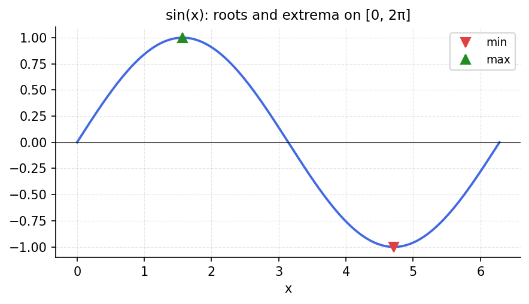

# Extrema and Roots

**Inspired by [Chebfun](https://www.chebfun.org/) examples (roots/Extrema)**

---

The extrema of a Chebfun $f$ are the roots of its derivative $f'$. Chebfun
computes both with spectral accuracy.

## Finding extrema via differentiation

```python
import chebfunjax as cj
import jax.numpy as jnp
import numpy as np

# f(x) = sin(pi*x^2) on [-1, 1]
f = cj.chebfun(lambda x: jnp.sin(jnp.pi * x**2))
fp = f.diff()                    # derivative: 2*pi*x * cos(pi*x^2)
critical = np.array(fp.roots())  # extrema: where f'(x) = 0

# Classify maxima vs minima
for xc in critical:
    fx = float(f(jnp.array(xc)))
    print(f"  x = {xc:+.6f}, f(x) = {fx:+.6f}", end="")
    fpp = float(f.diff(2)(jnp.array(xc)))
    print(f"  ({'max' if fpp < 0 else 'min'})")
```

## Global extrema

The `min` and `max` methods return the global minimum and maximum:

```python
x_max, f_max = f.max()
x_min, f_min = f.min()
print(f"Global max: f({float(x_max):.4f}) = {float(f_max):.6f}")
print(f"Global min: f({float(x_min):.4f}) = {float(f_min):.6f}")
```



## Simultaneous zeros

For $f(x) = \sin(5\pi x)$, the roots and extrema interleave:

```python
g = cj.chebfun(lambda x: jnp.sin(5 * jnp.pi * x))
roots = np.array(g.roots())
gp_roots = np.array(g.diff().roots())
print(f"Roots of g: {len(roots)} points")
print(f"Roots of g': {len(gp_roots)} extrema")
# Should be 11 roots and 10 extrema on [-1,1]
```
