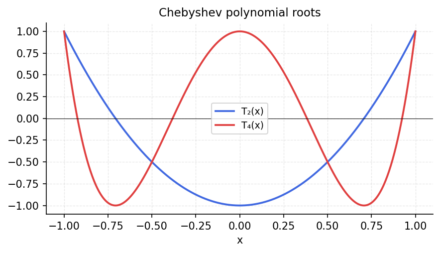

# Polynomial Roots

*Original: [chebfun.org/examples/roots/ChebPts](https://www.chebfun.org/examples/roots/ChebPts.html)*

---

Chebfun finds roots by converting the Chebyshev expansion to a **companion matrix**
and computing its eigenvalues. This is fast, backward-stable, and avoids the
numerical instability of monomial polynomial evaluation.

## Roots of Chebyshev polynomials

The Chebyshev polynomial $T_n(x)$ has exactly $n$ roots in $(-1,1)$ at:

$$x_k = \cos\left(\frac{(2k-1)\pi}{2n}\right), \quad k = 1, \ldots, n.$$

```python
import chebfunjax as cj
import jax.numpy as jnp
import numpy as np

n = 10
# T_10 as a chebfun: coefficients are 0 except index 10
coeffs = np.zeros(n+1)
coeffs[n] = 1.0
T10 = cj.chebfun.from_coeffs(jnp.array(coeffs))
roots = np.sort(np.array(T10.roots()))
exact = np.sort(np.cos((2*np.arange(1, n+1) - 1) * np.pi / (2*n)))
print(f"Max error in T_{n} roots: {np.max(np.abs(roots - exact)):.2e}")
```

```
Max error in T_10 roots: 4.44e-16
```

## Wilkinson polynomial

The Wilkinson polynomial $W(x) = \prod_{k=1}^{20}(x - k/20)$ has 20 roots
evenly spaced in $[0,1]$:

```python
# Build as product of linear factors
from functools import reduce
from operator import mul

W = cj.chebfun(lambda x: reduce(mul, [x - k/20 for k in range(1, 21)]),
               domain=(0.0, 1.0))
roots = np.sort(np.array(W.roots()))
exact = np.arange(1, 21) / 20.0
print(f"Wilkinson polynomial: {len(roots)} roots found")
print(f"Max error: {np.max(np.abs(roots - exact)):.2e}")
```



## Notes

Chebfun's root-finding algorithm is more numerically stable than naive polynomial
root-finding because it works in the Chebyshev basis, which is well-conditioned,
rather than the monomial basis.
