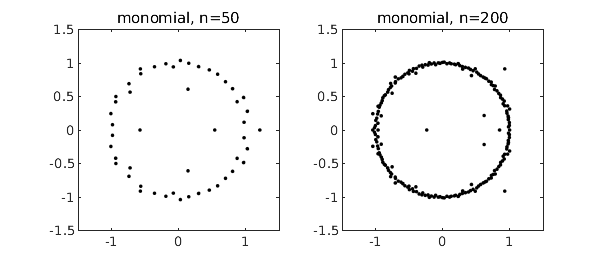
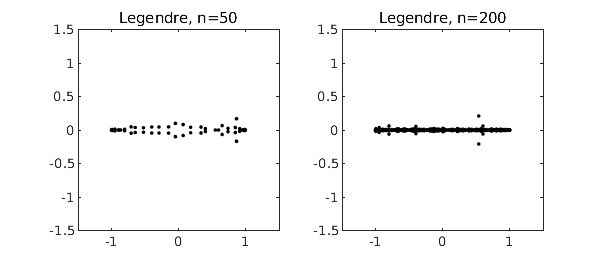

<!-- Generated by scripts/sync_chebfun_examples.py. -->
<!-- Source: https://www.chebfun.org/examples/roots/RandomPolynomials.html -->

<h1>Roots of random polynomials</h1>
<h2>Nick Trefethen, November 2011 in <a href='../'>roots</a><a href='/examples/roots/RandomPolynomials.m'>download</a>&middot;<a href='//github.com/chebfun/examples/blob/master/roots/RandomPolynomials.m'>view on GitHub</a></h2>

If $p(z) = a_0 + a_1 z + \cdots + a_n z^n$ is a polynomial with random coefficients, its roots tend to lie near the unit circle [1,2]. To be specific, suppose $a_0,\ldots,a_{n-1}$ are independent real numbers from the standard normal distribution, with $a_n=1$. Here are typical pictures for $n = 50$ and $n = 200$, based on the MATLAB <code>roots</code> command. Incidentally, such computations are numerically stable [4]; the well-known difficulties of polynomial rootfinding pertain mainly to problems with roots away from the unit circle and coefficients far from random.

<pre class="mcode-input">nn = [50 200];
for j = 1:2
    subplot(1,2,j)
    n = nn(j);
    a = [1; randn(n,1)];
    r = roots(a);
    plot(r,'.k')
    axis(1.5*[-1 1 -1 1]), axis square
    title(['monomial, n=' int2str(n)])
end</pre>

The reason these roots lie near the unit circle is that the monomials $1, z, z^2,\ldots$ are orthogonal polynomials defined on that set. For orthogonal polynomials defined on a different region of the complex plane, we get roots tending to cluster on the boundary of that region [3]. In particular, the best-known families of orthogonal polynomials are defined over $[-1,1]$, and random polynomials expressed in these bases tend to have roots near $[-1,1]$. The Chebfun <code>roots</code> command provides an easy way to compute roots of such polynomials stably. For example, here is what happens if we repeat the experiment above but for random polynomials in the basis of Chebyshev polynomials, i.e., $p = a_0 + a_1 T_1 + \cdots + a_n T_n$.

<pre class="mcode-input">rng(1)
for j = 1:2
    subplot(1,2,j)
    n = nn(j);
    a = [1; randn(n,1)];
    p = chebfun(a,'coeffs');
    r = roots(p,'all');
    plot(r,'.k')
    axis(1.5*[-1 1 -1 1]), axis square
    title(['Chebyshev, n=' int2str(n)])
end</pre>

Legendre polynomials are orthogonal over the same interval $[-1,1]$, so the results aren't much different:

<pre class="mcode-input">for j = 1:2
    subplot(1,2,j)
    n = nn(j);
    a = [1; randn(n,1)];
    A = legpoly(n:-1:0);
    p = A*a;
    r = roots(p,'all');
    plot(r,'.k')
    axis(1.5*[-1 1 -1 1]), axis square
    title(['Legendre, n=' int2str(n)])
end</pre>

<h3 id="references">References</h3>
<ol>
<li>

J. Hammersley, The zeros of a random polynomial, <em>Proceedings of the Third    Berkeley Symposium on Mathematical Statistics and Probability</em>, 1954-1955,    U. California Press, 1956, pp. 89-111.

</li>
<li>

L. A. Shepp and R. J. Vanderbei, The complex zeros of random polynomials,    <em>Transactions of the American Mathematical Society</em>, 347 (1995), 4365-4384.

</li>
<li>

B. Shiffman and S. Zelditch, Equilibrium distribution of zeros of random    polynomials, <em>International Mathematical Research Notices</em>, 2003, pp.    25-49.

</li>
<li>

K.-C. Toh and L. N. Trefethen, Pseudozeros of polynomials and    pseudospectra of companion matrices, <em>Numerische Mathematik</em>, 68 (1994),    403-425.

</li>
</ol>

        

    

