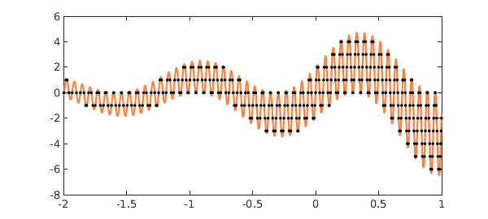
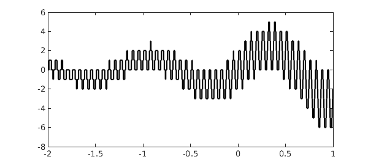
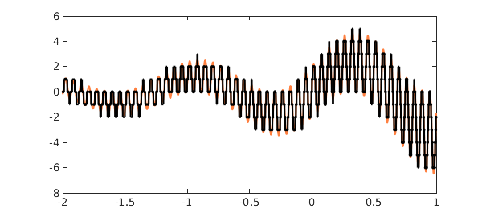

<!-- Generated by scripts/sync_chebfun_examples.py. -->
<!-- Source: https://www.chebfun.org/examples/roots/Tiger.html -->

<h1>The tiger's tail</h1>
<h2>Nick Trefethen, August 2014 in <a href='../'>roots</a><a href='/examples/roots/Tiger.m'>download</a>&middot;<a href='//github.com/chebfun/examples/blob/master/roots/Tiger.m'>view on GitHub</a></h2>

My essay "Six myths of polynomial interpolation and quadrature", reproduced as an appendix in [1], closes with an example that reminds one of a tiger's tail. Here with a few modifications is that example:

<pre class="mcode-input">x = chebfun('x',[-2 1]);
CO = 'color'; orange = [1 .5 .25];
f = 2*exp(.5*x).*(sin(5*x) + sin(101*x));
roundf = round(f);
r = roots(f-roundf,'nojump');
hold off, plot(f,CO,orange), hold on
ylim([-8 6])
plot(r,f(r),'.k'), hold off</pre>

Let's look at what's going on here.  First of all a chebfun $f$ is constructed:

<pre class="mcode-input">plot(f,CO,orange)
ylim([-8 6])</pre>

Then another chebfun is constructed consisting of $f$ rounded to integers:

<pre class="mcode-input">plot(roundf,'k','jumpline','k')
ylim([-8 6])</pre>

Superimposing the two curves yields a lot of intersections, which are computed by <code>roots</code>:

<pre class="mcode-input">number_of_roots = length(r)
plot(f,CO,orange), hold on
plot(roundf,'k','jumpline','k')
plot(r,f(r),'.k'), hold off</pre>

<pre class="mcode-output">number_of_roots =
   345
</pre>

In [1], dots appear not only where $f$ is equal to an integer, but also where it is equal to a half-integer. In the present version of the tiger's tail, this effect has been eliminated by use of the <code>'nojump'</code> flag in <code>roots</code>.

<h3 id="reference">Reference</h3>
<ol>
<li>L. N. Trefethen, <em>Approximation Theory and Approximation    Practice, Extended Edition</em>, SIAM, 2019.</li>
</ol>

        

    

    

        
&copy; Copyright 2025 the University of Oxford and the Chebfun Developers.

        
    

    
    
    
    
    
    
    
    
  </body>

