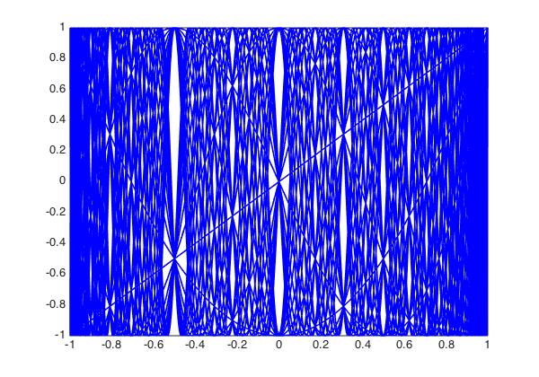
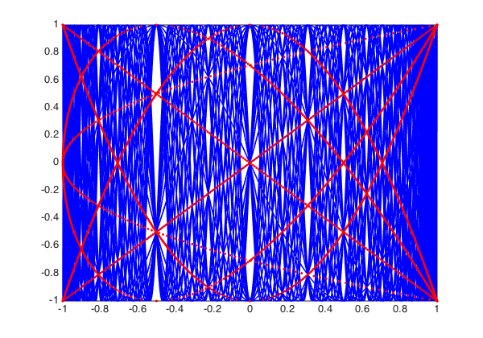
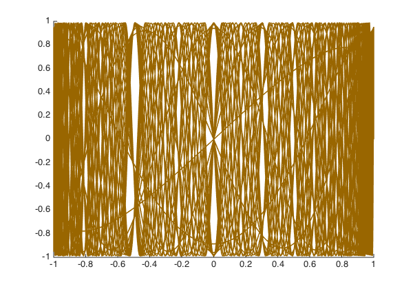
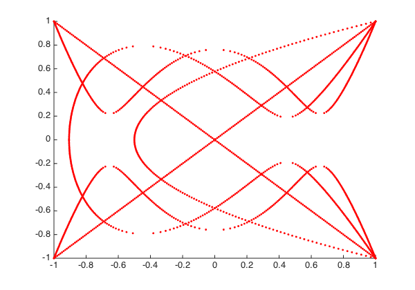

<!-- Generated by scripts/sync_chebfun_examples.py. -->
<!-- Source: https://www.chebfun.org/examples/roots/WhiteCurves.html -->

<h1>The white curves of Ortiz and Rivlin</h1>
<h2>Stefan Guettel, November 2011 in <a href='../'>roots</a><a href='/examples/roots/WhiteCurves.m'>download</a>&middot;<a href='//github.com/chebfun/examples/blob/master/roots/WhiteCurves.m'>view on GitHub</a></h2>

In their 1983 article "Another look at the Chebyshev polynomials" [1], E. L. Ortiz and T. J. Rivlin considered the graph of 30 Chebyshev polynomials $T_j(x)$, noticing the appearance of what they called "white curves":

<pre class="mcode-input">set(gcf, 'position', [0 0 600 420])
plot(chebpoly(1:30), 'b-'), hold on
axis([-1 1 -1 1])</pre>

The white curves are regions in the graph with exceptionally many intersection points of Chebyshev polynomials. Ortiz and Rivlin show that if $0 &lt; m \leq n$ and $T_m(x) = T_n(x) = y$, then

$$ (1 - T_{n-m}(x)) (T_2(y) - T_{n-m}(x)) = 0. $$

Hence the interior intersection points of Chebyshev polynomials must lie on the curve $(x,y)$ satisfying $T_2(y) = T_{n-m}(x)$. Smaller numbers $n-m$ correspond to smaller numbers of intersection points. Here are the intersection points obtained with $n-m \leq 4$, obtained with Chebfun's rootfinding capability:

<pre class="mcode-input">T_2 = chebpoly(2);
for j = 1:4,        % j = n-m
    T_j = chebpoly(j);
    for y = linspace(-1,1,200),
        x = roots(T_j - T_2(y));
        plot(x,y,'r.')
    end
end
axis([-1 1 -1 1])</pre>

Ortiz and Rivlin also noted that the phenomenon of white curves appears for other orthogonal polynomials as well. For example, let's take the Legendre polynomials and plot them with some appropriate reweighting:

<pre class="mcode-input">clf, hold on
x = chebfun('x');
for j = 1:30,
    L = legpoly(j);
    q = (pi*j/2)^.5*(1-x.^2).^.25;
    plot(L.*q, 'color', [.6 .4 0])
end
axis([-1 1 -1 1])</pre>

It is easy to compute the points $(x,y)$ satisfying $L_2(y) = L_j(x)$ just as before. They have no particular meaning in this case, but they appear as a nice pattern:

<pre class="mcode-input">clf, hold on
L_2 = legpoly(2);
for j = 1:4,        % j = n-m
    L_j = legpoly(j);
    for y = linspace(-1,1,200),
        x = roots(L_j - L_2(y));
        if(~isempty(x)), plot(x,y,'r.'), end
    end
end
axis([-1 1 -1 1])</pre>

<h3 id="references">References</h3>
<ol>
<li>E. L. Ortiz and T. J. Rivlin, Another look at the Chebyshev polynomials,    <em>American Mathematical Monthly</em>, 90 (1983), 3-10.</li>
</ol>

        

    

    

        
&copy; Copyright 2025 the University of Oxford and the Chebfun Developers.

        
    

    
    
    
    
    
    
    
    
  </body>

