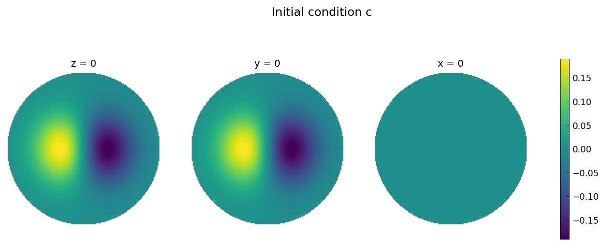
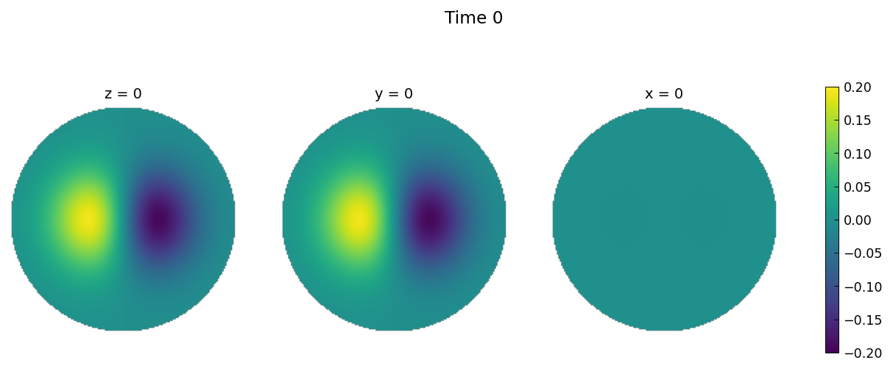
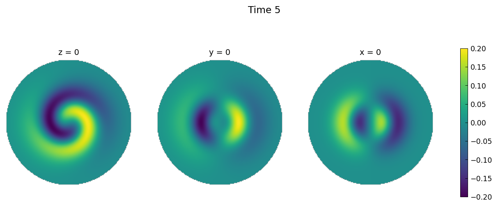
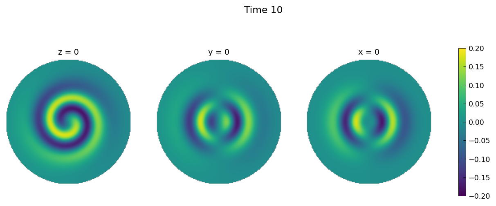
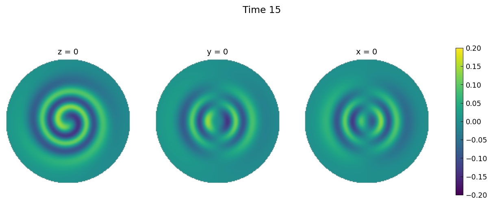

# Advection-diffusion in the unit ball

*Nicolas Boullé, July 2019*

[Original MATLAB Chebfun example](https://www.chebfun.org/examples/sphere/AdvectionDiffusion.html)

(Chebfun example sphere/AdvectionDiffusion.m)

The advection–diffusion equation in the ball,

$$ \frac{\partial c}{\partial t} = D\nabla^2 c - v\cdot\nabla c, $$

with $D = 1/5000$ and the divergence-free, no-slip field
$v = \nabla\times[ze^{-5r^2}(x,y,z)]$, solved with Ballfun's
`helmholtz` command via IMEX-BDF1 (one Neumann Helmholtz solve per
step).

The velocity field is divergence-free and satisfies no-slip:

```text
ans =
     5.4438e-30
ans =
     2.9725e-18
```

(MATLAB publishes `1.27e-17` and `1.30e-33` for the same two checks —
both at roundoff.)

The initial condition $c = -xe^{-5r^2}$ and its evolution to
$t = 15$ ($\Delta t = 0.1$, $K = i\sqrt{1/(\Delta t D)}$), shown as
slices through the three coordinate planes:







The dipole is wound into a spiral by the swirling flow while slowly
diffusing — the published evolution, panel for panel (150 steps,
182 s total).

> **A stability note.** Without per-step coefficient simplification
> the explicit advection term amplifies a roundoff-seeded parasitic
> mode by ~1.5×/step, blowing up around $t = 10$ — and *faster* at
> higher resolution. MATLAB's ballfun pipeline simplifies adaptively
> after every operation, which acts as the stabilizing spectral chop;
> the replica calls `.simplify()` each step to match. (Two `helmholtz`
> fixes found by this page: complex/imaginary $K$ was truncated by
> `float(K)` in both the spectral core and the Poisson-evaluator
> fallback.)

---

*Replica script: [`examples/sphere/advectiondiffusion_replica.py`](https://github.com/ma-gilles/chebfunjax/blob/main/examples/sphere/advectiondiffusion_replica.py).
Original example copyright by The University of Oxford and The Chebfun
Developers.*
