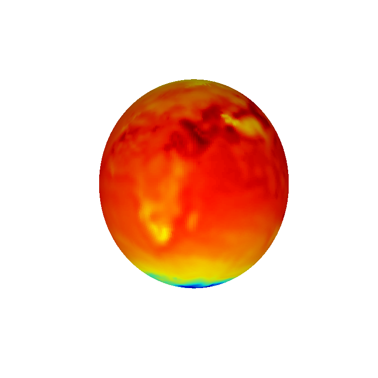
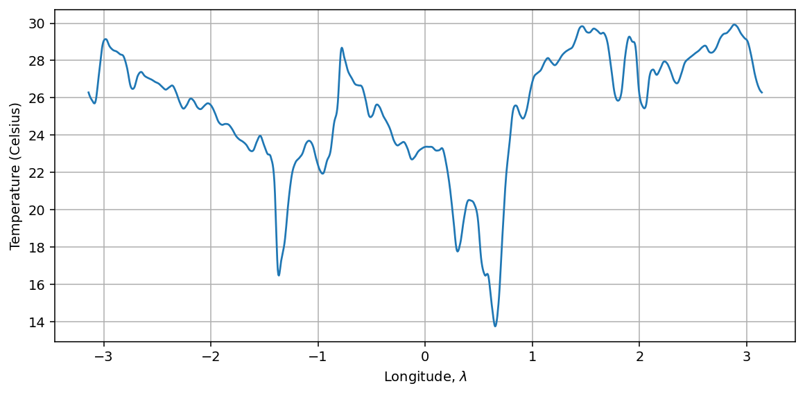
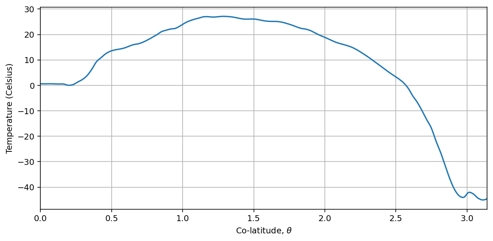
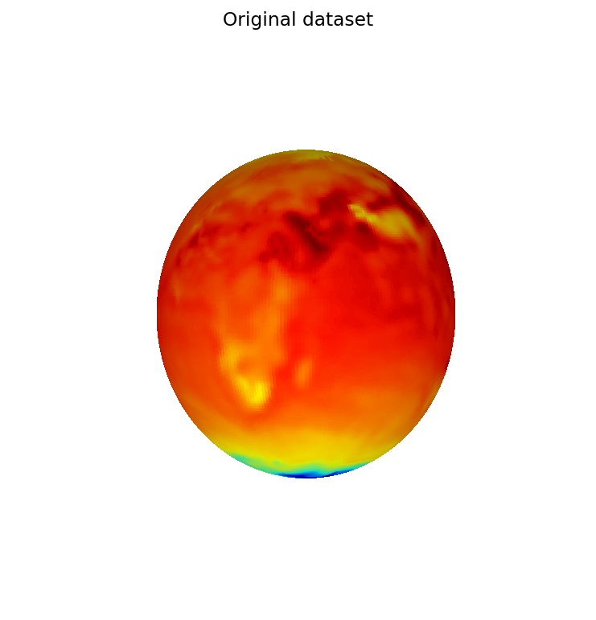
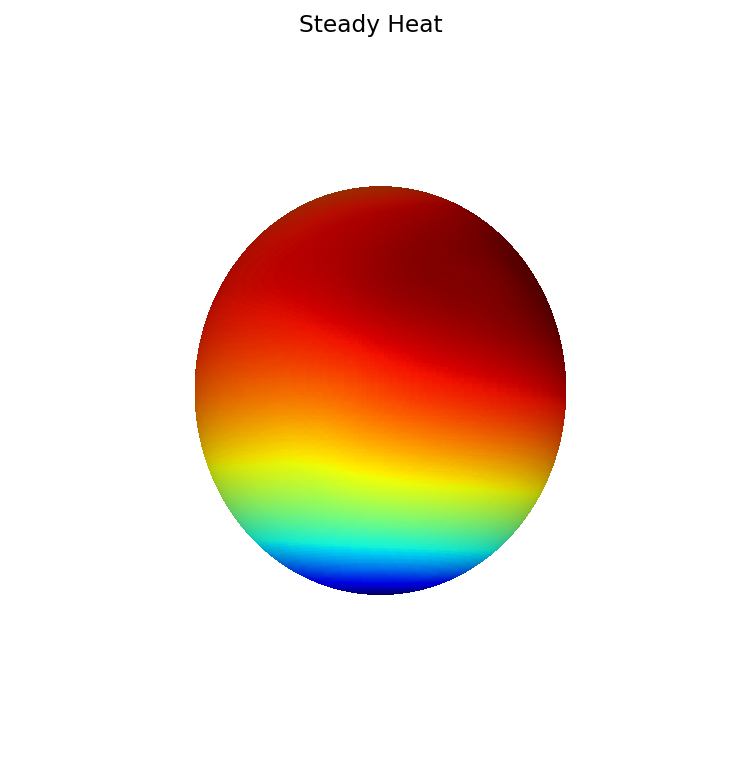
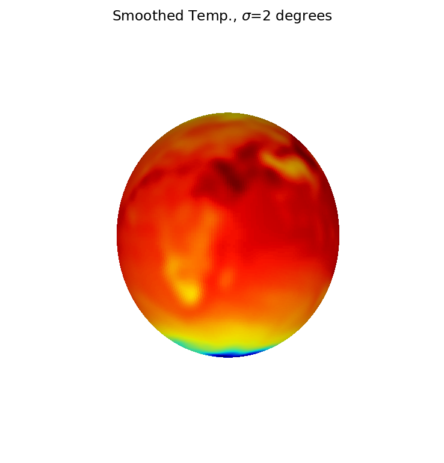
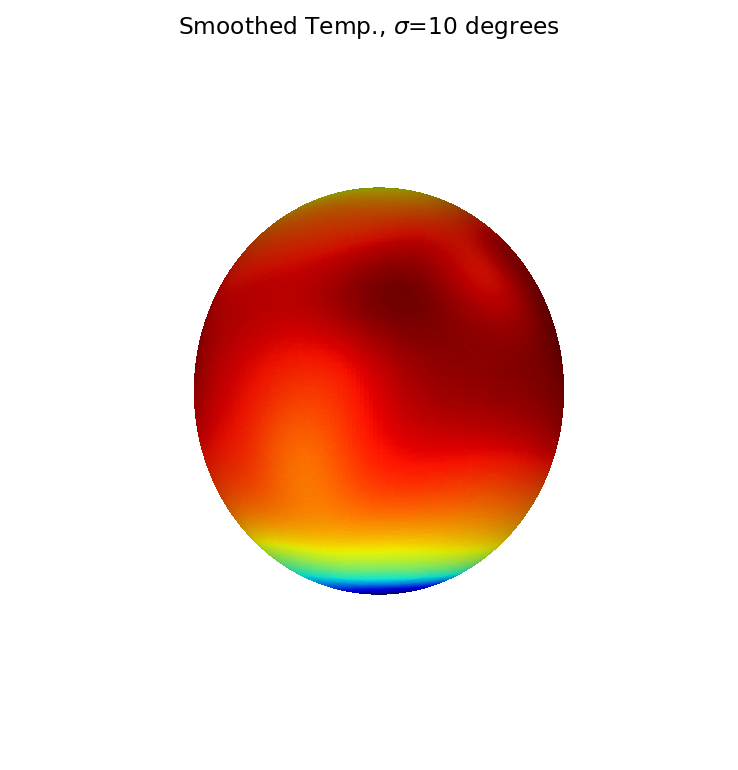
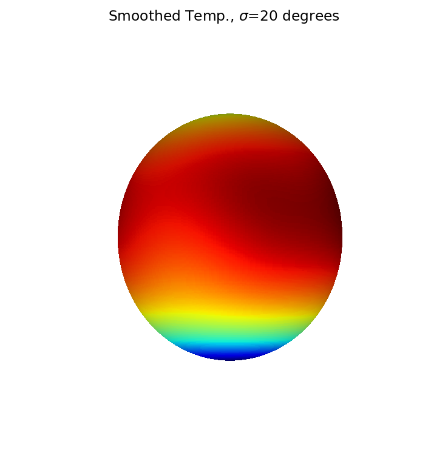

# Atmospheric temperature data on the sphere

[Original MATLAB Chebfun example](https://www.chebfun.org/examples/sphere/AtmosphericTemperature.html)

(Chebfun example sphere/AtmosphericTemperature.m)

The 529×1024 global temperature dataset (`AtmosphericData.mat`,
fetched from the chebfun examples repository) represented on the
sphere via its double-Fourier-sphere trig interpolant:



In Celsius, the mean temperature and the pole values:

```text
mean2(f) =
  16.367742646508908
f(North pole) =
   0.624920062688012
f(South pole) =
 -44.513990845477075
```

MATLAB publishes `16.367643667365925`, `0.624920062687732`,
`-44.513990845477139` — the pole values match to **12–13 digits**
(they are data points of the interpolant); the means differ at
$10^{-4}$ because MATLAB integrates its rank-185 GE compression of
the data while we integrate the full trig interpolant.

The equator slice and the zonal mean:




## Steady heat

The Poisson solve $\nabla^2 u = -(f - \bar f)$ smooths the data into
its steady heat distribution:




## Gaussian filtering

Gauss–Weierstrass smoothing at $\sigma = 2, 10, 20$ degrees (each
harmonic band scaled by $e^{-\ell(\ell+1)\sigma^2/2}$):





---

*Replica script: [`examples/sphere/atmospherictemperature_replica.py`](https://github.com/ma-gilles/chebfunjax/blob/main/examples/sphere/atmospherictemperature_replica.py).
Original example copyright by The University of Oxford and The Chebfun
Developers.*
