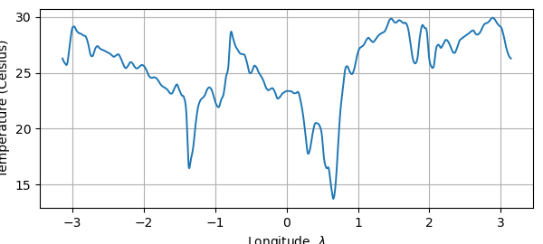
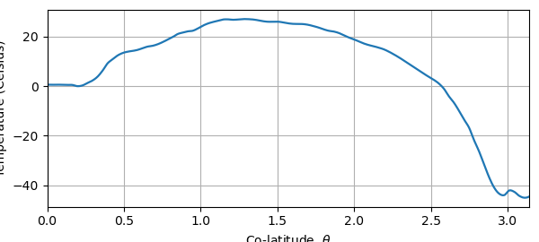
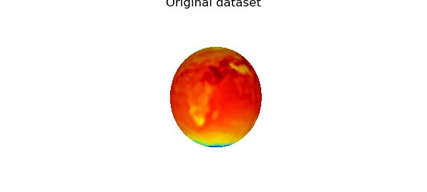
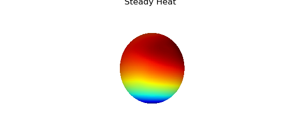
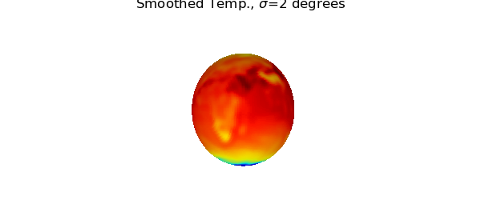
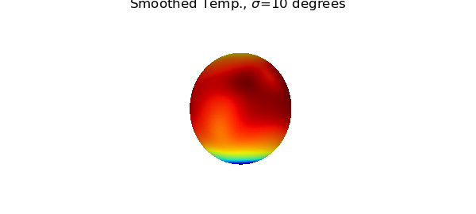
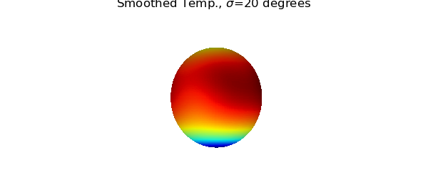
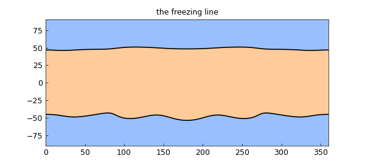

# Computing with an atmospheric dataset in Spherefun

*Alex Townsend and Grady Wright, May 2016*

[Original MATLAB Chebfun example](https://www.chebfun.org/examples/sphere/AtmosphericTemperature.html)

Python translation: [`examples/sphere/atmospherictemperature.py`](https://github.com/ma-gilles/chebfunjax/blob/main/examples/sphere/atmospherictemperature.py)

## 1. Introduction

Spherefun is a part of Chebfun for computing with functions on the sphere. The underlying approximation scheme is based on representing functions on the sphere by certain structure-preserving low rank approximants [1]. Mathematically, most functions are of infinite rank on the sphere with a notable exception being spherical harmonic functions. However, many functions are numerically of low rank. When a function is of low rank, Spherefun is surprisingly efficient.

## 2. Is surface air temperature of low rank?

Recently, we were asked: Is the surface air temperature of the earth of low rank? In this example, we apply Spherefun to one atmospheric dataset and find that it can be well approximated by a function of moderate rank.

Here is a data set on a 529x1024 latitude-longitude grid containing the global atmospheric temperature (in Kelvin) of earth on 12-July-2005 obtained from the National Oceanic and Atmospheric Administration (NOAA) Earth System Research Laboratory:

```matlab
load AtmosphericData;
```

We can use Spherefun to construct an approximation of $f$ and visualize the dataset:

```matlab
f = spherefun( Temp );
surf(f), colormap(jet), colorbar, axis off, view([50 0]), hold on
spherefun.plotEarth('k-'), hold off
```


The last line includes the landmasses of earth on the plot.

We can find out more about the underlying data set by looking at the rank:

```matlab
f
```

```text

```

Spherefun calculated the rank of $f$ as 185. Since the dataset is of size 529x1024, this shows that the low rank representation is achieving some useful compression of the original dataset, although the results are not as dramatic as one often sees for smooth functions (see [2] for more detailed discussions).

## 3. Investigating the atmospheric temperature

There are over a hundred commands in Spherefun and we can now investigate properties of atmospheric temperature over the earth. Before we begin, we convert the function to units of Celsius by subtracting 273.15.

```matlab
f = f - 273.15;
```

What is the mean temperature of the earth?

```matlab
mean2( f )
```

```text

```

What is the temperature at the North and South poles?

```matlab
f( 0, 0, 1 ) % North pole
f( 0, 0, -1) % South pole
```

```text

```

This confirms that the atmospheric temperature data was taken during summer in the Northern hemisphere.

What is the temperature along the equator?

```matlab
plot( f( :, pi/2 ) )   % In spherical coordinates.
xlabel('Longitude, \lambda'), ylabel('Temperature (Celsius)')
```



What do the isolines look line?

```matlab
contour( f, -40:5:40, 'LineWidth', 2 ), axis off, view([50 5]), hold on
spherefun.plotEarth('k-'), hold off
```



What is the zonal mean temperature?

```matlab
zonalMean = mean(f,2);
plot(zonalMean), xlim([0 pi])
xlabel('Co-latitude, \theta'), ylabel('Temperature (Celsius)')
```



## 4. Poisson solver

We can also compute the steady heat profile with an external source, assuming there are no internal heat sinks or sources. This requires solving Poisson's equation on the sphere.

The solution to Poisson's equation only makes sense if the right hand side has mean zero. So, we first subtract a constant from the external heat source to ensure it has a mean of zero. For fun, we take the source as $f$ from above.

```matlab
[n, m] = length( f );
steadyHeat = spherefun.poisson( -(f - mean2(f)), 0, m, n );
plot( f ), colormap(jet), axis off, view([50 0]), hold on
spherefun.plotEarth('k-'), title('Original dataset'), snapnow, hold off

plot( steadyHeat ), colormap(jet), axis off, view([50 0]), hold on
spherefun.plotEarth('k-'), title('Steady Heat'), snapnow, hold off
```





## 5. Scale-space selection using a Gaussian filter

It is common to smooth data by applying a Gaussian filter. This type of filter also provides a means of analyzing data at various scales and is particularly appealing as it does not introduce artificial structures in the data, such as magnifying local extrema.

This idea is applied in [3] to global climate data collected on the surface of the sphere, such as air surface temperature, to identify features in the data that are robust over multiple scales. The `smooth` command in Spherefun uses a Gaussian filter to smooth a function f. It has in optional parameter $\sigma$ that determines the length scale (as measured in radians at the equator of the unit sphere) at which the smoothing occurs.

We can repeat the experiments of [3] easily on the surface air temperature with this command. For example, in this paper the authors analyze smoothing at scales of 2, 10, and 20 degrees, which in radians correspond to $\sigma$ values

```matlab
sig = [2 10 20]*pi/180;
```

The smoothed temperature at these scales, together with original temperature are computed and plotted as

```matlab
surf(f), colormap(jet), axis off, view([50 0]), hold on
spherefun.plotEarth('k-'), title('Original Temp.'), snapnow, hold off

for j=1:3
    fsmooth = smooth( f, sig(j) );
    surf(fsmooth), colormap(jet), axis off, view([50 0]), hold on
    spherefun.plotEarth('k-')
    title(['Smoothed Temp., \sigma=' num2str(sig(j)*180/pi) ' degrees'])
    snapnow, hold off
end
```





*(Figure 09 of the original page is not reproduced yet.)*



This type of filtering has also been used on CT scans of the brain to detect certain abnormalities [4].

## References

[1] A. Townsend, H. Wilber, and G. B. Wright, Computing with functions in spherical and polar geometries I. The sphere, submitted, 2016.

[2] A. Townsend, Computing with Functions in Two Dimensions, PhD Thesis, University of Oxford, 2014.

[3] K. Marvel, D. Ivanova, and K. E. Taylor, Scale space methods for climate model analysis, J. Geophys. Res. Atmospheres, 118, 5082-5097, 2013

[4] M. K. Chung, K. M. Dalton, and R. J. Davidson, Tensor-based cortical surface morphometry via weighted spherical harmonic representation, IEEE Trans. On Medical Imag., 27, 1143-1151, 2008

---

*Translated with [chebfunjax](https://github.com/ma-gilles/chebfunjax); prose and MATLAB code from the original example, copyright The University of Oxford and The Chebfun Developers.  Printed outputs and figures are chebfunjax's.*
