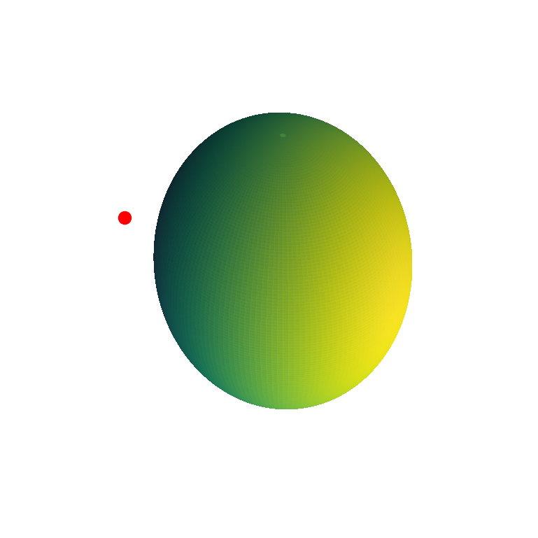

# Gravitational force from a spherical shell

[Original MATLAB Chebfun example](https://www.chebfun.org/examples/sphere/Gravity.html)

(Chebfun example sphere/Gravity.m)

Newton's theorem: a uniform spherical shell attracts an exterior
point as if all its mass were at the center. Take
$X = (-1, -1.1, -0.2)$:

```text
ans =
   1.500000000000000
min_distance =
   0.500000000000052
max_distance =
   2.499999999999999
```

(MATLAB publishes `1.5`, `0.500000000000014`, `2.499999999999999`.)



With shell density $\rho = 1/(4\pi)$ the radial force integral over
the sphere should equal $1/1.5^2 = 4/9$:

```text
force_exact =
   0.444444444444444
rho =
   0.079577471545948
force =
   0.444444444444444
```

**All fifteen digits of the published force match** — `sum2` of the
force spherefun reproduces Newton's theorem exactly, as in MATLAB.

---

*Replica script: [`examples/sphere/gravity_replica.py`](https://github.com/ma-gilles/chebfunjax/blob/main/examples/sphere/gravity_replica.py).
Original example copyright by The University of Oxford and The Chebfun
Developers.*
