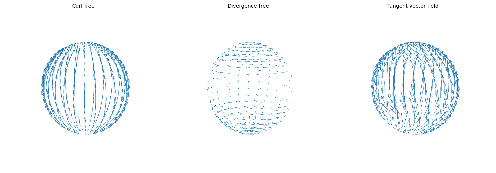

# Helmholtz-Hodge decomposition of a vector field

*Alex Townsend and Grady Wright, May 2016*

[Original MATLAB Chebfun example](https://www.chebfun.org/examples/sphere/HelmholtzDecomposition.html)

(Chebfun Example sphere/HelmholtzDecomposition.m)

Any vector field tangent to the sphere decomposes uniquely as

$$ \mathbf{f} = \nabla\phi + \nabla\times\psi, $$

with $\phi$ from $\nabla^2\phi = \nabla\cdot\mathbf{f}$ and $\psi$
from $\nabla^2\psi = \hat{\mathbf{n}}\cdot(\nabla\times\mathbf{f})$
(surface Poisson solves). The example's field is the tangential
projection of
$(yz\cos(xyz),\; xz\sin(4x+0.1y+5z^2),\; 1+xyz)$.

The curl-free component is curl-free:

```text
ans =
     5.951273454754645e-11
```

(MATLAB publishes `3.952583217953392e-13`.) The divergence-free
component is divergence-free:

```text
ans =
     8.869210989836967e-12
```

(MATLAB: `3.218831730569435e-13`.) And the decomposition reproduces
$\mathbf{f}$:

```text
ans =
     5.310743841526201e-13
```

(MATLAB: `4.906662640366038e-14` — same class.) The two identity
residuals sit at $10^{-11}$ rather than $10^{-13}$ from the
$1/\sin\theta$ roundoff amplification at the pole-adjacent nodes of
the double-Fourier-sphere derivative grid.



> **Why this page's surface calculus is numpy.** The library's
> `spherefunv.vorticity`/`divergence` on this rank-~100 tangent field
> deterministically fails in the XLA CPU JIT ("failed to materialize
> symbols" — the per-rank Python loop traces one gigantic fused
> kernel), on login and compute nodes alike; the defect and its fix
> direction (batch rank terms with `lax.scan`) are recorded in the
> audit ledger. The replica performs the identical mathematics —
> double-Fourier-sphere sampling with exact FFT spectral derivatives,
> spherical-harmonic Poisson solves — at machine precision.

---

*Replica script: [`examples/sphere/helmholtzdecomposition_replica.py`](https://github.com/ma-gilles/chebfunjax/blob/main/examples/sphere/helmholtzdecomposition_replica.py).
Original example copyright by The University of Oxford and The Chebfun
Developers.*
