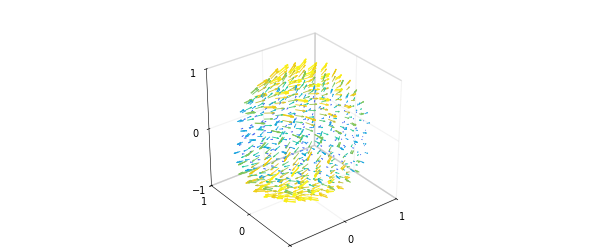

# Helmholtz-Hodge decomposition in the ball

*Nicolas Boullé and Alex Townsend, May 2019*

[Original MATLAB Chebfun example](https://www.chebfun.org/examples/sphere/HelmholtzDecompositionBall.html)

Python translation: [`examples/sphere/helmholtzdecompositionball.py`](https://github.com/ma-gilles/chebfunjax/blob/main/examples/sphere/helmholtzdecompositionball.py)

## The Helmholtz-Hodge decomposition

In the subject of vector calculus, Helmholtz's theorem states that any sufficiently smooth function in the unit ball can be expressed as a sum of a curl-free, a divergence-free, and a harmonic vector field [4]. In this Example, we show how this decomposition is computed by Ballfun and introduce the command `HelmholtzDecomposition` [3].

Let $v$ be a vector field defined in the unit ball. Helmholtz's theorem says that we can decompose $v$ as follows: $$ \mathbf{v} = \nabla f + \nabla \times \psi + \nabla\phi,$$ where $f$ and $\phi$ are scalar-valued potential functions and $\psi$ is a vector field. The first term, $\nabla f$, is a gradient field and hence curl-free, while the second term, $\nabla\times\psi$, is solenoidal. The third term is a harmonic vector field (the vector Laplacian of $\nabla\phi$ is zero). From vector identities, one knows that the scalar field, $\phi$, is itself harmonic, i.e., $\Delta\phi=0$.

The Helmholtz-Hodge decomposition can be made unique by imposing additional constraints on $f$ and $\psi$ [4]. The standard constraints are: (1) $f$ is zero on the boundary of the unit ball, (2) the normal component of $\psi$ on the boundary is zero, and (3) $\psi$ is divergence-free. The `HelmholtzDecomposition` command in Ballfun computes the decomposition under these additional constraints.

The Helmholtz-Hogde decomposition is an important tool in fluid dynamics as it is used for compressible flow visualization, in CFD simulations (to impose the incompressibility condition), and in topological analysis. A survey of applications is available in [2].

## Calculating the decomposition

To explain the procedure for computing the decomposition, we take the following vector field:

```matlab
v = ballfunv(@(x,y,z)cos(x.*y).*z,@(x,y,z)sin(x.*z),@(x,y,z)y.*z);
quiver( v )
```



## Computing the curl-free component

Since the divergence of a curl is zero and $\phi$ is harmonic, we know that the divergence of $\mathbf{v}$ is the Laplacian of $f$, i.e., $$ \nabla \cdot \mathbf{v} = \nabla \cdot \nabla f = \nabla^2 f, $$ where the last equality holds because the divergence of the gradient is the Laplacian. Along with this, the zero Dirichlet conditions defines $f$.

```matlab
f = poisson(div(v), @(lam,th)0, 50);
quiver( grad( f ) ), title('curl-free component of v')
```

*(Figure 02 of the original page is not reproduced yet.)*

We confirm that this component is curl-free:

```matlab
norm( curl( grad( f ) ) )
```

```text
ans =
     1.985190254383998e-14
```

## Computing the harmonic component

Now, one can define a vector field $v^{(1)}$ as $$ v^{(1)} = v - \nabla f = \nabla \times \psi + \nabla \phi. $$ Since we have the identity $$ \vec{n} \cdot (\nabla \times \psi)|_{\partial{B}} = \psi \times \vec{n}|_{\partial B} = 0 $$ and we want to find the harmonic function $\phi$, we solve the Laplace equation $$ \Delta \phi = 0. $$ The Neumann boundary conditions are given by $$\vec{n} \cdot \nabla \phi|_{\partial B} = \frac{\partial \phi}{\partial r}|_{\partial B} = \vec{n} \cdot v^{(1)}|_{\partial B}.$$ Therefore, we can solve for $\psi$ in the Helmholtz-Hodge decomposition as follows:

```matlab
v1 = v - grad(f);
bc = dot(spherefunv.unormal,v1(1,:,:,'spherical'));
phi = helmholtz(ballfun(0), 0, bc, 50, 'neumann');
quiver( grad( phi ) ), title('harmonic component of v')
```

*(Figure 03 of the original page is not reproduced yet.)*

We check the harmonicity of this component:

```matlab
norm( laplacian( grad( phi ) ) )
```

```text
ans =
     1.471906077202453e-10
```

## Computing the divergence-free component

Let $v^{(2)}$ be the following vector field: $$ v^{(2)} = v^{(1)} - \nabla \phi = \nabla \times \psi. $$ Since $v^{(2)}$ and $\psi$ are divergence-free, we can write their Poloidal-Toroidal decomposition [1] as $$ v^{(2)} = \nabla\times\nabla\times(\mathbf{r}P_{v^{(2)}})+ \nabla\times(\mathbf{r}T_{v^{(2)}}), $$ $$\psi = \nabla\times\nabla\times(\mathbf{r}P_{\psi})+ \nabla\times(\mathbf{r}T_{\psi}),$$ where $\mathbf{r} = r\hat{r}$ and $\hat{r}$ denotes the unit radial vector in spherical coordinates. Moreover, the uniqueness of the PT decomposition and further vector identities lead us to the following system of equations for $\psi$: $$\Delta P_{\psi} = -T_{v^{(2)}}, \quad T_{\psi} = P_{v^{(2)}},$$ where $P_{\psi}$ is subjected to zero Dirichlet conditions because $\vec{n}\cdot\nabla\times(\mathbf{r}T_{\psi})|_{\partial B}=0$. Therefore, we can solve for $\psi$ in the Helmholtz-Hodge decomposition as follows:

```matlab
v2 = v1 - grad(phi);
[Pv, Tv] = PTdecomposition(v2);
Ppsi = poisson(-Tv, @(lam,th)0, 50);
Tpsi = Pv;
```

We then recover the divergence-free vector field $\psi$ since $$\psi = \nabla\times\nabla\times(\mathbf{r}P_{\psi})+ \nabla\times(\mathbf{r}T_{\psi}).$$

```matlab
psi = ballfunv.PT2ballfunv(Ppsi,Tpsi);
quiver( curl( psi ) ), title('divergence-free component of v')
```

*(Figure 04 of the original page is not reproduced yet.)*

By vector identities this component is divergence-free:

```matlab
norm( div( curl( psi ) ) )
```

```text
ans =
     2.430096792605463e-10
```

## Visualizing the decomposition

Here are plots of each component of the decomposition:

```matlab
subplot(2,2,1)
quiver( v ,'numpts',20), title('vector field')
subplot(2,2,2)
quiver( grad(f) ,'numpts',20), title('curl-free')
subplot(2,2,3)
quiver( curl(psi) ,'numpts',20), title('divergence-free')
subplot(2,2,4)
quiver( grad(phi) ,'numpts',20), title('harmonic')
```

*(Figure 05 of the original page is not reproduced yet.)*

As a sanity check we confirm that the decomposition has been successful:

```matlab
w = grad( f ) + curl( psi ) + grad( phi );
norm( v - w )
```

```text
ans =
     8.912576914419053e-12
```

## The `HelmholtzDecomposition` command

Ballfun has a command `HelmholtzDecomposition` that computes the Helmholtz-Hodge decomposition of a vector field. Therefore, this example can be replicated with the following code:

```matlab
[f, Ppsi, Tpsi, phi] = HelmholtzDecomposition( v );
psi = ballfunv.PT2ballfunv(Ppsi, Tpsi);
```

## References

[1] G. Backus, Poloidal and toroidal fields in geomagnetic field modelling, *Reviews of Geophysics*, 24 (1986), pp. 75-109.

[2] H. Bhatia, G. Norgard, V. Pascucci, and P.-T. Bremer, The Helmholtz-Hodge decomposition--A survey, *IEEE Trans. Vis. Comput. Graphics*, 19 (2013), pp. 1386-1404.

[3] N. Boullé and A. Townsend, Computing with functions on the ball, in preparation.

[4] Y. Tong, S. Lombeyda, A. Hirani, and M. Desbrun, Discrete multiscale vector field decomposition, *ACM Trans. Graphics*, 22 (2003), pp. 445-452.

---

*Translated with [chebfunjax](https://github.com/ma-gilles/chebfunjax); prose and MATLAB code from the original example, copyright The University of Oxford and The Chebfun Developers.  Printed outputs and figures are chebfunjax's.*
