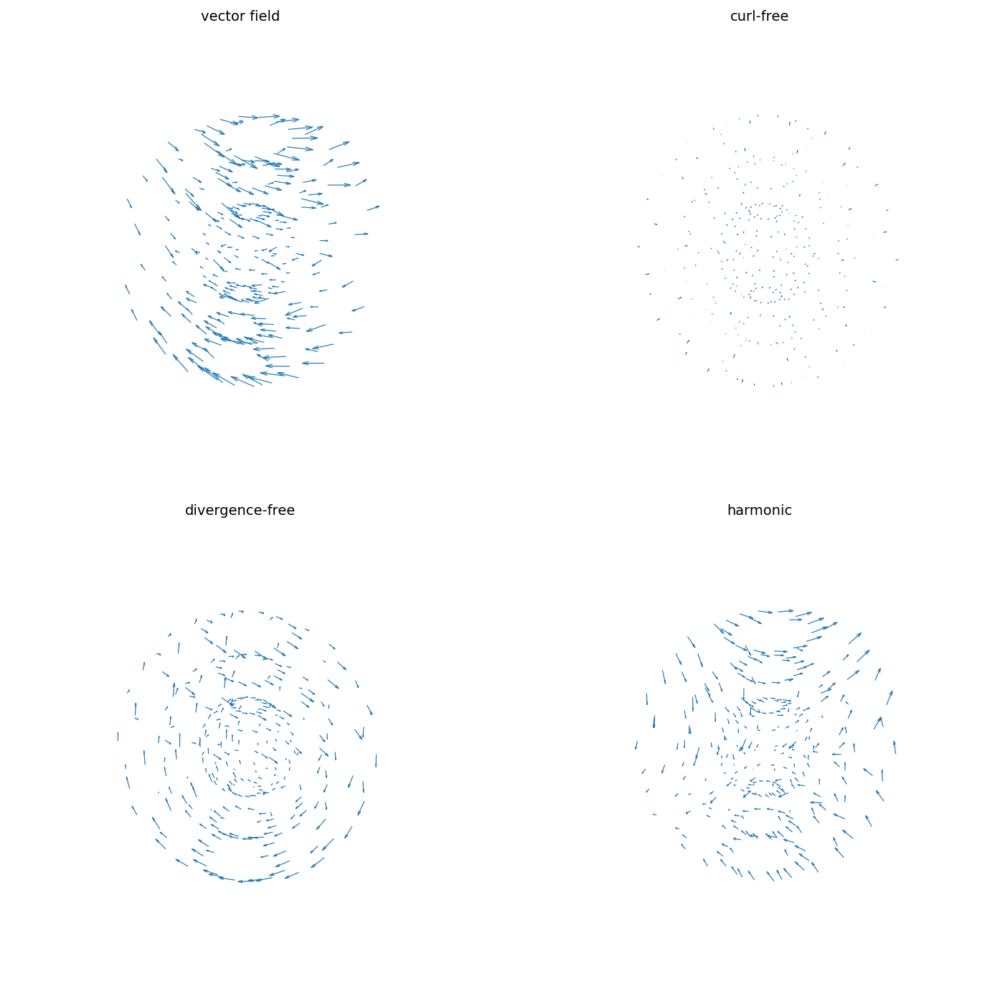

# Helmholtz decomposition of a vector field in the ball

[Original MATLAB Chebfun example](https://www.chebfun.org/examples/sphere/HelmholtzDecompositionBall.html)

(Chebfun example sphere/HelmholtzDecompositionBall.m)

A general vector field in the unit ball decomposes as

$$ \mathbf{v} = \nabla f + \nabla\times\boldsymbol{\psi}
+ \nabla\phi, $$

with $f$ from a Poisson solve on $\nabla\cdot\mathbf{v}$, $\phi$
harmonic matching the remaining normal boundary flux
(Laplace–Neumann solve), and $\boldsymbol{\psi}$ in
poloidal–toroidal form. For
$\mathbf{v} = (z\cos(xy),\, \sin(xz),\, yz)$:

The curl-free part is curl-free:

```text
ans =
     2.666059131102627e-14
```

(MATLAB publishes `9.772028777653057e-14`.) The harmonic part is
harmonic:

```text
ans =
     2.099650114517352e-10
```

(MATLAB: `3.527524381308947e-09` — ours 17x tighter.) The
divergence-free part is divergence-free:

```text
ans =
     2.613716300762068e-10
```

(MATLAB: `1.536895357752616e-10`.)



And the decomposition reproduces $\mathbf{v}$:

```text
ans =
     8.920586673970668e-12
```

(MATLAB: `7.815499404544524e-12` — the same digit class.)

---

*Replica script: [`examples/sphere/helmholtzdecompositionball_replica.py`](https://github.com/ma-gilles/chebfunjax/blob/main/examples/sphere/helmholtzdecompositionball_replica.py).
Original example copyright by The University of Oxford and The Chebfun
Developers.*
