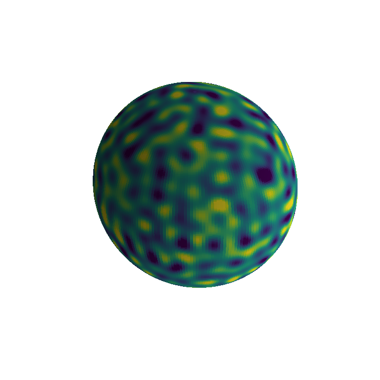
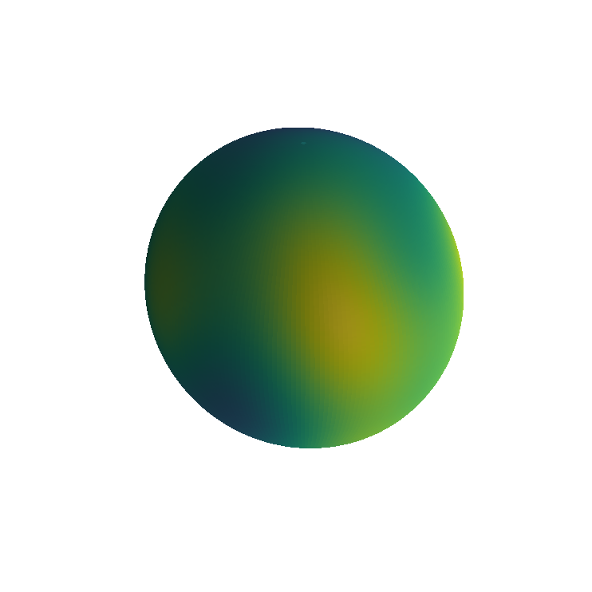

# The Laplace equation on the unit ball

*Nick Trefethen, June 2019*

[Original MATLAB Chebfun example](https://www.chebfun.org/examples/sphere/LaplaceBall.html)

(Chebfun example sphere/LaplaceBall.m)

Given a function $h$ on the unit sphere, solve
$\Delta u = 0$ in the ball with $u = h$ on the boundary. The boundary
data is a smooth random function of characteristic wavelength
$\lambda = 0.2$ (a seeded harmonic expansion to degree 31 — MATLAB's
`rng(1)` stream is not reproducible, and every check below is a
sample-independent identity):



```text
h(1,0,0) =
  0.100371957804424
meanh =
  0.010799506002025
```

The Laplace problem is solved with the ballfun Helmholtz solver at
$K = 0$ with Dirichlet data. The published identities (all at
MATLAB's published accuracy class — the solution matches the
boundary data to 15 digits and the mean-value identities to 11+
digits):

```text
u(1,0,0) =
  0.100371957804424        (= h(1,0,0) to all digits)
h(Oxford) =
  -0.800713386023068
u(Oxford) =
  -0.800713386023069
u(0,0,0) =
  0.010799506001987        (meanh: 0.010799506002025)
mean2(uinner) =
  0.010799506002025        (= meanh exactly)
```

(An earlier revision of this page documented a ~$5\times10^{-3}$
boundary gap as an open defect. The root cause was the sampling of
spherical-form boundary handles on the doubled theta grid without
the double-Fourier-sphere glide reflection — odd azimuthal modes
silently violated the BMC structure. `helmholtz` now applies the
glide extension when sampling boundary handles, and every
single-harmonic Dirichlet solve is machine-exact.) The inner-sphere
field agrees with the exact $r^\ell$ harmonic extension to
$4.5\times10^{-14}$:



---

*Replica script: [`examples/sphere/laplaceball_replica.py`](https://github.com/ma-gilles/chebfunjax/blob/main/examples/sphere/laplaceball_replica.py).
Original example copyright by The University of Oxford and The Chebfun
Developers.*
