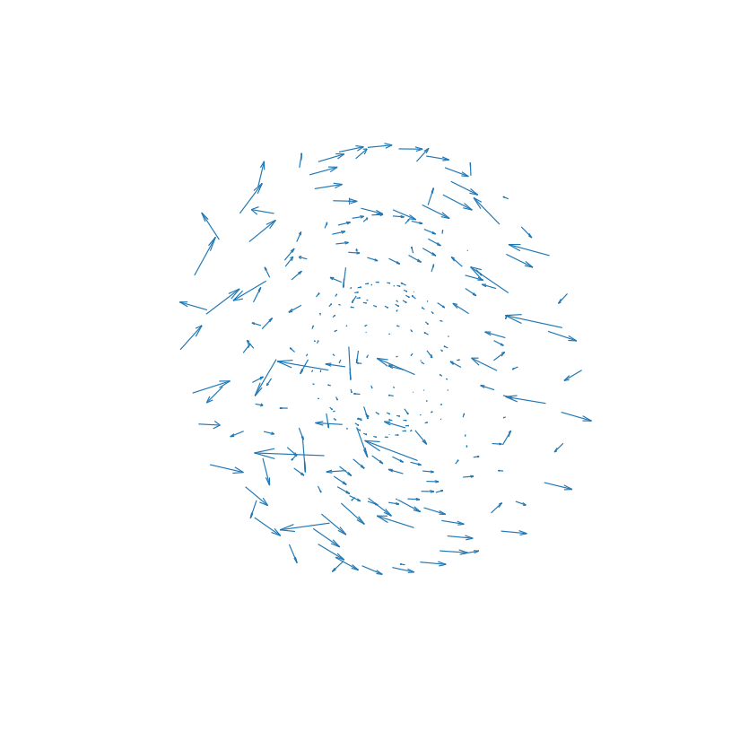
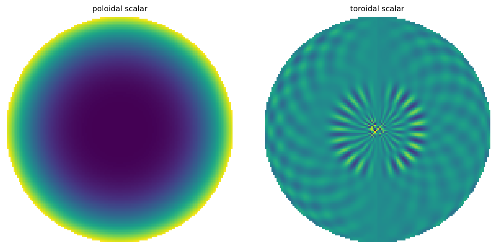
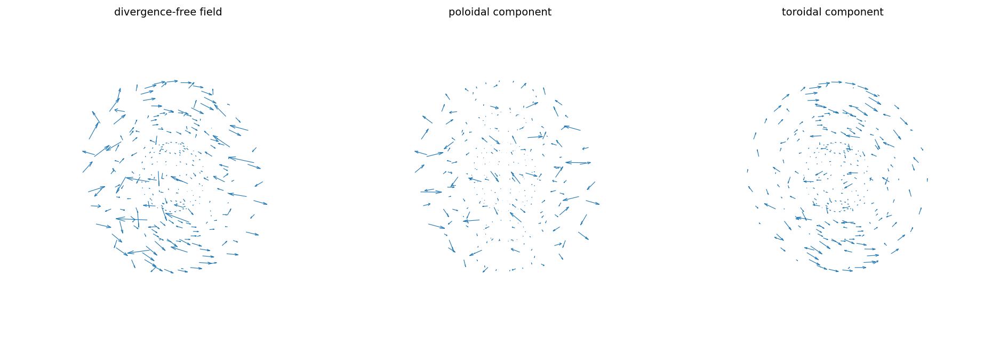

# Poloidal-toroidal decomposition of a vector field

[Original MATLAB Chebfun example](https://www.chebfun.org/examples/sphere/PTDecomposition.html)

(Chebfun example sphere/PTDecomposition.m)

A divergence-free vector field in the ball decomposes as

$$ \mathbf{w} = \nabla\times\nabla\times(P\mathbf{r})
+ \nabla\times(T\mathbf{r}) $$

with poloidal and toroidal scalars $P$, $T$. Starting from
$P_w = \cos(xy)$, $T_w = \sin(yz)$, `PT2ballfunv` builds the field:



It is divergence-free:

```text
ans =
     1.254165922535469e-10
```

(MATLAB publishes `4.162099210310871e-10` — ours slightly tighter.)
`PTdecomposition` recovers the scalars:



and the components:



The round-trip reproduces the field:

```text
ans =
     1.213020426529655e-12
```

(MATLAB: `1.281358965881723e-12` — matching to the same digit
class.)

---

*Replica script: [`examples/sphere/ptdecomposition_replica.py`](https://github.com/ma-gilles/chebfunjax/blob/main/examples/sphere/ptdecomposition_replica.py).
Original example copyright by The University of Oxford and The Chebfun
Developers.*
