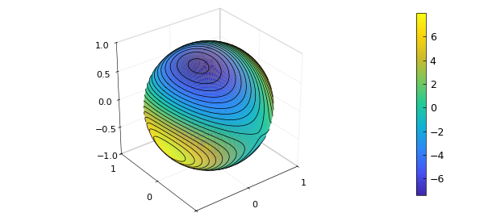
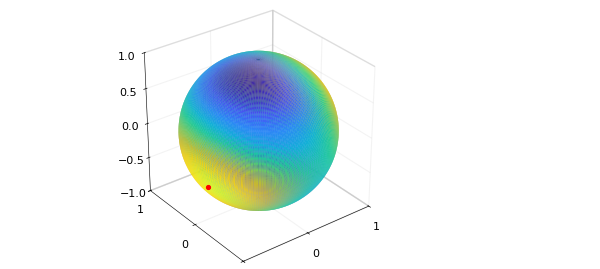
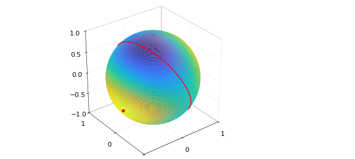
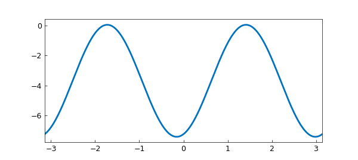
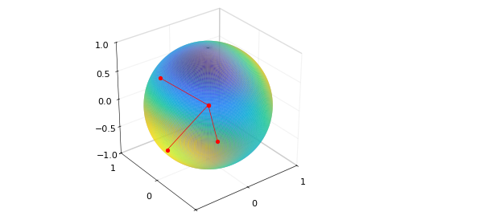
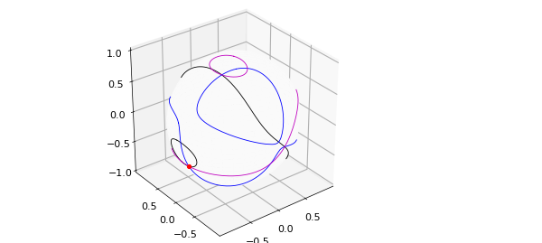

# Rayleigh quotient and the maximum principle for eigenvalues

*Grady Wright, February 2017*

[Original MATLAB Chebfun example](https://www.chebfun.org/examples/sphere/RayleighQuotientExample.html)

Python translation: [`examples/sphere/rayleighquotientexample.py`](https://github.com/ma-gilles/chebfunjax/blob/main/examples/sphere/rayleighquotientexample.py)

```matlab
MS = 'MarkerSize'; ms = 22; LW = 'LineWidth'; lw = 2;
```

## 1. Introduction

The Rayleigh quotient plays a key role in the study of eigenvalues of symmetric matrices. If $A$ is a real $n\mbox{-by-}n$ symmetric matrix then the Rayleigh quotient is defined as $$ r(x) = \frac{x^{T} A x}{x^T x}, $$ for any $n$-dimensional real vector $x\neq 0$. A key property of the Rayleigh quotient is that if $x$ is an eigenvector of $A$ then $r(x)$ gives the corresponding eigenvalue. Note that we can naturally extend the Rayleigh quotient to more general matrices, but our focus in this example is on real symmetric ones.

If we restrict our attention to unit vectors, i.e. $|x|=1$, then the Rayleigh quotient can simply be written $$ q(x) = x^{T} A x. $$ In this way, we can view the Rayleigh quotient as a function defined on the $(n-1)$-dimensional sphere. Here is an example for the 2-sphere:

```matlab
rng(52509);
A = 10*(2*rand(3)-1); A = 0.5*(A+A');
q = spherefun(@(x,y,z) [x,y,z]*A*[x;y;z],'vectorize');
plot(q), hold on, contour(q,20,'k-'), colorbar, hold off
```



## 2. Maximum principle

The following theorem tells us that the eigenvalues of $A$ are given by the maximum value of the restricted Rayleigh quotient $q$ on certain subspaces of the sphere.

_Theorem_(Maximum principle [2]) Let $A$ be a real $n\mbox{-by-}n$ symmetric matrix. The largest eigenvalue $\lambda_1$ of $A$ is given by $$ \lambda_1 = \max_{|x|=1} q(x) $$ and the location where this maximum occurs, $\lambda_1 = q(x_1)$, is the corresponding eigenvector. Furthermore, the remaining $n-1$ eigenvalues $\lambda_2 \geq \lambda_3 \geq \cdots \geq \lambda_n$, are given by $$ \lambda_k = \left{\max_{|x|=1} q(x) \bigr| <x,x_j> = 0,\; j=1,\ldots,k-1\right}, $$ where $x_j = q(\lambda_j)$ is the eigenvector corresponding $\lambda_j$.

Our goal in this example is to demonstrate this theorem in the case of the 2-sphere.

## 3. Demonstration of maximum principle

The theorem says that the largest eigenvalue of $A$, $\lambda_1$, is given by the maximum value of $q$. This can be computed this as follows:

```matlab
[lambda1,loc] = max2(q);
lambda1
```

```text
lambda1 =
   7.982732868198188
```

We can verify the result against MATLAB's `eig` function:

```matlab
lambdaA = sort(eig(A),1,'descend');
error = abs(lambdaA(1)-lambda1)
```

```text
error =
     7.105427357601002e-15
```

The entries of the corresponding eigenvector, $x_1$, are given by the Cartesian coordinates of the location of $\lambda_1$.

```matlab
s2c = @(u) [cos(u(1))*sin(u(2)); sin(u(1))*sin(u(2)); cos(u(2))];
x1 = s2c(loc);
plot(q), hold on
plot3(x1(1),x1(2),x1(3),'r.',MS,ms), hold off
```



The maximum principle theorem says that the next two eigenvalues of $A$ must lie on the great circle formed by the plane that is normal to $x_1$ and passes through the origin. This great circle can be parameterized and plotted as follows:

```matlab
xp = @(t) cos(loc(1))*cos(loc(2))*cos(t)-sin(loc(1))*sin(t);
yp = @(t) sin(loc(1))*cos(loc(2))*cos(t)+cos(loc(1))*sin(t);
zp = @(t) -sin(loc(2))*cos(t);

t = linspace(-pi,pi,501);
plot(q), hold on
plot3(xp(t),yp(t),zp(t),'r-',LW,lw)
plot3(x1(1),x1(2),x1(3),'r.',MS,ms), hold off
```



Let $f$ be equal to the value of $q$ on this great circle.

```matlab
f = chebfun(@(t) feval(q,xp(t),yp(t),zp(t)),[-pi pi],'trig');
plot(f,LW,lw)
```



The maximum value of $f$ on this great circle gives the next largest eigenvalue $\lambda_2$.

```matlab
[lambda2,loc] = max(f);
x2 = [xp(loc); yp(loc); zp(loc)];  % corresponding eigenvector
lambda2
error = abs(lambdaA(2)-lambda2)
```

```text
lambda2 =
   0.036664858944934
error =
     7.632783294297951e-17
```

According to the maximum principle theorem, the smallest eigenvalue, $\lambda_3$, is then given as the value of $q$ at the vector orthogonal to $x_2$ on the great circle. This is simply the value of $f$ shifted by $\pi/2$ from the location of $\lambda_2$ on the great circle.

```matlab
lambda3 = f(loc+pi/2);
x3 = [xp(loc+pi/2); yp(loc+pi/2); zp(loc+pi/2)]; % corresponding eigenvector
lambda3
error = abs(lambdaA(3)-lambda3)
```

```text
lambda3 =
  -7.428107401152658
error =
     4.440892098500626e-15
```

Here are the eigenvectors and locations of the values of the eigenvalues of $A$, together with a plot of $q$.

```matlab
plot(q), hold on
X = repmat([zeros(2,3);nan(1,3)],[3 1]);
X([2 5 8],:) = [x1';x2';x3'];
plot3(X(:,1),X(:,2),X(:,3),'r.-',LW,lw,MS,ms)
axis([-1 1 -1 1 -1 1]), alpha(0.8), hold off
```



## 4. Eigenvalues and the vanishing gradient of $q$

We conclude this example with a demonstration of another property of the restricted Rayleigh quotient related to the maximum principle theorem. The property is that the eigenvalues of $q$ occur where the surface gradient of $q$ vanishes [2]. To demonstrate this, we plot the zero-level curves of the three components of the surface gradient of $q$ together with the location of the eigenvalues.

```matlab
Gq = grad(q);
contour(Gq(1),[0 0],'k-'), hold on
contour(Gq(2),[0 0],'b-')
contour(Gq(3),[0 0],'m-'),
plot3(X(:,1),X(:,2),X(:,3),'r.-',LW,lw,MS,ms), hold off
```



## 7. References

[1] J. P. Keener, *Principles of Applied Mathematics: Transformation and Approximation*, Westview Press, 2000.

[2] L. N. Trefethen and D. Bau, III, *Numerical Linear Algebra*, SIAM, 1997.

---

*Translated with [chebfunjax](https://github.com/ma-gilles/chebfunjax); prose and MATLAB code from the original example, copyright The University of Oxford and The Chebfun Developers.  Printed outputs and figures are chebfunjax's.*
