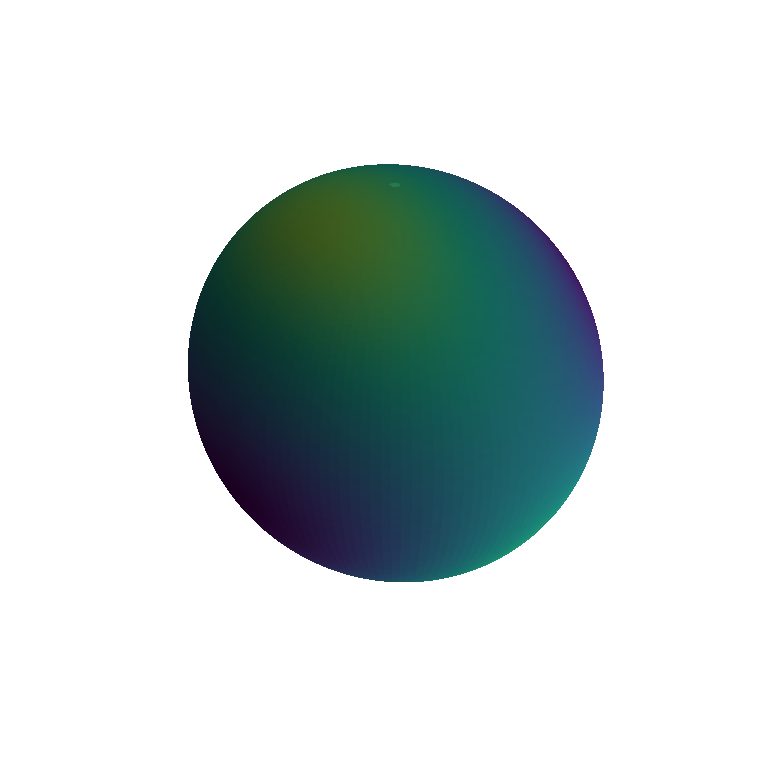
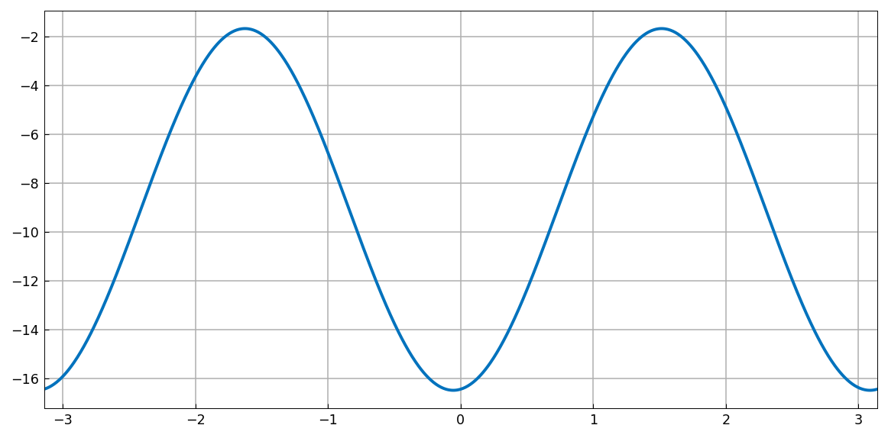

# The Rayleigh quotient on the sphere

[Original MATLAB Chebfun example](https://www.chebfun.org/examples/sphere/RayleighQuotientExample.html)

(Chebfun example sphere/RayleighQuotientExample.m)

The eigenvalues of a random symmetric $3\times3$ matrix $A$ recovered
by optimizing the Rayleigh quotient $q(\mathbf{x}) =
\mathbf{x}^TA\mathbf{x}$ over the unit sphere:



$\lambda_1$ is the global max, found with `max2`:

```text
lambda1 =
   10.949909253775568
error =
     3.552713678800501e-15
```

$\lambda_2$ is the max of $q$ restricted — as a trig chebfun — to
the great circle orthogonal to the first eigenvector:



```text
lambda2 =
   -1.672143774672077
error =
     3.552713678800501e-15
```

And $\lambda_3$ is a quarter turn further along the same circle:

```text
lambda3 =
  -16.490767815700611
error =
     7.105427357601002e-15
```

MATLAB publishes errors `8.88e-15`, `1.39e-17`, `2.66e-15` — the
same machine-precision class on all three ($A$ itself uses a numpy
seed since MATLAB's `rng(52509)` stream is not reproducible; the
errors against `eig(A)` are sample-independent identities).

---

*Replica script: [`examples/sphere/rayleighquotientexample_replica.py`](https://github.com/ma-gilles/chebfunjax/blob/main/examples/sphere/rayleighquotientexample_replica.py).
Original example copyright by The University of Oxford and The Chebfun
Developers.*
