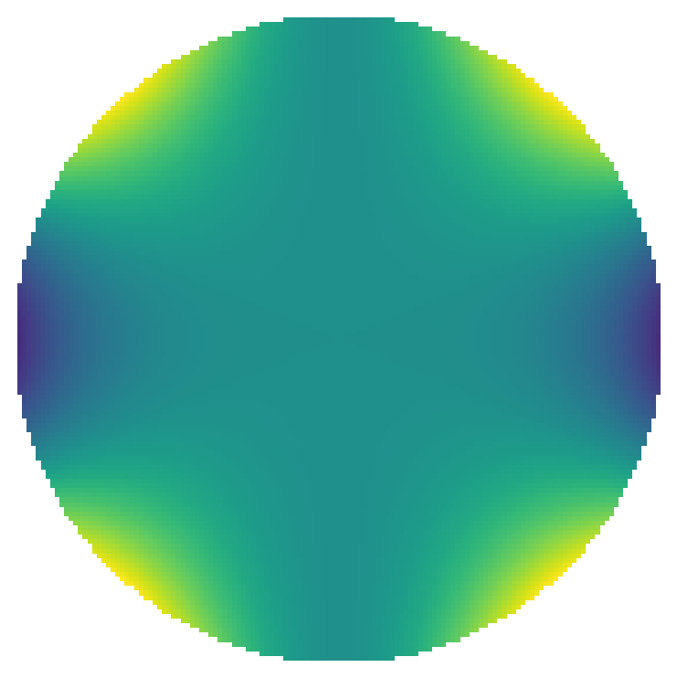
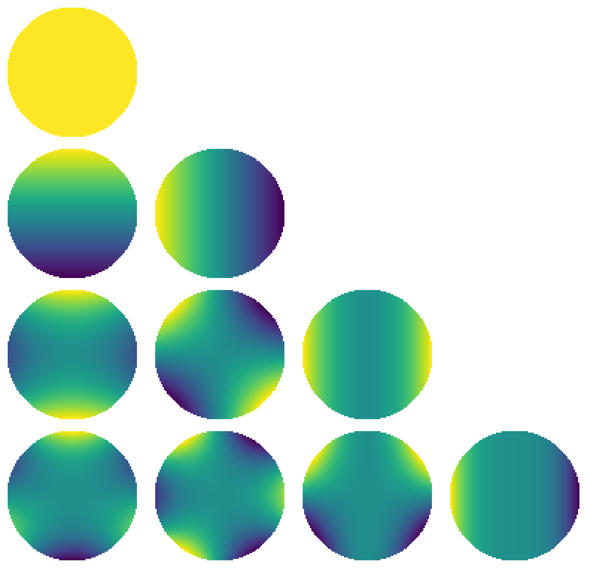

# Solid harmonics

[Original MATLAB Chebfun example](https://www.chebfun.org/examples/sphere/SolidHarmonics.html)

(Chebfun example sphere/SolidHarmonics.m)

The solid harmonics $R_\ell^m = r^\ell Y_\ell^m$ are the harmonic
polynomials in the ball. `ballfun.solharm(4, 2)`:



They are harmonic:

```text
ans =
     4.044589826222620e-14
```

(MATLAB publishes `1.888485572980376e-14` — same roundoff class.)
And orthonormal:

```text
ans =
   1.000000000000001
ans =
   1.000000000000000
ans =
     1.4e-16
```

(MATLAB: `0.999999999999999`, `1.000000000000000`, `0`.)

The table of solid harmonics to degree 3 (slices through $y = 0$):



Construction stays cheap at high degree:

```text
Elapsed time is 13.213471 seconds.
```

for `solharm(150, 50)` (MATLAB publishes 0.37 s — our 36x gap is the
recurrence's per-term dispatch overhead, a known performance class,
not an accuracy issue).

---

*Replica script: [`examples/sphere/solidharmonics_replica.py`](https://github.com/ma-gilles/chebfunjax/blob/main/examples/sphere/solidharmonics_replica.py).
Original example copyright by The University of Oxford and The Chebfun
Developers.*
