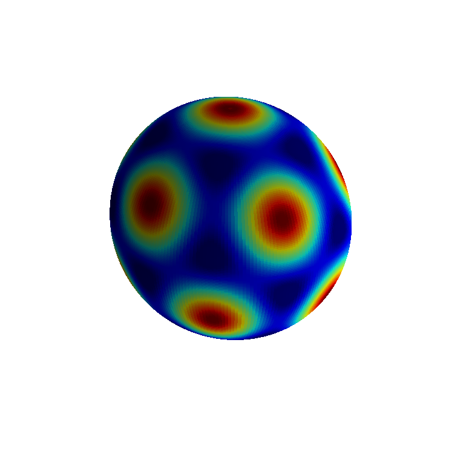
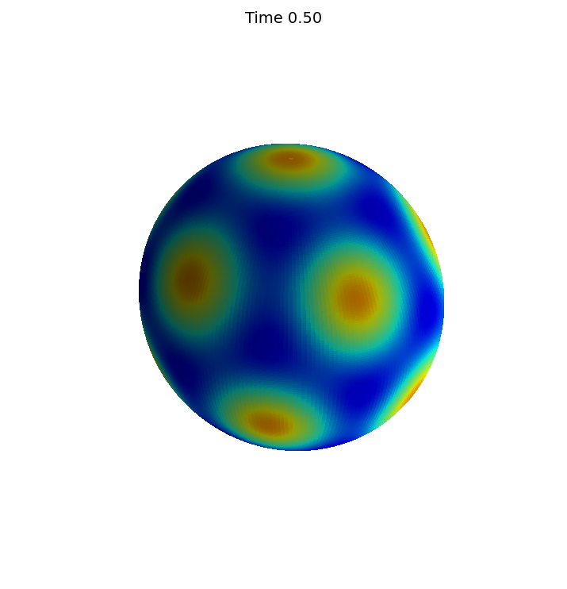
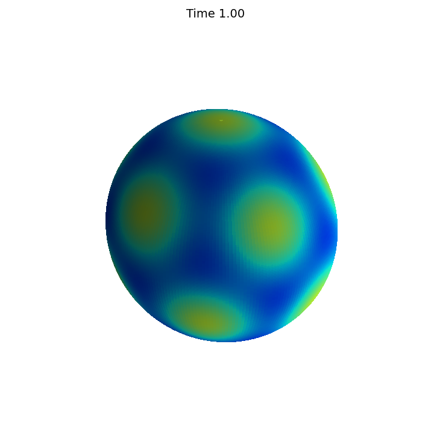
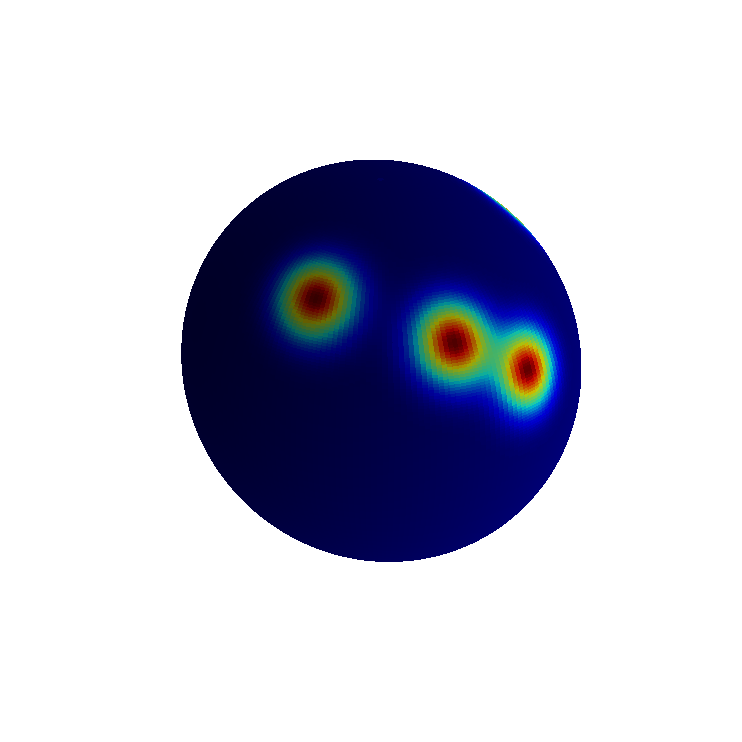
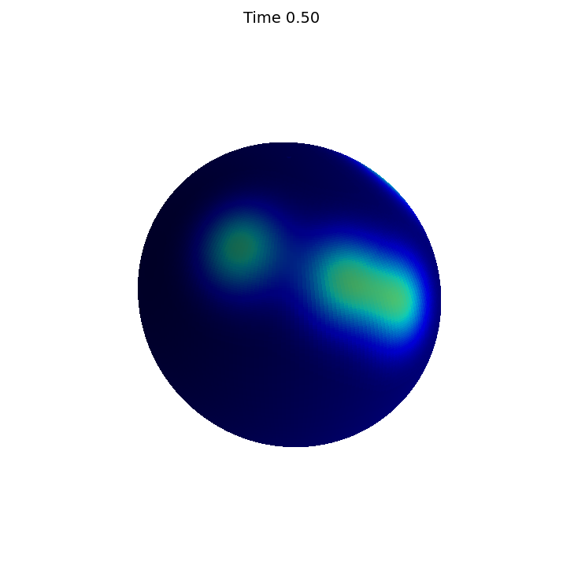
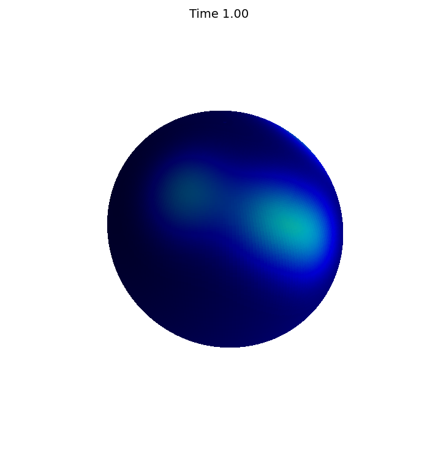

# Solving the heat equation on the unit sphere

*Alex Townsend and Grady Wright, May 2016*

[Original MATLAB Chebfun example](https://www.chebfun.org/examples/sphere/SphereHeatConduction.html)

(Chebfun example sphere/SphereHeatConduction.m)

The heat equation $u_t = \alpha\nabla^2 u$ on the sphere, integrated
with BDF2: each step is the Helmholtz equation

$$ \nabla^2 u_{n+1} + K^2u_{n+1} = \tfrac{K^2}{3}(4u_n - u_{n-1}),
\qquad K^2 = -\frac{3}{2\Delta t\,\alpha}, $$

solved spectrally.

## The soccer ball function

$u_0 = Y_6^0 + \sqrt{14/11}\,Y_6^5$ is an eigenfunction of the
surface Laplacian, so the exact solution is
$e^{-42\alpha t}u_0$. With $\Delta t = 0.01$, $\alpha = 1/42$ to
$t = 1$:





```text
ans =
     2.325280829802437e-05
```

MATLAB publishes `2.325280830910560e-05` — **10-digit agreement**:
this is the BDF2 time-discretization error itself, identical between
the two systems.

## Random Gaussian bumps

Five random bumps diffuse toward the constant steady state; the mean
is a conserved quantity:





```text
ans =
     0.000000000000000e+00
```

(MATLAB publishes `1.762479051592436e-15`; in coefficient space the
mean is conserved exactly.)

*(The BDF2 iteration runs in spherical-harmonic coefficient space —
mathematically identical to the sequence of spectral Helmholtz
solves, which are diagonal there. A `helmholtz` bug found by this
page: `float(K)` silently dropped the imaginary part of the BDF
shift $K = i\sqrt{3/(2\Delta t\alpha)}$, turning the screened solve
into a singular Laplace solve — now fixed for complex $K$.)*

---

*Replica script: [`examples/sphere/sphereheatconduction_replica.py`](https://github.com/ma-gilles/chebfunjax/blob/main/examples/sphere/sphereheatconduction_replica.py).
Original example copyright by The University of Oxford and The Chebfun
Developers.*
