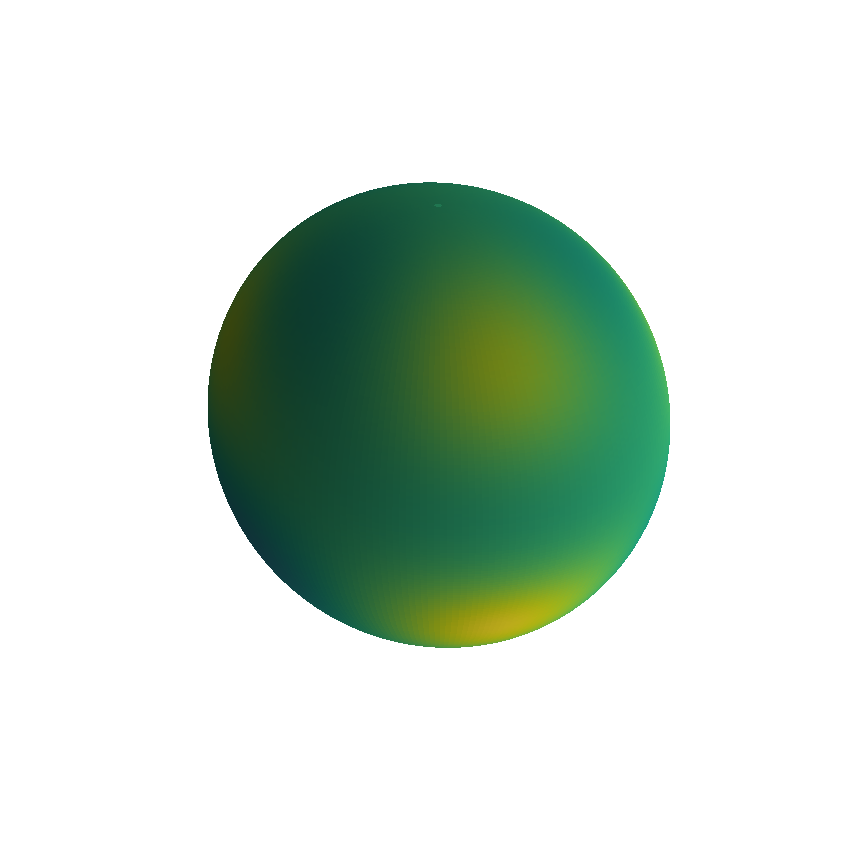
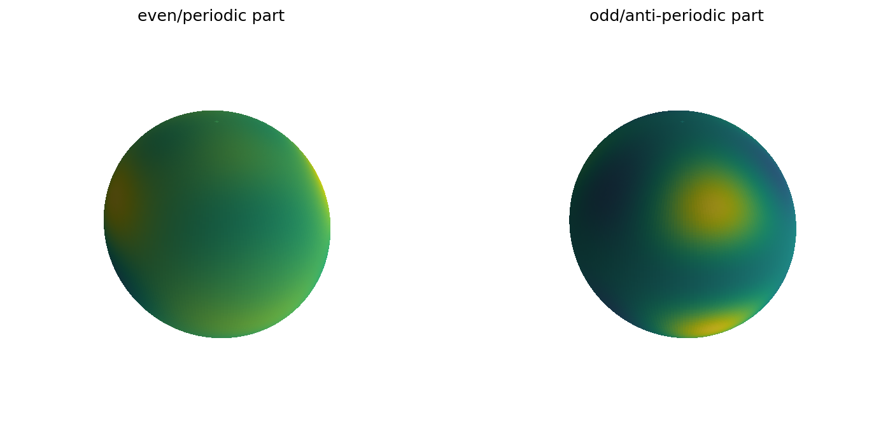
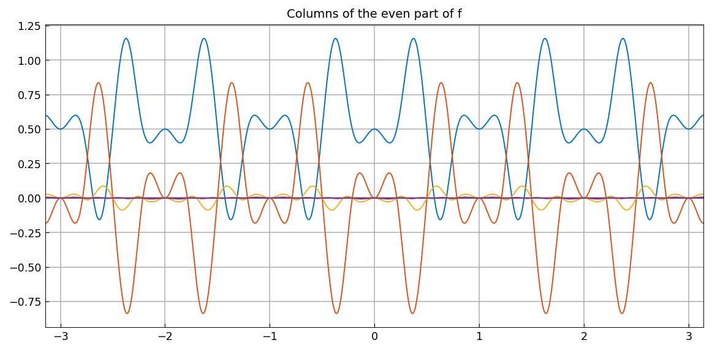
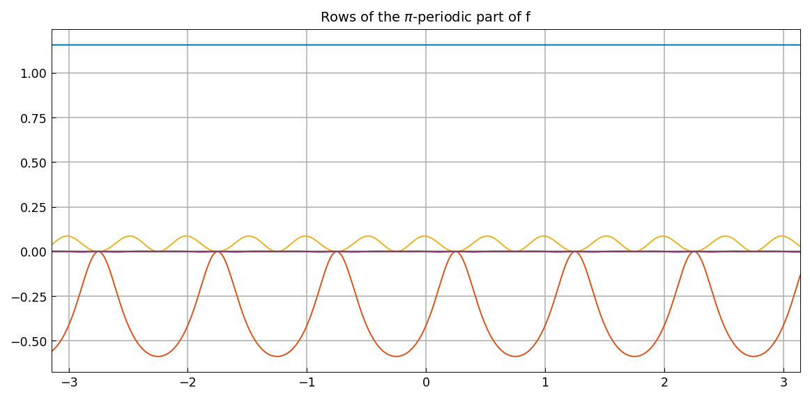
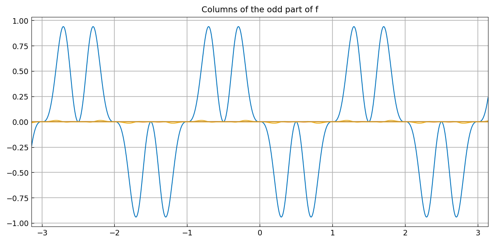
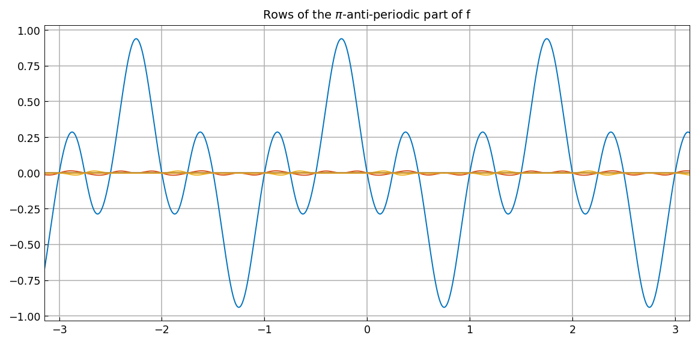

# Parity partitioning a spherefun

*Behnam Hashemi, November 2016*

[Original MATLAB Chebfun example](https://www.chebfun.org/examples/sphere/SpherefunPartition.html)

(Chebfun Example sphere/SpherefunPartition.m)

A spherefun is a sum of two spherefuns, one even/$\pi$-periodic and
one odd/$\pi$-anti-periodic — the two symmetry classes of the
block-mirror-centrosymmetric (BMC) structure. For
$f = 0.5 + \sinh(5xyz)\cos(x-y+2z)$:



```text
f rank: 21
fep rank: 11
foa rank: 10
err =
     0
```

MATLAB publishes ranks `21 → 11 + 10` and `err = 0` — **identical**,
including the exact rank split of the CDR decomposition.



The columns of `fep` are even and its rows are $\pi$-periodic (not
just $2\pi$); the columns of `foa` are odd and its rows are
$\pi$-anti-periodic:






The integral of a spherefun equals the integral of its
even/$\pi$-periodic piece:

```text
sum_f =
   6.283185307179586
sum_foa =
     0
sum_fep =
   6.283185307179586
```

— all three exactly as published (the integral is $2\pi$).

---

*Replica script: [`examples/sphere/spherefunpartition_replica.py`](https://github.com/ma-gilles/chebfunjax/blob/main/examples/sphere/spherefunpartition_replica.py).
Original example copyright by The University of Oxford and The Chebfun
Developers.*
