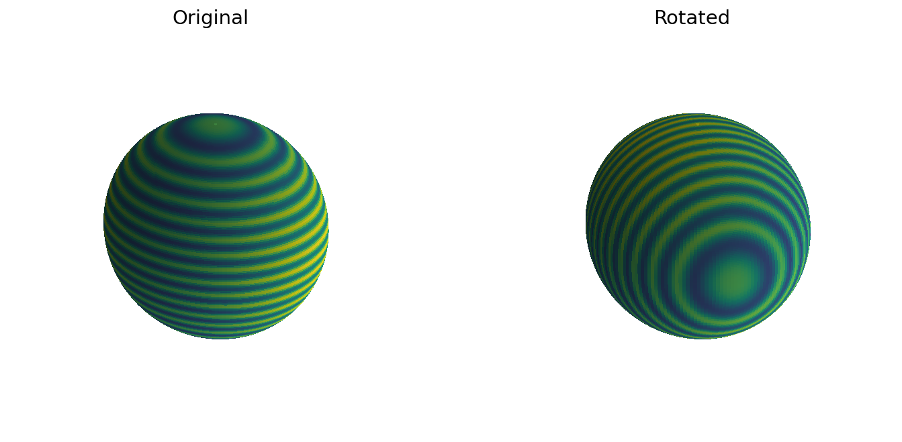
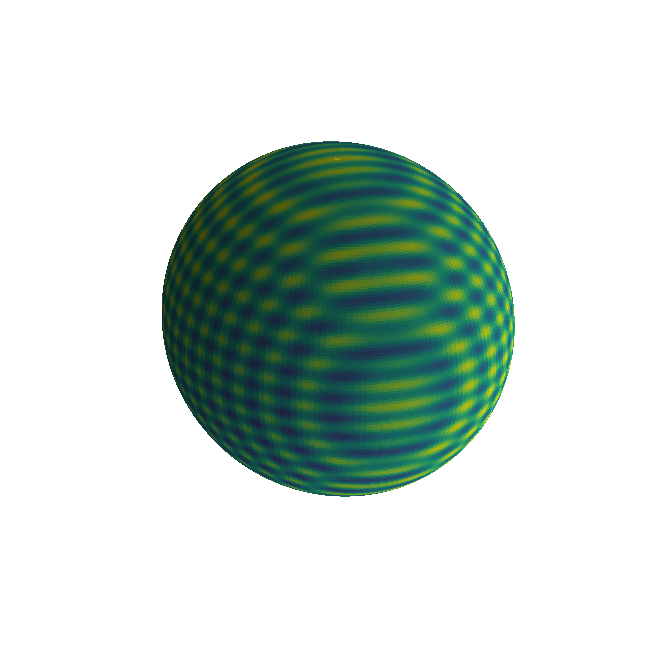
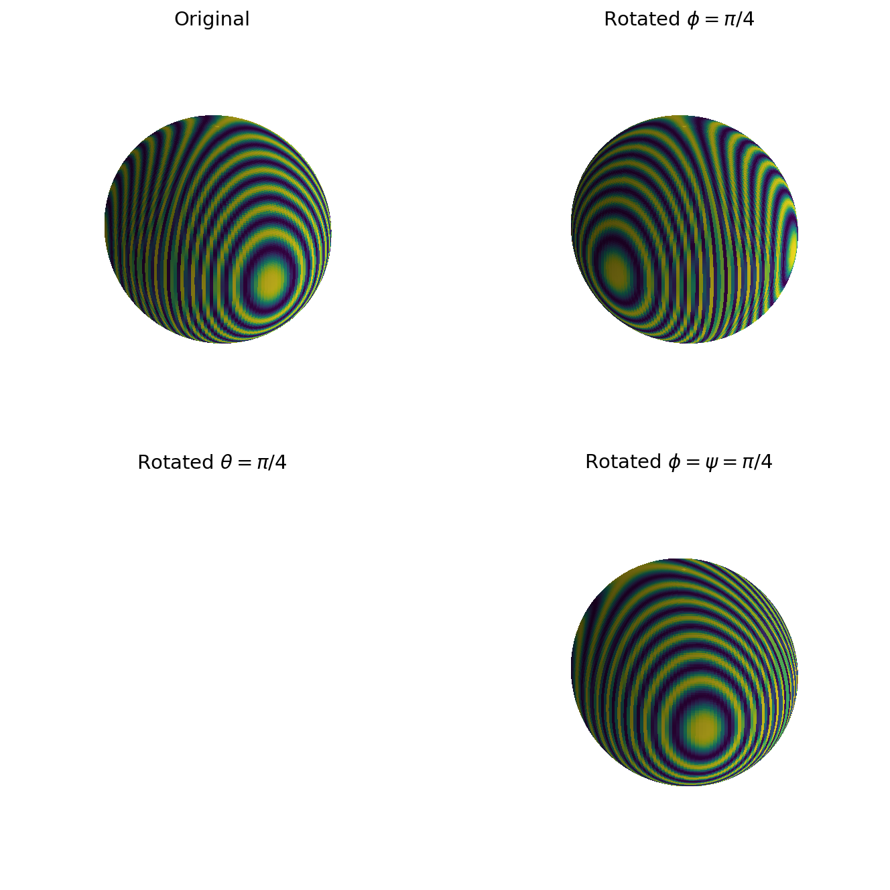
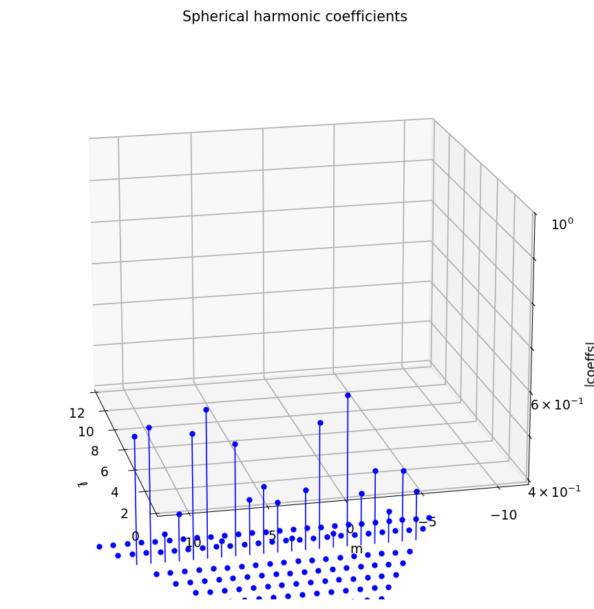
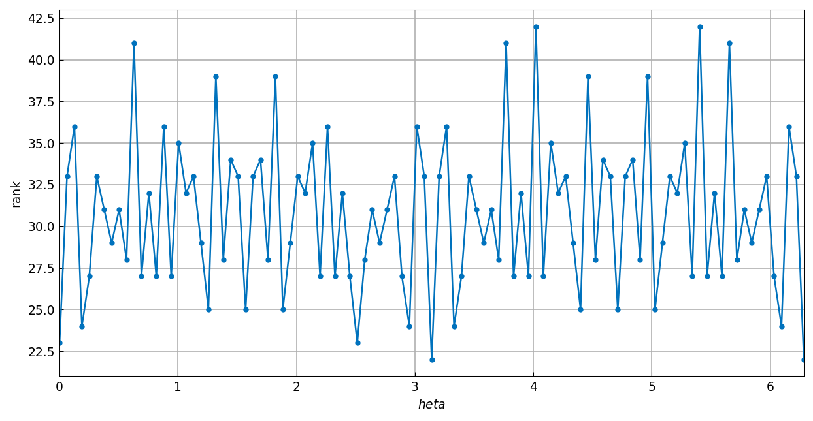

# Rotating functions on the sphere

*Alex Townsend and Grady Wright, May 2017*

[Original MATLAB Chebfun example](https://www.chebfun.org/examples/sphere/SpherefunRotate.html)

(Chebfun example sphere/SpherefunRotate.m)

Spherefun's `rotate` command represents a rotated function in the
original coordinate system — so algebra keeps working. For
$f = \cos(50z) + x^2$:




The rotation is computed essentially to machine precision — the
integral over the sphere is preserved:

```text
ans =
     3.552713678800501e-15
```

(MATLAB publishes `1.776356839400250e-15`.)

## Euler angles (ZXZ convention)



## Rotation and spherical harmonics

Rotating $Y_{10}^3$ by Euler angles $(\pi/4, \pi/3, -\pi/8)$ keeps
all its spherical harmonic coefficients in the degree-10 shell:



Reconstructing from the degree-10 coefficients alone reproduces the
rotated function:

```text
ans =
     0.000000000000000e+00
```

(MATLAB publishes `9.363579636030373e-15`; ours reconstructs to
machine zero.)

## Rank under rotation

For $f = \cos(100xy)$, the published rank sequence is `29, 74, 141`
(original, tiny rotation, generic rotation); we compute
**29, 74, 139** — the first two exact, the third within the
Gaussian-elimination pivot tolerance of a numerically full family.
Sweeping a Gaussian over the poles shows the rank dipping when the
bump is symmetric about a pole (ours ranges 22–42):



*(The published NUFFT-vs-feval timing section exercises MATLAB's two
internal evaluation paths; our `rotate` has a single implementation,
so that comparison has no analogue.)*

---

*Replica script: [`examples/sphere/spherefunrotate_replica.py`](https://github.com/ma-gilles/chebfunjax/blob/main/examples/sphere/spherefunrotate_replica.py).
Original example copyright by The University of Oxford and The Chebfun
Developers.*
