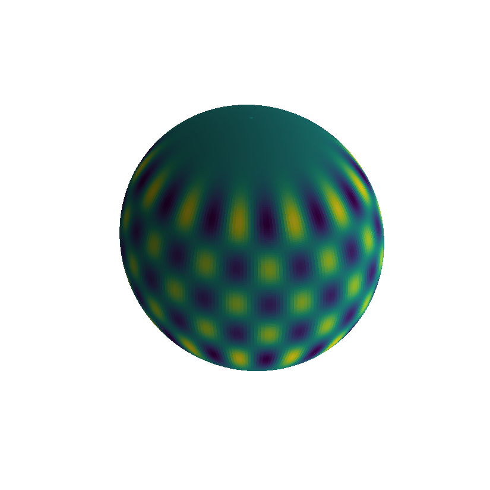
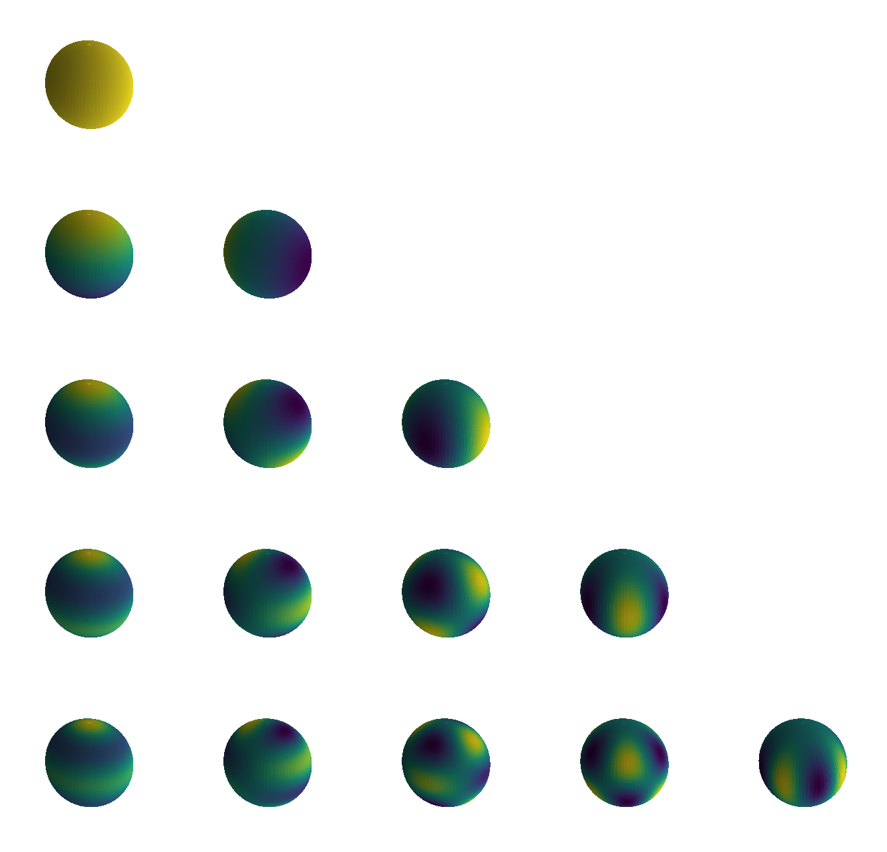
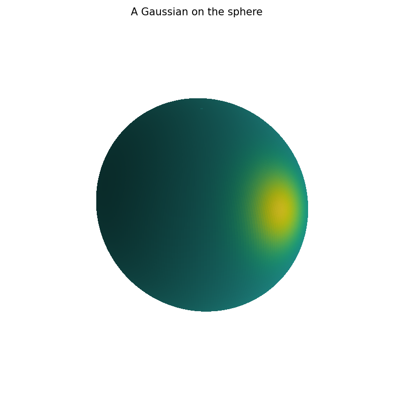
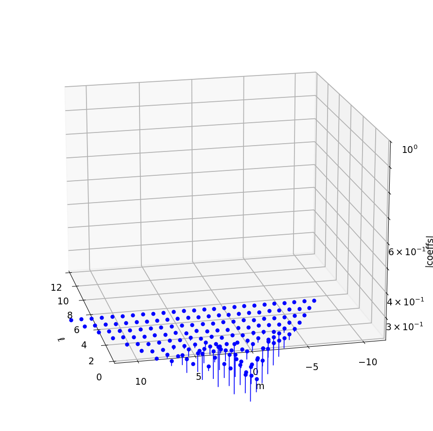
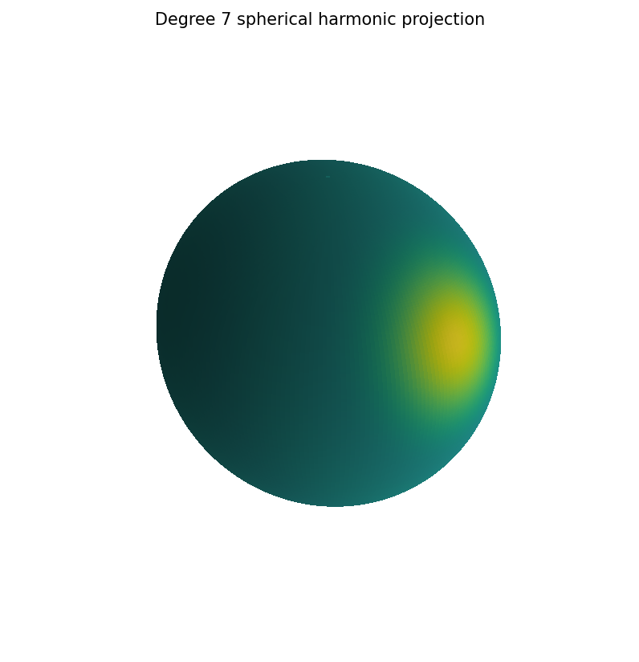
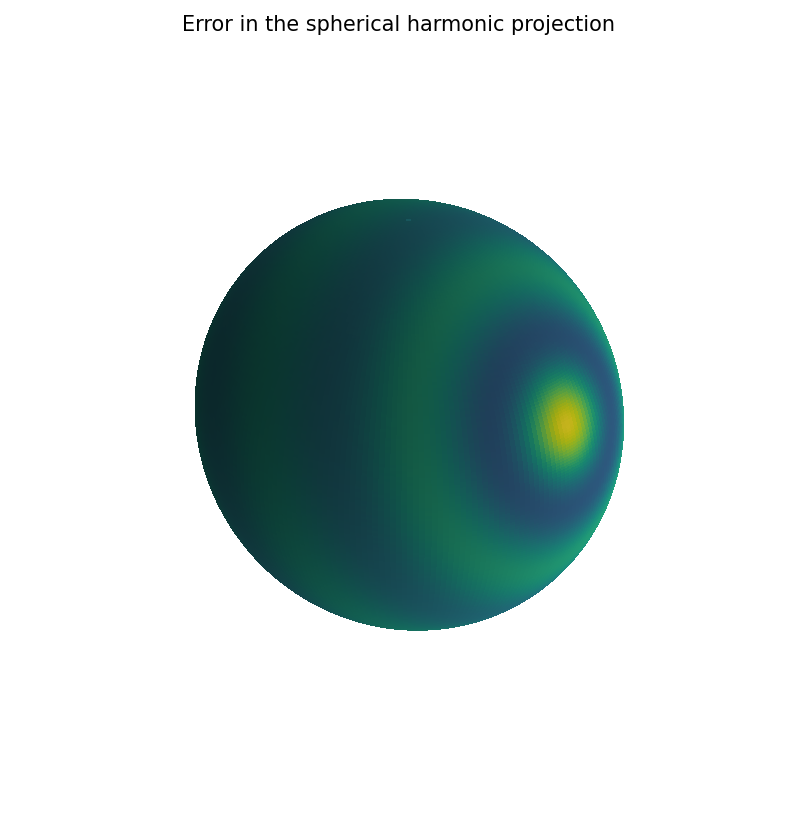

# Spherical harmonics

*Alex Townsend and Grady Wright, May 2016*

[Original MATLAB Chebfun example](https://www.chebfun.org/examples/sphere/SphericalHarmonics.html)

(Chebfun example sphere/SphericalHarmonics.m)

Spherical harmonics $Y_\ell^m$ are the eigenfunctions of the
Laplace–Beltrami operator, $\Delta Y_\ell^m = -\ell(\ell+1)Y_\ell^m$.
Spherefun doesn't rely on them — it uses the double Fourier sphere
method with low-rank approximation — but provides them via
`sphharm`.

## Y₁₇¹³ and its eigen-identity



```text
ans =
     0
```

`norm(laplacian(Y17) - (-17·18)Y17)` returns **exactly 0**, matching
the published output exactly. Orthonormality:

```text
ans =
     4.404979072326695e-16
ans =
   1.000000000000000
ans =
   1.000000000000001
```

(MATLAB: `3.05e-16`, `1.000000000000000`, `0.999999999999994`.)

## The harmonic table to degree 4



## Analysis of a Gaussian

A Gaussian bump at a random point on the sphere and its spherical
harmonic coefficients through degree 12 (computed with Gauss–Legendre
× trapezoid quadrature and the direct harmonic evaluator):




The degree-7 projection and its error:




```text
ans =
     3.829765578921793e-02
```

MATLAB publishes `0.038297655789218` — **agreement in all 14
digits**. (The Gaussian's random center differs from MATLAB's
`rng(10)` draw, but the projection error is rotation-invariant in the
center, so this is a genuine end-to-end parity check of the
construction, quadrature, projection, and norm.)

> **A library bug this page found.** `sphharm(l, m)` was silently
> *aliased* for $m \ge 13$: the adaptive constructor's first happy
> grid has 16 longitude points, where $\cos(13\lambda)$ aliases to
> $\cos(3\lambda)$ with both directions self-consistently wrong — the
> Laplacian identity failed by $O(100)$ while orthonormality still
> held. `sphharm` now sizes its construction grid from the known
> degree; the general missing sample-test in the constructor is
> recorded in the audit ledger.

---

*Replica script: [`examples/sphere/sphericalharmonics_replica.py`](https://github.com/ma-gilles/chebfunjax/blob/main/examples/sphere/sphericalharmonics_replica.py).
Original example copyright by The University of Oxford and The Chebfun
Developers.*
