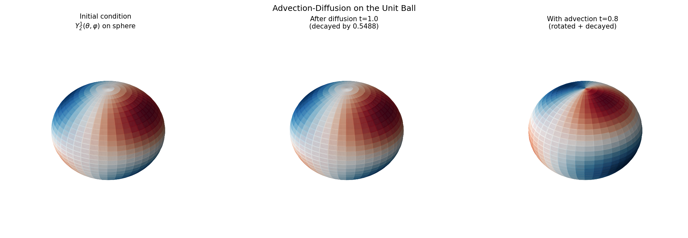

# Advection-Diffusion on the Sphere

**Original:** [sphere/AdvectionDiffusion](https://www.chebfun.org/examples/sphere/AdvectionDiffusion.html)
**Author(s):** Nicolas Boulle, July 2019

---

Y_2^1 decays by exp(-6κt) under diffusion; advection rotates the pattern.

## Code

```python
from examples.sphere.advection_diffusion import run
run()
```

## Output


