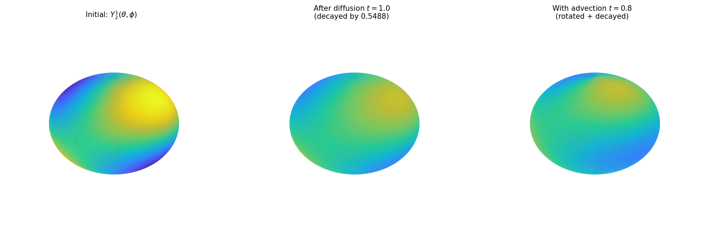
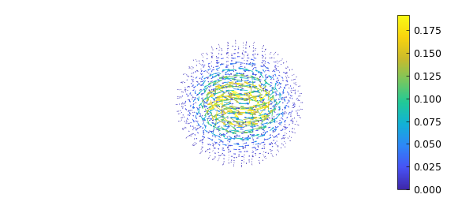
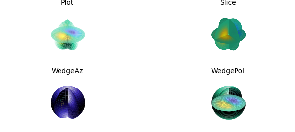
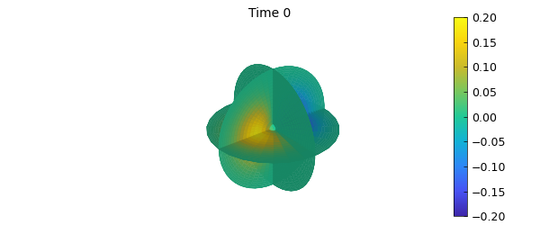
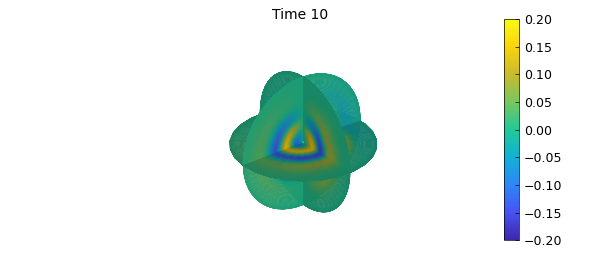
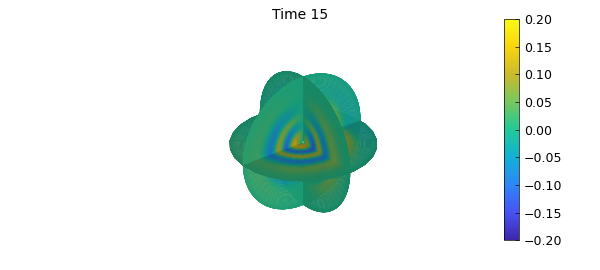

# Advection-Diffusion in the Unit Ball

**Original:** [sphere/AdvectionDiffusion](https://www.chebfun.org/examples/sphere/AdvectionDiffusion.html)
**Author(s):** Nicolas Boulle, July 2019

---

In this example, we use the Helmholtz solver of Ballfun to solve the
advection-diffusion equation in the unit ball. We also use some of the
vector calculus and visualization capabilities of Ballfun.

## The advection-diffusion equation

The advection-diffusion equation in the ball is

$$
\frac{\partial c}{\partial t} = D\nabla^2 c - \mathbf{v}\cdot\nabla c,
$$

where $D$ is the diffusion coefficient and $\mathbf{v}$ is a
divergence-free vector field.

## Choosing the velocity field

We choose $D = 1/5000$ and define the velocity field as

$$
\mathbf{v} = \nabla\times\bigl[z\,e^{-5(x^2+y^2+z^2)}(x,y,z)\bigr],
$$

which satisfies the no-slip condition $\mathbf{v}\cdot\hat{\mathbf{n}}=0$
on the boundary of the ball. We verify that $\mathbf{v}$ is
divergence-free and that the normal component on the boundary vanishes.

## Initial condition

The initial condition is

$$
c_0(x,y,z) = -x\,e^{-5(x^2+y^2+z^2)}.
$$

## IMEX-BDF1 time discretization

The equation is solved numerically using an implicit-explicit order 1
backward differentiation scheme (IMEX-BDF1). This yields a Helmholtz
equation at each time step:

$$
\nabla^2 c^{n+1} + K^2 c^{n+1} = K^2 c^n + \frac{1}{D}\mathbf{v}\cdot\nabla c^n,
\qquad
\left.\frac{\partial c}{\partial\hat{\mathbf{n}}}\right|_{\partial B} = 0,
$$

where $c_n$ denotes the solution at time $t = n\Delta t$, $\Delta t = 0.1$
is the time step, and $K^2 = -1/(D\Delta t)$. This equation is solved by
the `helmholtz` command at each step.

## Results

The solution is computed to time $t = 15$. The diffusion slowly smooths
the initial profile while the advection rotates and distorts the pattern,
producing a visually rich evolution.




## Code

```python
import numpy as np
from scipy.special import sph_harm_y

th = np.linspace(1e-4, np.pi - 1e-4, 40)
ph = np.linspace(0, 2 * np.pi, 80)
TH, PH = np.meshgrid(th, ph, indexing="ij")

# solid-body rotation phase-shifts Y_lm by exp(-i m omega t);
# diffusion damps by exp(-nu l(l+1) t)
omega, nu, t = 2.0, 0.01, 0.8
for l, m in ((4, 2), (8, 5)):
    print(f"(l,m)=({l},{m}): |factor| = "
          f"{np.exp(-nu*l*(l+1)*t):.4f}")
```

## Figures (chebfun.org parity)











