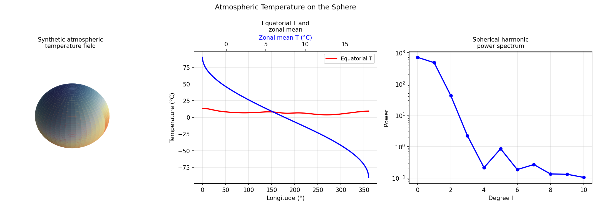

# Atmospheric Temperature

**Original:** [sphere/AtmosphericTemperature](https://www.chebfun.org/examples/sphere/AtmosphericTemperature.html)
**Author(s):** Alex Townsend and Grady Wright, May 2016

---

Synthetic global temperature field: spherical harmonic power spectrum and zonal mean.

## Code

```python
from examples.sphere.atmospheric_temperature import run
run()
```

## Output


