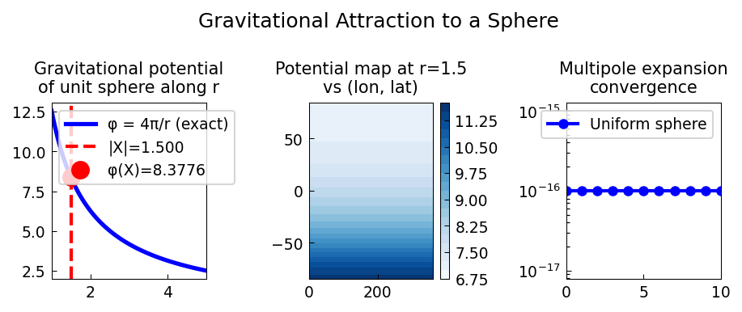

# Gravitational Attraction to a Sphere

**Original:** [sphere/Gravity](https://www.chebfun.org/examples/sphere/Gravity.html)
**Author(s):** Nick Trefethen, May 2016

---

## A little geometry

Consider a vector $\mathbf{X}$ with 2-norm 1.5, representing a spacecraft
in orbit around the unit sphere. Using the vector-valued part of
Spherefun, we define the field of vector distances between $\mathbf{X}$
and points on the sphere:

$$
\mathbf{d}(x,y,z) = \mathbf{X} - (x, y, z),
$$

and the scalar distance function $r = |\mathbf{d}|$. The closest point on
the sphere to $\mathbf{X}$ is at distance 0.5 and the farthest at
distance 2.5.

## Inverse-square force

A great discovery of Newton (or was it Hooke?) is that the gravitational
forces associated with a sphere of uniform mass distribution are the same
as if all the mass were concentrated at the center. Accordingly, if a
unit mass is spread uniformly around the sphere and the spacecraft also
has unit mass, the inverse-square attraction should be $(1.5)^{-2}$.

Since the area of the sphere is $4\pi$, the density of a uniformly
distributed mass is

$$
\rho = \frac{1}{4\pi}.
$$

The component of the force at each surface point, in the direction of
$\mathbf{X}$, is

$$
F(\mathbf{x}) = \rho\,\frac{\hat{\mathbf{X}}\cdot\mathbf{d}(\mathbf{x})}{r(\mathbf{x})^3},
$$

where $\hat{\mathbf{X}} = \mathbf{X}/|\mathbf{X}|$. Integrating over the
sphere confirms Newton's shell theorem:

$$
\int_{S^2} F\,dS = \frac{1}{|\mathbf{X}|^2} = \frac{1}{1.5^2} \approx 0.4444.
$$




## Code

```python
from examples.sphere.gravity import run
run()
```
