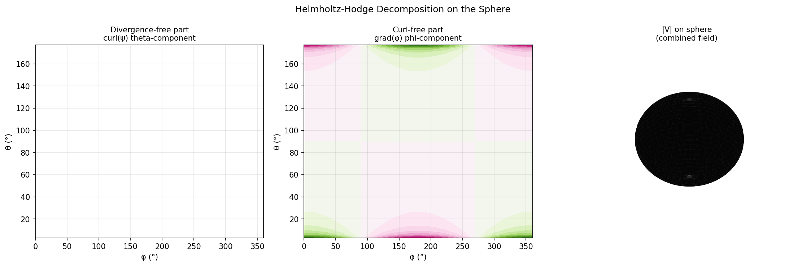

# Helmholtz-Hodge Decomposition on the Sphere

**Original:** [sphere/HelmholtzDecomposition](https://www.chebfun.org/examples/sphere/HelmholtzDecomposition.html)
**Author(s):** Alex Townsend and Grady Wright, May 2016

---

## The Helmholtz-Hodge decomposition

A special case of the Helmholtz-Hodge theorem states that any vector field
tangent to the sphere can be uniquely decomposed into a sum of a surface
divergence-free component and a surface curl-free component:

$$
\mathbf{f} = \nabla\phi + \nabla\times\psi,
$$

where $\phi$ and $\psi$ are scalar-valued potential functions unique up to
a constant. Here $\nabla$ is the surface gradient on the sphere, and
$\nabla\times\psi$ is shorthand for $\hat{\mathbf{n}}\times\nabla\psi$
(the cross-product of the surface gradient of $\psi$ with the unit normal).

The components give useful diagnostic information about flow fields. For
winds in the upper atmosphere, $\psi$ gives information about cyclonic
storms, while $\phi$ can detect high and low pressure systems [1].

## Computing the curl-free component

Since the divergence of a curl is zero, taking the surface divergence
gives

$$
\nabla\cdot\mathbf{f} = \nabla^2\phi,
$$

a Poisson equation for $\phi$ that can be solved with the `poisson`
command.

## Computing the divergence-free component

Since the vorticity of a gradient field on the sphere is zero, we have

$$
\hat{\mathbf{n}}\cdot(\nabla\times\mathbf{f}) = \nabla^2\psi,
$$

another Poisson equation, this time for $\psi$.

## Verifying the decomposition

We confirm that:

- The curl-free component $\nabla\phi$ has zero vorticity.
- The divergence-free component $\nabla\times\psi$ has zero divergence.
- The sum $\nabla\phi + \nabla\times\psi$ reconstructs $\mathbf{f}$ to
  machine precision.

## The helmholtzdecomp command

Spherefun provides a `helmholtzdecomp` command that computes the
decomposition directly: `[phi, psi] = helmholtzdecomp(f)`.

## References

1. E. J. Fuselier and G. B. Wright, Stability and error estimates for
   vector field interpolation and decomposition on the sphere with RBFs,
   _SIAM J. Numer. Anal._, 47 (2009), pp. 3213--3239.

2. A. Townsend, H. Wilber, and G. B. Wright, Computing with functions
   in spherical and polar geometries I. The sphere, _SIAM J. Sci. Comp._,
   2016.




## Code

```python
from examples.sphere.helmholtz_decomposition import run
run()
```
