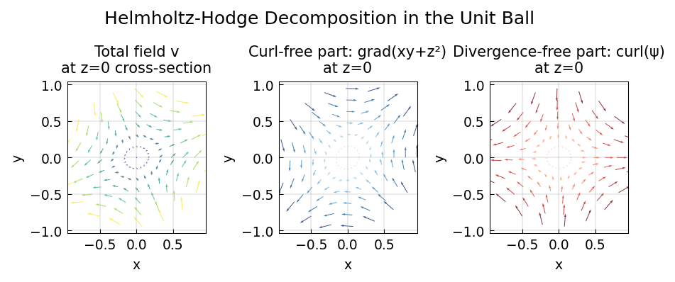

# Helmholtz-Hodge Decomposition in the Ball

**Original:** [sphere/HelmholtzDecompositionBall](https://www.chebfun.org/examples/sphere/HelmholtzDecompositionBall.html)
**Author(s):** Nicolas Boulle and Alex Townsend, May 2019

---

## The Helmholtz-Hodge decomposition

Helmholtz's theorem states that any sufficiently smooth vector field in
the unit ball can be expressed as a sum of a curl-free, a divergence-free,
and a harmonic vector field [4]:

$$
\mathbf{v} = \nabla f + \nabla\times\boldsymbol{\psi} + \nabla\phi,
$$

where $f$ and $\phi$ are scalar-valued potential functions and
$\boldsymbol{\psi}$ is a vector field. The first term $\nabla f$ is a
gradient field (hence curl-free), the second term
$\nabla\times\boldsymbol{\psi}$ is solenoidal (divergence-free), and
the third term $\nabla\phi$ is harmonic (the vector Laplacian of
$\nabla\phi$ is zero, because $\phi$ itself is harmonic: $\Delta\phi=0$).

The decomposition is made unique by imposing:

1. $f = 0$ on the boundary of the unit ball.
2. The normal component of $\boldsymbol{\psi}$ on the boundary is zero.
3. $\boldsymbol{\psi}$ is divergence-free.

This decomposition is an important tool in fluid dynamics, used for
compressible flow visualization, CFD simulations (to impose
incompressibility), and topological analysis [2].

## Computing the curl-free component

Since $\nabla\cdot(\nabla\times\boldsymbol{\psi})=0$ and $\phi$ is
harmonic, taking the divergence gives

$$
\nabla\cdot\mathbf{v} = \nabla^2 f.
$$

This Poisson equation with zero Dirichlet boundary conditions defines $f$.

## Computing the harmonic component

After subtracting $\nabla f$, we solve the Laplace equation
$\Delta\phi = 0$ with Neumann boundary conditions

$$
\left.\frac{\partial\phi}{\partial r}\right|_{\partial B}
= \hat{\mathbf{n}}\cdot\mathbf{v}^{(1)}\big|_{\partial B},
$$

where $\mathbf{v}^{(1)} = \mathbf{v} - \nabla f$.

## Computing the divergence-free component

The remaining field $\mathbf{v}^{(2)} = \mathbf{v}^{(1)} - \nabla\phi =
\nabla\times\boldsymbol{\psi}$ is divergence-free. Using the
poloidal-toroidal decomposition of both $\mathbf{v}^{(2)}$ and
$\boldsymbol{\psi}$, we obtain a system of equations for the PT scalars
of $\boldsymbol{\psi}$.

## Verification

As a sanity check, we confirm that

$$
\|\mathbf{v} - (\nabla f + \nabla\times\boldsymbol{\psi} + \nabla\phi)\|
\approx 0.
$$

## References

1. G. Backus, Poloidal and toroidal fields in geomagnetic field modelling,
   _Reviews of Geophysics_, 24 (1986), pp. 75--109.

2. H. Bhatia, G. Norgard, V. Pascucci, and P.-T. Bremer, The
   Helmholtz-Hodge decomposition -- A survey, _IEEE Trans. Vis. Comput.
   Graphics_, 19 (2013), pp. 1386--1404.

3. N. Boulle and A. Townsend, Computing with functions on the ball,
   in preparation.

4. Y. Tong, S. Lombeyda, A. Hirani, and M. Desbrun, Discrete multiscale
   vector field decomposition, _ACM Trans. Graphics_, 22 (2003),
   pp. 445--452.

## Code

```python
from examples.sphere.helmholtz_decomposition_ball import run
run()
```

## Output


