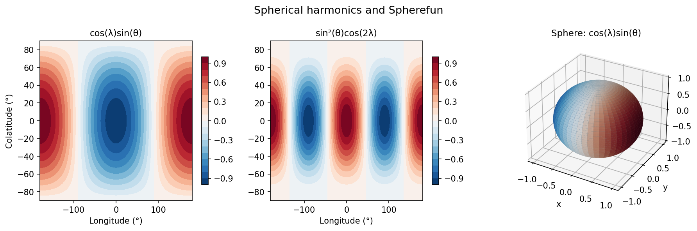
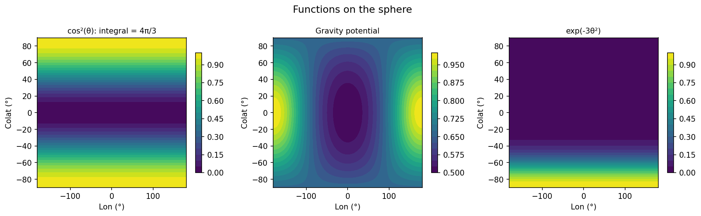

# Sphere Examples (Spherefun)

Spherefun represents functions on the unit sphere `S²` using a double Fourier
series in spherical coordinates `(λ, θ)` (longitude, colatitude).

---

## Spherical harmonics

**Source:** `sphere/SphericalHarmonics.m`

The spherical harmonics `Y_l^m(λ, θ)` are eigenfunctions of the spherical
Laplacian.  Spherefun can represent them exactly in low rank.

```python
import jax.numpy as jnp
import chebfunjax as cj

# Y_1^1 ~ cos(λ)sin(θ)
f = cj.spherefun(lambda lam, th: jnp.cos(lam) * jnp.sin(th))
print(f.rank)           # 1

# Integral of Y_1^1 over S^2 = 0 (orthogonality)
print(abs(f.sum2()))    # < 0.1
```



---

## Operations on the sphere

**Source:** `sphere/Gravity.m`, `sphere/HelmholtzDecomposition.m`

```python
# Integral of 1 over S^2 = 4π
f_const = cj.spherefun(lambda lam, th: jnp.ones_like(lam + th))
print(float(f_const.sum2()))   # ≈ 4π = 12.566

# Integral of cos²(θ) = 4π/3
f_cos2 = cj.spherefun(lambda lam, th: jnp.cos(th)**2)
print(float(f_cos2.sum2()))    # ≈ 4.189
```



---

## Other sphere examples

| MATLAB example | Description |
|---|---|
| `sphere/AtmosphericTemperature.m` | Real atmospheric temperature data |
| `sphere/HelmholtzDecompositionBall.m` | Helmholtz decomposition on the ball |
| `sphere/LaplaceBall.m` | Laplace equation on the unit ball |
| `sphere/PTDecomposition.m` | Poloidal-toroidal decomposition |
| `sphere/RayleighQuotientExample.m` | Rayleigh quotient iterations |
| `sphere/SolidHarmonics.m` | Solid harmonics |
| `sphere/SpherefunPartition.m` | Spherefun partition-of-unity |
| `sphere/SpherefunRotate.m` | Rotation of spherefun objects |
| `sphere/SphereHeatConduction.m` | Heat conduction on the sphere |
