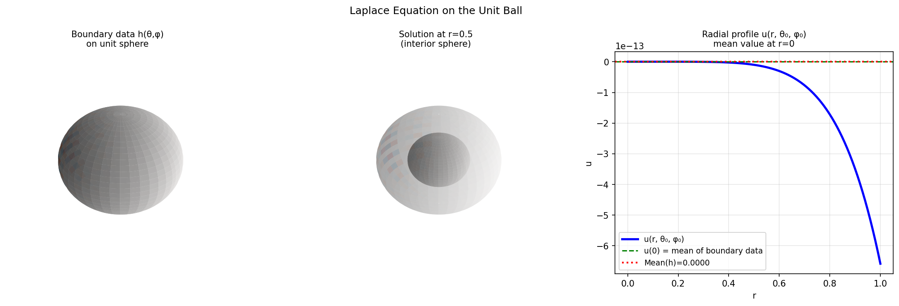

# Laplace Equation on the Unit Ball

**Original:** [sphere/LaplaceBall](https://www.chebfun.org/examples/sphere/LaplaceBall.html)
**Author(s):** Nick Trefethen, June 2019

---

u = Σ c_lm r^l Y_lm satisfies Δu=0; mean value property u(0) = mean(h) on sphere.

## Code

```python
from examples.sphere.laplace_ball import run
run()
```

## Output


