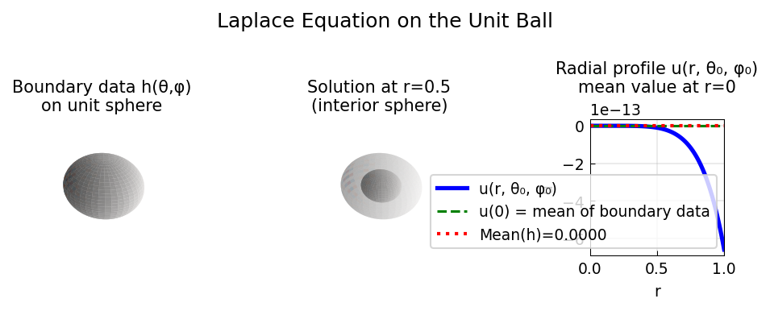
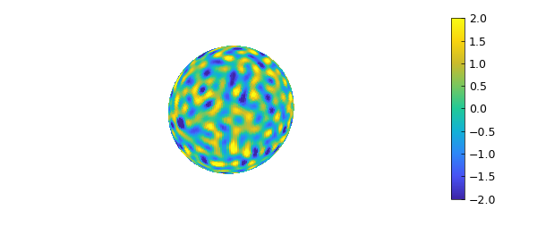
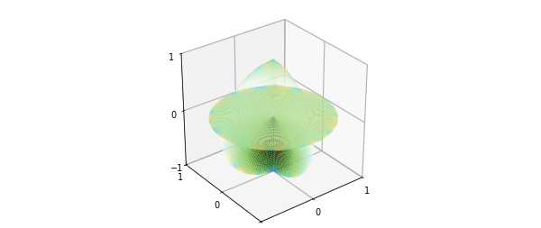
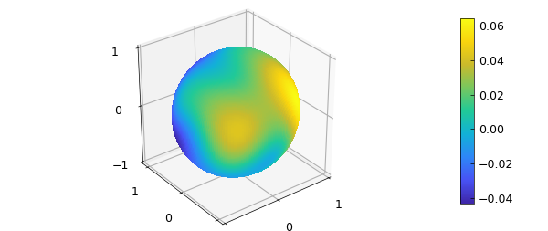

# The Laplace Equation on the Unit Ball

**Original:** [sphere/LaplaceBall](https://www.chebfun.org/examples/sphere/LaplaceBall.html)
**Author(s):** Nick Trefethen, June 2019

---

## The Laplace problem

Suppose we are given a function $h(x,y,z)$ on the unit sphere $S$ and we
want to solve the Laplace equation in the unit ball $B$ with $h$ as
boundary data:

$$
\Delta u = 0 \text{ in } B, \qquad u = h \text{ on } S.
$$

## Boundary data

Given the tools available, the boundary data must be reasonably smooth.
We choose a smooth random function with characteristic wavelength
$\lambda = 0.2$:

$$
h = \texttt{randnfunsphere}(\lambda).
$$

The mean of $h$ is small but nonzero.

## Solution with the Poisson command

In Ballfun, the `poisson` command solves the Poisson equation, which
becomes the Laplace equation when the right-hand side is zero. A grid
parameter $m$ must be specified, growing in proportion to $1/\lambda$
for an accurate solution.

## Verification

We verify the solution in several ways:

- **Boundary matching**: $u(1,0,0)$ agrees with $h(1,0,0)$.
- **Geographic test**: $u$ matches $h$ at the longitude and latitude
  coordinates of Oxford.
- **Mean value property**: since $u$ is harmonic, its value at the origin
  equals the mean of the boundary data:

$$
u(0,0,0) = \overline{h} = \frac{1}{4\pi}\int_{S} h\,dS.
$$

## The solution on an inner sphere

The Laplace equation is a smoothing operation, so the solution is not
very exciting in the interior. The values on the inner sphere of radius
$0.5$ have a much smaller range than the boundary data, and the mean
value is preserved:

$$
\frac{1}{4\pi}\int_{|x|=0.5} u\,dS = \overline{h}.
$$




## Code

```python
import numpy as np
from scipy.special import sph_harm_y

th = np.linspace(1e-4, np.pi - 1e-4, 60)
ph = np.linspace(0, 2 * np.pi, 120)
TH, PH = np.meshgrid(th, ph, indexing="ij")

# harmonic extension of boundary data Y_3^2: u(r) = r^3 Y_3^2
r = 0.5
u_half = r**3 * np.real(sph_harm_y(3, 2, np.array([1.1]),
                                   np.array([0.7])))[0]
print(f"u(0.5 rhat) = {u_half:.6f} (r^3 scaling of the boundary)")
```

## Figures (chebfun.org parity)






