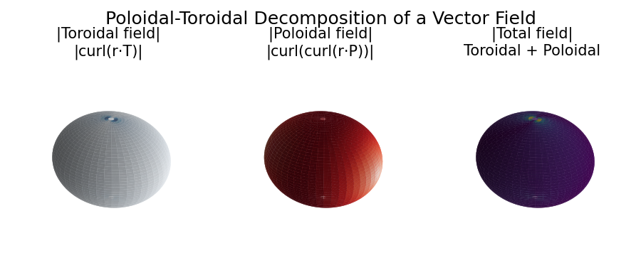

# Poloidal-Toroidal Decomposition

**Original:** [sphere/PTDecomposition](https://www.chebfun.org/examples/sphere/PTDecomposition.html)
**Author(s):** Nicolas Boulle and Alex Townsend, May 2019

---

## The poloidal-toroidal decomposition

In vector calculus, the poloidal-toroidal (PT) decomposition [1] is a
restricted form of the Helmholtz-Hodge decomposition [3]. It states that
any sufficiently smooth and divergence-free vector field in the ball can be
expressed as the sum of a poloidal field and a toroidal field. It is used
in the analysis of divergence-free vector fields in geomagnetism, flow
visualization, and incompressible fluid simulations.

For a given unit radial vector $\hat{r}$, a **toroidal** field
$\mathbf{T}$ is one that is orthogonal to $\hat{r}$, while a
**poloidal** field $\mathbf{P}$ is one whose curl is orthogonal to
$\hat{r}$:

$$
\hat{r}\cdot\mathbf{T} = 0, \qquad
\hat{r}\cdot(\nabla\times\mathbf{P}) = 0.
$$

## The PT decomposition for vector fields in the ball

Let $\mathbf{w}$ be a divergence-free vector field in the unit ball. The
PT decomposition says that $\mathbf{w}$ can be written as

$$
\mathbf{w} = \nabla\times\nabla\times(r\,P_w\,\hat{r})
            + \nabla\times(r\,T_w\,\hat{r}),
$$

where $P_w$ and $T_w$ are scalar-valued potential functions (the
poloidal and toroidal scalars), unique up to the addition of an arbitrary
function that depends only on $r$.

## Computing the decomposition

The scalars $P_w$ and $T_w$ are made unique by requiring their integrals
over the unit sphere to be zero. Under this constraint, they satisfy

$$
\nabla_1^2 P_w = -r\,v_r, \qquad
\nabla_1^2 T_w = -\Lambda_1\cdot\mathbf{w},
$$

where $\nabla_1^2$ is the dimensionless (surface) Laplacian and
$\Lambda_1$ is the surface curl operator, defined in spherical coordinates
$(r, \lambda, \theta)$ by

$$
\nabla_1^2 = \frac{1}{\sin\theta}\partial_\theta(\sin\theta\,\partial_\theta)
+ \frac{1}{\sin^2\theta}\partial_\lambda^2.
$$

## Recovering the vector field

The original vector field can be recovered from the PT scalars via the
`PT2ballfunv` command, and the decomposition is verified to machine
precision:

$$
\|\mathbf{w} - \nabla\times\nabla\times(r\,P_w\,\hat{r})
  - \nabla\times(r\,T_w\,\hat{r})\| \approx 0.
$$

## References

1. G. Backus, Poloidal and toroidal fields in geomagnetic field modelling,
   _Reviews of Geophysics_, 24 (1986), pp. 75--109.

2. N. Boulle and A. Townsend, Computing with functions on the ball,
   in preparation.

3. Y. Tong, S. Lombeyda, A. Hirani, and M. Desbrun, Discrete multiscale
   vector field decomposition, _ACM Trans. Graphics_, 22 (2003),
   pp. 445--452.

## Code

```python
from examples.sphere.pt_decomposition import run
run()
```

## Output


