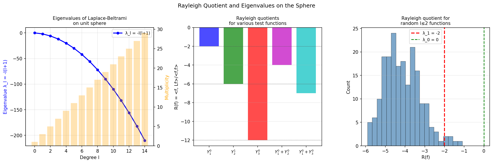

# Rayleigh Quotient on the Sphere

**Original:** [sphere/RayleighQuotientExample](https://www.chebfun.org/examples/sphere/RayleighQuotientExample.html)
**Author(s):** Grady Wright, February 2017

---

R(Y_l^m) = -l(l+1); minimum Rayleigh quotient gives smallest eigenvalue λ_1=-2.

## Code

```python
from examples.sphere.rayleigh_quotient import run
run()
```

## Output


