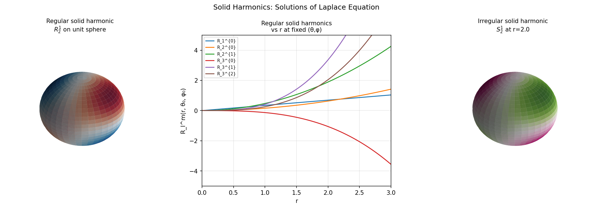

# Solid Harmonics

**Original:** [sphere/SolidHarmonics](https://www.chebfun.org/examples/sphere/SolidHarmonics.html)
**Author(s):** Nicolas Boulle and Alex Townsend, May 2019

---

R_lm = r^l Y_lm (regular) and S_lm = r^{-(l+1)} Y_lm (irregular) satisfy Laplace.

## Code

```python
from examples.sphere.solid_harmonics import run
run()
```

## Output


