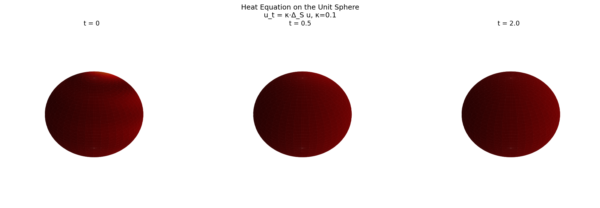

# Sphere Heat Conduction

**Original:** [sphere/SphereHeatConduction](https://www.chebfun.org/examples/sphere/SphereHeatConduction.html)
**Author(s):** Alex Townsend and Grady Wright, May 2016

---

u_t = κ Δ_S u: eigenfunctions Y_lm decay as exp(-l(l+1)κt).

## Code

```python
from examples.sphere.sphere_heat_conduction import run
run()
```

## Output


