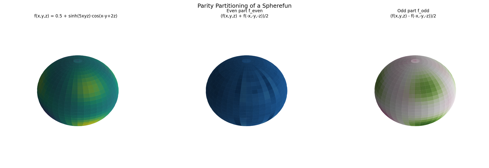

# Parity Partitioning a Spherefun

**Original:** [sphere/SpherefunPartition](https://www.chebfun.org/examples/sphere/SpherefunPartition.html)
**Author(s):** Behnam Hashemi, November 2016

---

f = f_even + f_odd where f_even(-x) = f(x); parity decomposition on S².

## Code

```python
from examples.sphere.spherefun_partition import run
run()
```

## Output


