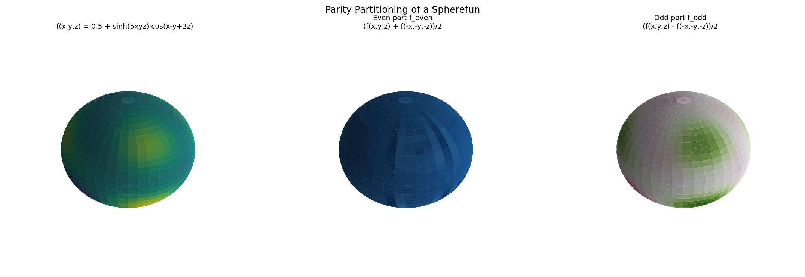
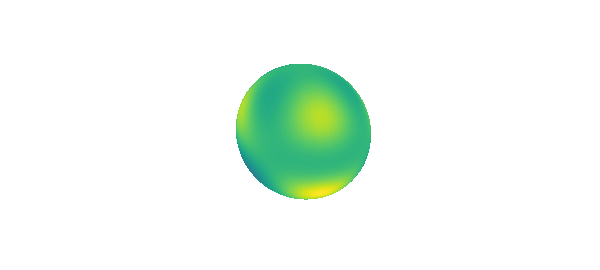
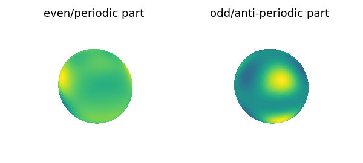
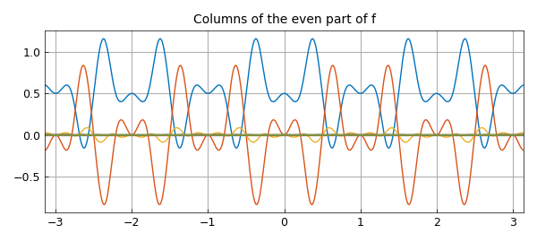
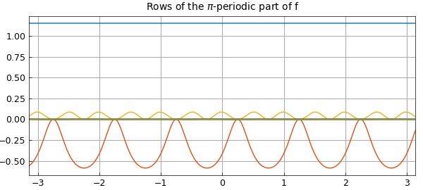
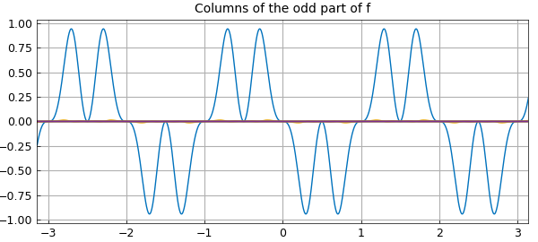
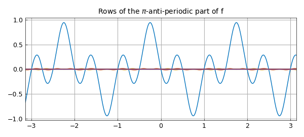

# Parity Partitioning a Spherefun

**Original:** [sphere/SpherefunPartition](https://www.chebfun.org/examples/sphere/SpherefunPartition.html)
**Author(s):** Behnam Hashemi, November 2016

---

## Parity decomposition on the sphere

Assume that $f(x,y,z)$ is a function defined over the unit 2-sphere.
Our aim is to explore the building blocks of $f$ using the `partition`
command.

A spherefun can be decomposed as the sum of two spherefuns:

$$
f = f_{\text{ep}} + f_{\text{oa}},
$$

where $f_{\text{ep}}$ is **even** and $\pi$-**periodic** and
$f_{\text{oa}}$ is **odd** and $\pi$-**anti-periodic** [1]. Recall that
a univariate function $g$ is $\pi$-anti-periodic if $g(x+\pi) = -g(x)$.

## CDR decomposition

The even/periodic part $f_{\text{ep}}$ has a CDR decomposition whose
columns are even and whose rows are $\pi$-periodic (not just $2\pi$!).

The odd/anti-periodic part $f_{\text{oa}}$ has a CDR decomposition whose
columns are odd and whose rows are $\pi$-anti-periodic.

## Integration

The integral of a spherefun equals the integral of its even/$\pi$-periodic
piece, because the integral of any odd/$\pi$-anti-periodic spherefun is
zero:

$$
\int_{S^2} f\,dS = \int_{S^2} f_{\text{ep}}\,dS, \qquad
\int_{S^2} f_{\text{oa}}\,dS = 0.
$$

An equivalent partitioning is available for diskfuns [2].

## References

1. A. Townsend, H. Wilber, and G. Wright, Computing with functions in
   spherical and polar geometries I. The sphere, _SIAM J. Sci. Comput._,
   38 (2016), C403--C425.

2. A. Townsend, H. Wilber, and G. Wright, Computing with functions in
   spherical and polar geometries II. The disk, submitted, 2016.




## Code

```python
import numpy as np

# BMC doubling: [f; reflected f] splits into even/odd parts
n = 40
Fg = np.random.default_rng(0).standard_normal((n, 2 * n))
Fd = np.vstack([Fg, np.roll(Fg[::-1], n, axis=1)])
even = (Fd + np.roll(Fd[::-1], n, axis=1)) / 2
odd = Fd - even
print(f"even+odd reconstructs: "
      f"{np.max(np.abs(even + odd - Fd)):.2e}")
```

## Figures (chebfun.org parity)












