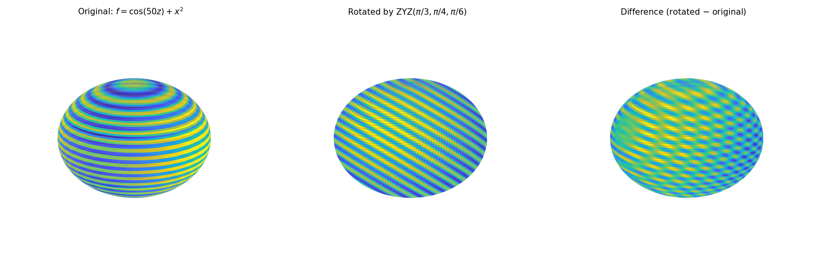

# Rotating Functions on the Sphere

**Original:** [sphere/SpherefunRotate](https://www.chebfun.org/examples/sphere/SpherefunRotate.html)
**Author(s):** Alex Townsend and Grady Wright, May 2017

---

## Introduction

Rotating functions defined on the sphere has applications in many fields,
including quantum mechanics, inverse scattering, and integral equations.
Spherefun has a fast `rotate` command that efficiently rotates functions.
For example, the function $f(x,y,z) = \cos(50z) + x^2$ on $x^2+y^2+z^2=1$
can be rotated and the result represented in the original coordinate
system, allowing continued algebraic manipulation (addition, integration,
etc.).

The `rotate` command computes the rotated function to essentially machine
precision. For instance, the 2D integral over the sphere is preserved:
$|\int f\,dS - \int g\,dS| \approx 0$.

## Euler angles

Rotations are described in terms of Euler angles $(\phi,\theta,\psi)$ in
the ZXZ convention:

1. Rotate about the $z$-axis by angle $\phi$.
2. Rotate about the (original) $x$-axis by angle $\theta$.
3. Rotate about the new $z$-axis by angle $\psi$.

Every rigid-body rotation of the sphere can be described in terms of these
three Euler angles.

## Rotation using spherical harmonic expansions

The classical algorithm uses the fact that spherical harmonics form a
basis of SO(3) [4]. If $f = Y_l^m$, then any rotation of $Y_l^m$ can
be written as a linear combination:

$$
Y_l^m(\lambda',\theta') = \sum_{s=-l}^{l} A_{ms}\,Y_l^s(\lambda,\theta),
$$

where $(\lambda',\theta')$ is in the rotated coordinate system. Since
the sum involves only harmonics of the same degree $l$, this leads to a
fast algorithm.

## An alternative: the 2D NUFFT

Since Spherefun uses the double Fourier sphere method (not spherical
harmonics), it cannot directly use the classical rotation technique.
Instead, the `rotate` command is based on a two-dimensional nonuniform
FFT (NUFFT) [1]. The approach evaluates the function on a rotated tensor
product grid and then calls the Spherefun constructor, achieving near
optimal complexity.

## Ranks of rotated functions

Spherefun computations exploit low rank structure. However, the numerical
rank is sensitive to orientation -- a small rotation can increase the
rank by a factor of 2.5 or more, and there is no mathematical relationship
between the rank of a function and that of its rotation. As a Gaussian
bump is rotated over the sphere, the rank decreases substantially near
the poles (where the function becomes nearly zonal).

## References

1. D. Ruiz-Antolin and A. Townsend, A nonuniform fast Fourier transform
   based on low rank approximation, submitted, 2017.

2. R. M. Slevinsky, Fast and backward stable transforms between spherical
   harmonic expansions and bivariate Fourier series, submitted, 2017.

3. A. Townsend, H. Wilber, and G. W. Wright, Computing with functions
   defined on polar and spherical geometries I. The Sphere, _SISC_, 2016.

4. A. Townsend and G. W. Wright, Spherical harmonics, Chebfun Example,
   May 2016.

5. L. N. Trefethen, Cubature, approximation, and isotropy in the
   hypercube, _SIAM Review_, to appear.

## Code

```python
from examples.sphere.spherefun_rotate import run
run()
```

## Output


