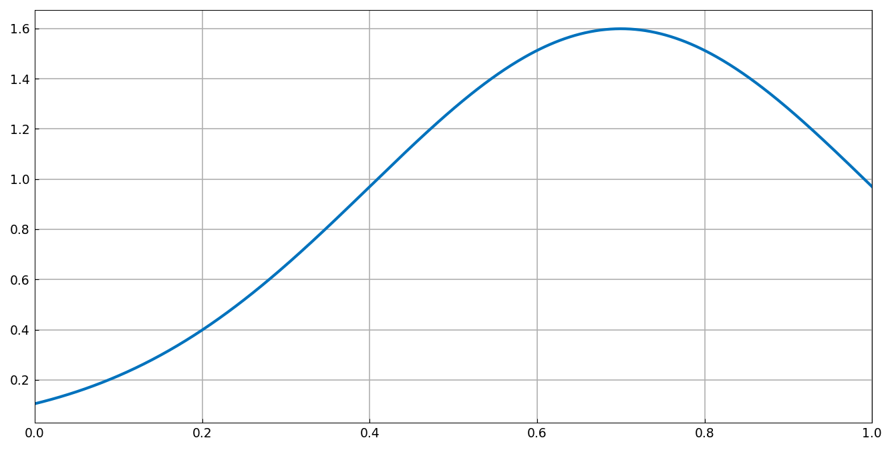
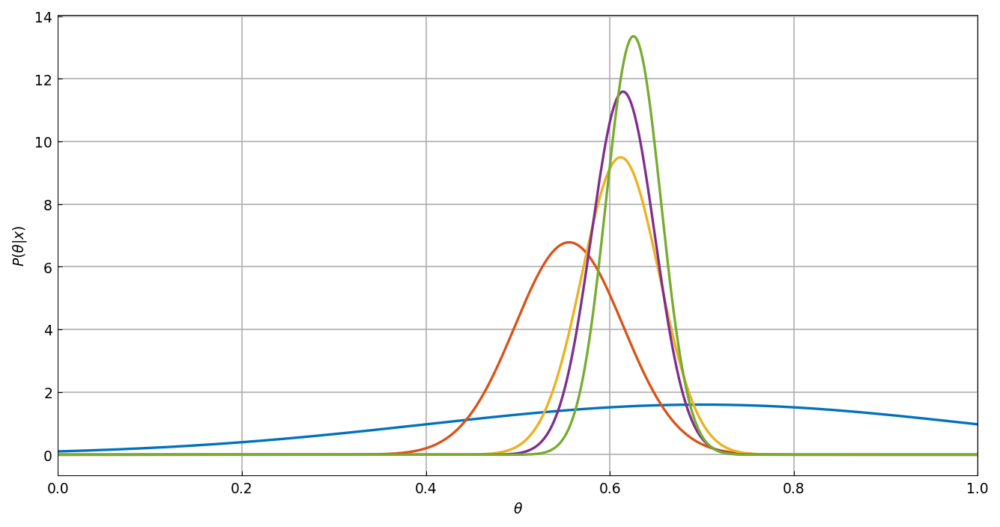

# A Bayesian gradebook

*Toby Driscoll, August 2014*

[Original MATLAB Chebfun example](https://www.chebfun.org/examples/stats/BayesianGradebook.html)

(Chebfun example stats/BayesianGradebook.m)

Model a student's ability as $\theta \in [0,1]$ with a broad prior,
and update the belief after each score using Bayes' rule; all
densities are chebfuns on $[0,1]$:



For scores $[0.55, 0.67, 0.62, 0.66]$ the posterior tightens around
the running average — Bayes and the traditional average agree:

```text
Method          m-3    m-2    m-1      m
------------------------------------------------
Traditional    0.550  0.610  0.613  0.625
Bayes Mode     0.556  0.612  0.614  0.626
Bayes Mean     0.556  0.612  0.614  0.626
Std dev        0.059  0.042  0.034  0.030
```



Near the top of the scale, the boundary matters — the normalization
$1/q$ boosts the likelihood of high abilities:

```text
Traditional    0.850  0.910  0.913  0.925
Bayes Mode     0.845  0.915  0.922  0.940
Bayes Mean     0.847  0.915  0.922  0.938
```

With one low outlier ($0.72$) the Bayes estimates shade the average
up (0.898 vs 0.892); with a noisier ten-score record
($\sigma = 0.15$) the Bayes mean sits noticeably above the
traditional average:

```text
Traditional    0.799  0.810  0.813  0.808
Bayes Mode     0.830  0.848  0.854  0.846
Bayes Mean     0.834  0.851  0.856  0.850
Std dev        0.066  0.062  0.059  0.057
```

(All four tables digit-for-digit with the published MATLAB run.)

---

*Replicated with [chebfunjax](https://github.com/ma-gilles/chebfunjax); original
example copyright The University of Oxford and The Chebfun Developers.*
