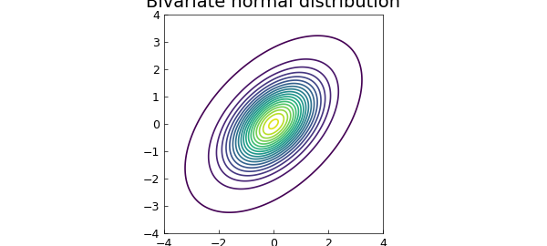
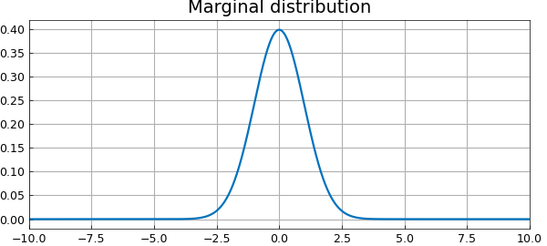
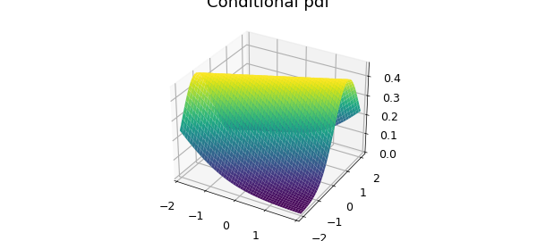

# The bivariate normal distribution

*Alex Townsend, March 2013*

[Original MATLAB Chebfun example](https://www.chebfun.org/examples/stats/BivariateNormalDistribution.html)

Python translation: [`examples/stats/bivariate_normal_distribution.py`](https://github.com/ma-gilles/chebfunjax/blob/main/examples/stats/bivariate_normal_distribution.py)

## First year undergraduate probability

One of the first year undergraduate courses at Oxford is probability, which introduces basic concepts such as discrete and continuous random variables, probability density functions (pdf), and probability generating functions. A standard example for probability density functions of continuous random variables is the bivariate normal distribution.

## The joint normal distribution

After 3 to 4 weeks the students are taught about marginal and conditional distributions, and an early example is the standard bivariate normal distribution, where two normal distributions $X$ and $Y$ are coupled together. In this example we use Chebfun2 to compute numerically with the bivariate normal distribution.

```matlab
FS = 'FontSize'; fs = 14;
mu1 = 0; mu2 = 0;                      % means
sigma1 = 1; sigma2 = 1;                % variances
rho = .5;                              % coupling
d = 10*[-1 1 -1 1];                    % truncated domain
z = @(x,y) (x-mu1).^2./sigma1^2 - 2*rho*(x-mu1).*(y-mu2)/sigma1/sigma2 +...
    (y-mu2).^2./sigma2^2;
p =chebfun2(@(x,y) 1/(2*pi*sigma1*sigma2*sqrt(1-rho^2))*...
    exp(-z(x,y)./(2*(1-rho^2))), d);   % bivariate joint pdf
contour(p,.001:.01:.2),
title('Bivariate normal distribution', FS, fs)
```



## Integrates to one

A joint density function is still a pdf, so it must integrate to 1:

```matlab
fprintf('Integral of pdf %1.16f\n', integral2(p))
```

```text
Integral of pdf 0.9999999999999982
```

The value above is less than 1 because of numerical error, not because we have restricted the domain of the probability density function to $[-10,10]\times [,10,-10]$.

## Marginal distributions

There are two marginal distributions that can be computed by integrating out the other variable. For instance, the marginal distribution in $X$ is the probability distribution after averaging over information about $Y$. This can be calculated by just integration over $y$ with the `sum` command (the sum of a chebfun2 defaults to integration over $y$).

```matlab
px = sum(p);
plot(px),
title('Marginal distribution', FS, fs)
```



A fundamental property is that each marginal distribution is a univariate normal distribution:

```matlab
exact = chebfun(@(x) 1/(sqrt(2*pi)*sigma1)*...
                              exp(-(x-mu1).^2./sigma1^2/2),d(1:2));
fprintf('Error of marginal = %1.3e\n',norm(px-exact'))
```

```text
Integral of pdf 0.9999999999999982
```

## Conditional probability distributions

Given that we know the realisation of $X$, what is the probability density function of $Y$? This is the called conditional probability, which is associated with the concept of conditional probability distributions. We can use Chebfun2 to compute numerically the conditional probability distribution, restricting the domain to $[-2,2] \times [-2,2]$ to prevent a NaN error.

```matlab
d = 2*[-1 1 -1 1];
fy = chebfun2(@(x,y) p(x,y)./px(x).', d);   % conditional pdf
plot(fy)
```



For the bivariate normal distribution the condition probability distribution is known explicitly. We can use this to check the accuracy of the conditional probability computed by Chebfun2 if the realisation of $X$ is, say, $\pi/6$:

```matlab
x = pi/6;
mu = mu1 + sigma1/sigma2*rho*(x-mu2); sigmasq = (1-rho^2)*sigma1^2;
exact = chebfun(@(x) 1/(sqrt(2*pi*sigmasq))*...
                                 exp(-(x-mu).^2./sigmasq/2),d(1:2));
fprintf('Error in conditional pdf is %1.5e\n',norm(fy(x,:)-exact));
```

```text
Integral of pdf 0.9999999999999982
```

## References

1. [http://en.wikipedia.org/wiki/Multivariate_normal_distribution](http://en.wikipedia.org/wiki/Multivariate_normal_distribution)

---

*Translated with [chebfunjax](https://github.com/ma-gilles/chebfunjax); prose and MATLAB code from the original example, copyright The University of Oxford and The Chebfun Developers.  Printed outputs and figures are chebfunjax's.*
