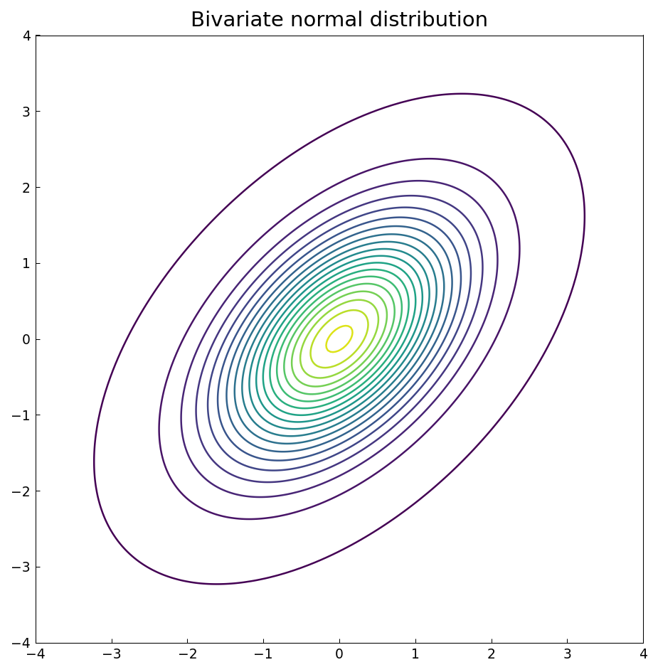
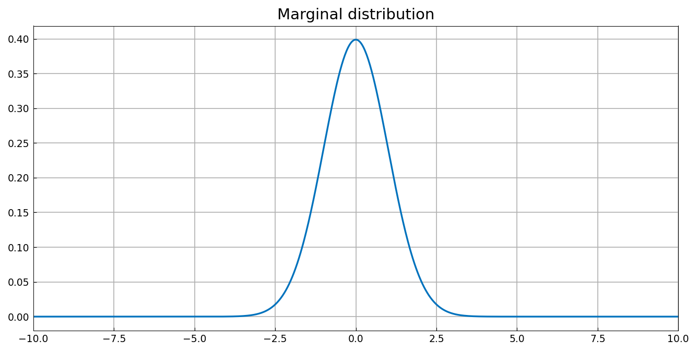
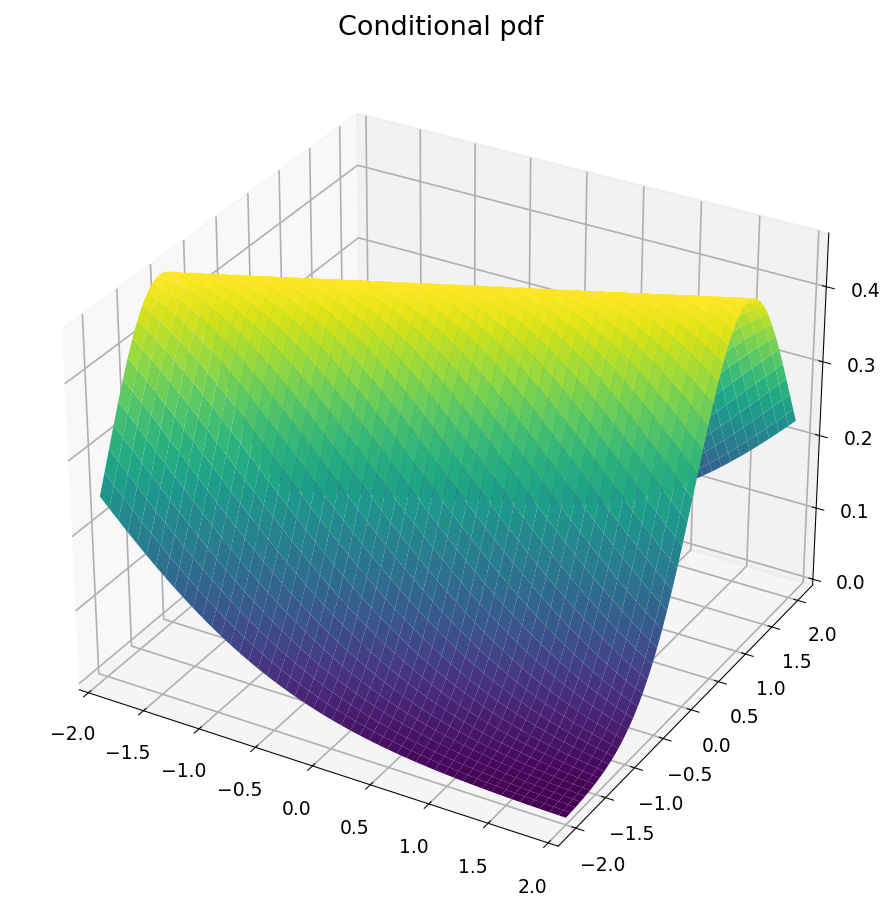

# The bivariate normal distribution

*Alex Townsend, March 2013*

[Original MATLAB Chebfun example](https://www.chebfun.org/examples/stats/BivariateNormalDistribution.html)

(Chebfun example stats/BivariateNormalDistribution.m)

The bivariate normal joint density with correlation $\rho = 1/2$
becomes a chebfun2 on a truncated domain:



```text
Integral of pdf 0.9999999999999779
```

(MATLAB: 0.9999999999999991.)  The marginal distribution is the
integral over $y$ — one call to `sum` — and matches the univariate
normal to near machine precision:



```text
Error of marginal = 2.200e-14
```

The conditional pdf $f(y\,|\,x)$ is the ratio of joint to marginal:



Evaluated at $x = \pi/6$ it matches the classical closed form —
normal with mean $\rho x$ and variance $1-\rho^2$:

```text
Error in conditional pdf is 2.12106e-16
```

(MATLAB: 1.72302e-15.)

---

*Replicated with [chebfunjax](https://github.com/ma-gilles/chebfunjax); original
example copyright The University of Oxford and The Chebfun Developers.*
