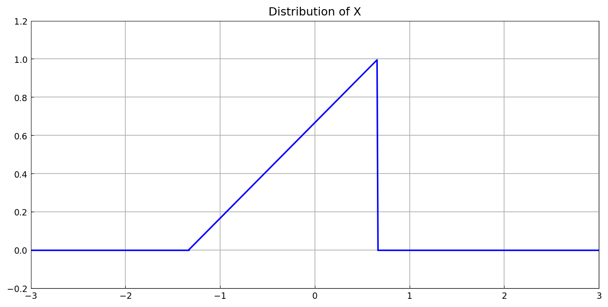
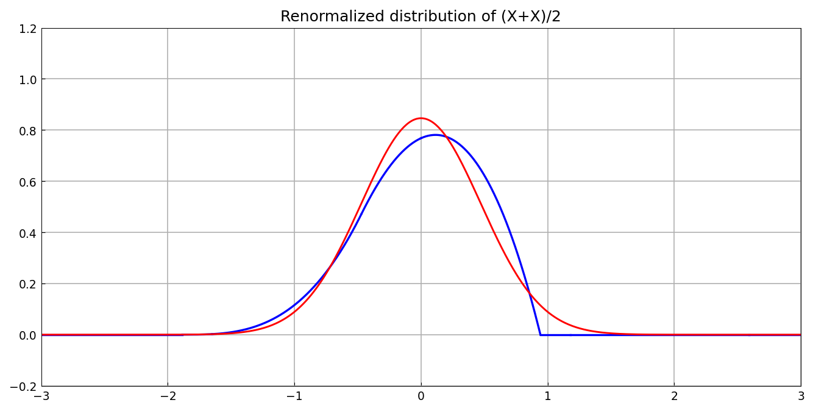
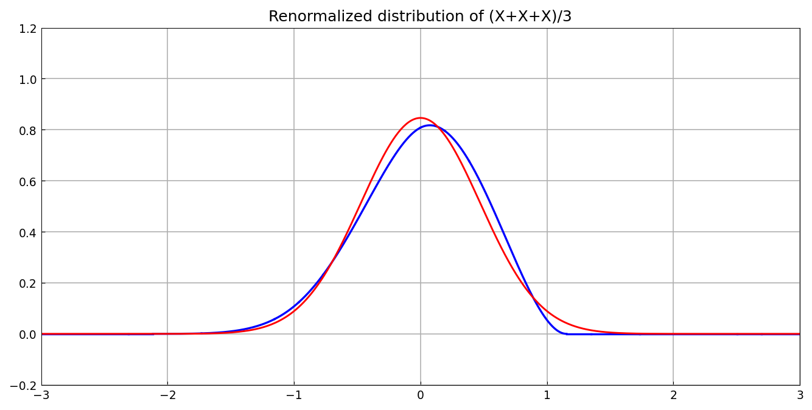
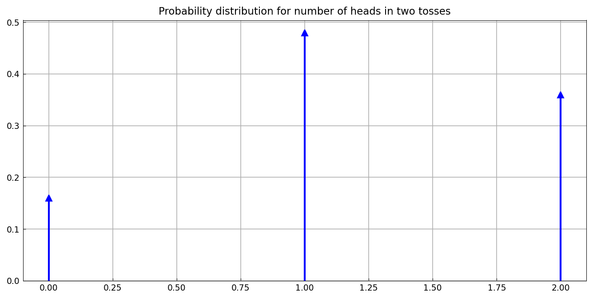
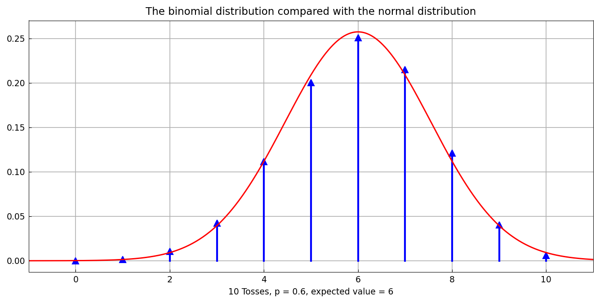

# Central limit theorem

*Nick Trefethen, June 2015*

[Original MATLAB Chebfun example](https://www.chebfun.org/examples/stats/CentralLimitTheorem.html)

(Chebfun example stats/CentralLimitTheorem.m)

The central limit theorem says that sums of independent identically
distributed random variables, renormalized, converge to a Gaussian.
Here is a triangular probability distribution:



Its mean and variance, from chebfun integrals — matching MATLAB's
printed values to the last digit:

```text
mu =
    8.326672684688674e-17
variance =
   0.222222222222223
```

The convolution `X.conv(X)`, renormalized, is already noticeably
closer to the Gaussian of the same variance:



And after three convolutions:



The discrete analogue: a biased-coin Bernoulli distribution is a pair
of Dirac deltas, and convolving it with itself repeatedly generates
the binomial distribution — the delta arithmetic is exact:



```text
ans =
     1
ans =
   1.000000000000000
mu =
     6
sigma =
   1.549193338482967
```

After ten tosses the binomial sticks hug the Gaussian envelope:



(All printed values digit-for-digit with the published MATLAB run.)

---

*Replicated with [chebfunjax](https://github.com/ma-gilles/chebfunjax); original
example copyright The University of Oxford and The Chebfun Developers.*
