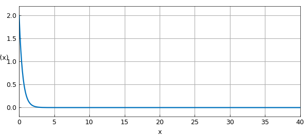
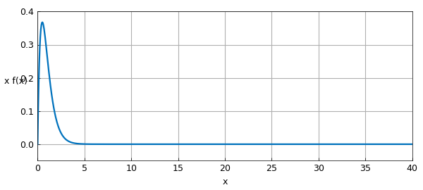
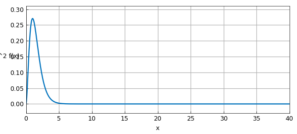
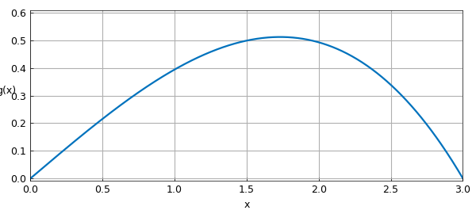
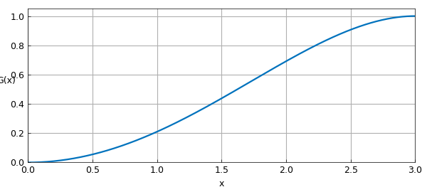
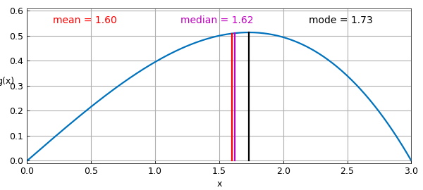

# Simple computations with probability distributions

*Mark Richardson, May 2011*

[Original MATLAB Chebfun example](https://www.chebfun.org/examples/stats/Expectations.html)

Python translation: [`examples/stats/expectations.py`](https://github.com/ma-gilles/chebfunjax/blob/main/examples/stats/expectations.py)

In this example, we use Chebfun to solve some probability distribution problems from [1].

## 1. Expectation of a random variable

We use Problem 3.4 from p. 86 of [1] to motivate this example.

Suppose a continuous random variable $X$ has the probability density function

$$ f(x) = 2e^{-2x},~~ x \ge 0, \qquad f(x) = 0, ~~ x < 0. $$

What are: (a) $E(X)$ and (b) $E(X^2)$?

(a) In order to compute the expectation $E(X)$, we first define a chebfun for $X$. This can be done over the semi-infinite interval $[0,\infty)$, but the resulting integrals lose a few digits of precision. Instead, since $\exp(-x)$ decreases so quickly, we take the interval to be $[0,40]$.

```matlab
x = chebfun('x',[0 40]);
```

Next we approximate the density function.

```matlab
f = 2*exp(-2*x);
figure('Position',[100 200 520 180])
LW = 'linewidth'; lw = 1.6;
plot(f,LW,lw), grid on
ylim([-0.2 2.2])
xlabel('x'), ylabel('f(x)','rotation',0)
```



If $f$ is a density function, its integral should be $1$, and we find that this is indeed the case to within rounding errors.

```matlab
sum(f)
```

```text
ans =
   1.000000000000000
```

The expectation of a continuous random variable is defined as the integral over of $xf(x)$.

```matlab
xf = x.*f;
plot(xf,LW,lw), grid on
ylim([-0.05 0.4])
xlabel('x'), ylabel(sprintf('x f(x)\n'),'rotation',0)
```



We can use the chebfun command `sum` to compute this integral The correct answer in this case is $1/2$.

```matlab
format long
sum(xf)
```

```text
ans =
   0.499999999999994
```

b) For $E(X^2)$, the answer is again $1/2$ and we compute this in the same way as before.

```matlab
xxf = x.^2.*f;
plot(xxf,LW,lw), grid on
ylim([-0.03 0.31])
xlabel('x'), ylabel('x^2 f(x)','rotation',0)
```



```matlab
sum(xxf)
```

```text
ans =
   0.500000000000335
```

## 2. Mean, median and mode of a probability distribution

This example is motivated by problem 3.33 on p. 94 of [1].

The probability density function of a continuous random variable $X$ is

$$ g(x) = 4x(9-x^2)/81, ~~ 0\le x\le 3, $$

and zero otherwise. Find: a) the mean, b) the median, and c) the mode.

First, we define an appropriate Chebfun variable and the pdf:

```matlab
x = chebfun('x',[0 3]);
g = 4*x.*(9-x.^2)/81;
plot(g,LW,lw), grid on
ylim([-0.01 0.61])
xlabel('x'), ylabel('g(x)','rotation',0)
```



a) Computing the mean is simply a matter of computing the expectation as in the previous question. The exact answer is $1.6$ and this is what we find using Chebfun.

```matlab
mean = sum(x.*g)
```

```text
mean =
   1.599999999999999
```

b) The median is the value $a$ for which $P(X\le a) = 1/2$. In order to solve this problem we need to work with the cumulative distribution function, which is simply the indefinite integral of the probability density. This can be computed with the chebfun command `cumsum`.

```matlab
G = cumsum(g);
plot(G,LW,lw), grid on
xlabel('x'), ylabel(sprintf('G(x)\n'),'rotation',0)
```



Note again that as we would expect for any pdf, the integral is $1$. Here is the median $a$:

```matlab
median = roots(G-0.5)
median_exact = sqrt(9-9*sqrt(2)/2)
```

```text
median =
   1.623588300438591
median_exact =
   1.623588300438591
```

c) For the mode, we are looking for the position of the global maximum of the probability distribution. This is easily computed with the Chebfun command `max`.

```matlab
[gmax,mode] = max(g);
display(mode)
```

```text
mode =
   1.732050807568877
```

Again, this matches the exact result

```matlab
mode_exact = sqrt(3)
```

```text
mode_exact =
   1.732050807568877
```

Here is a graph showing the three computed values:

```matlab
plot(g,LW,lw), grid on, hold on
plot([mean mean],[0 g(mean)],'-r',LW,lw)
plot([median median],[0 g(median)],'-m',LW,lw)
plot([mode mode],[0 g(mode)],'-k',LW,lw)
text(0.2,0.55,sprintf('mean   = %1.2f',mean),'color','r')
text(1.2,0.55,sprintf('median = %1.2f',median),'color','m')
text(2.2,0.55,sprintf('mode   = %1.2f',mode),'color','k')
hold off, ylim([-0.01 0.61])
xlabel('x'), ylabel('g(x)','rotation',0)
```



## Reference

1. M. Spiegel, J. Schiller, and R. Srinivasan, *Schaum's Outlines: Probability and Statistics*, 3rd. ed., 2009.

---

*Translated with [chebfunjax](https://github.com/ma-gilles/chebfunjax); prose and MATLAB code from the original example, copyright The University of Oxford and The Chebfun Developers.  Printed outputs and figures are chebfunjax's.*
