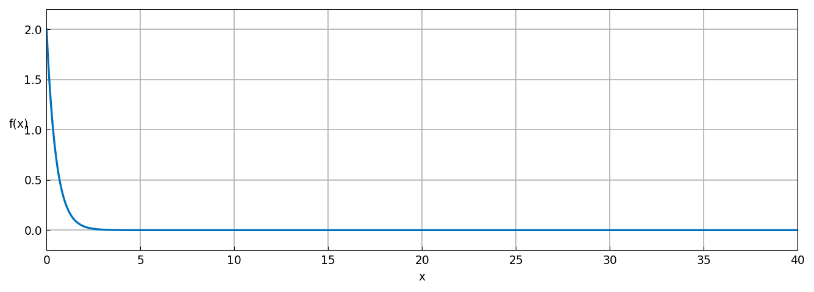
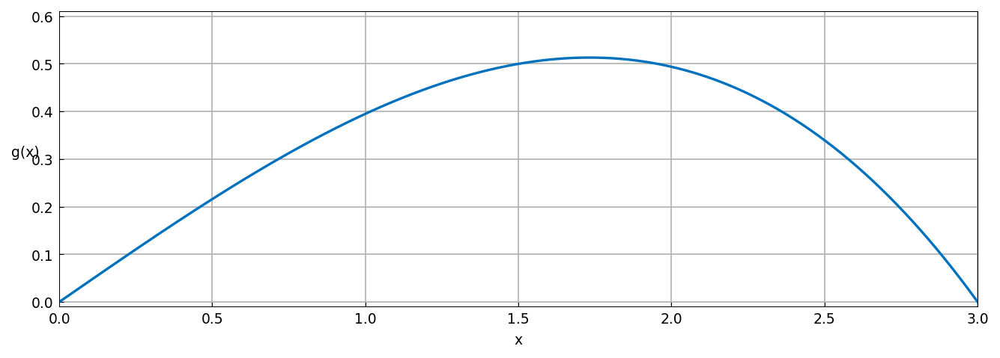
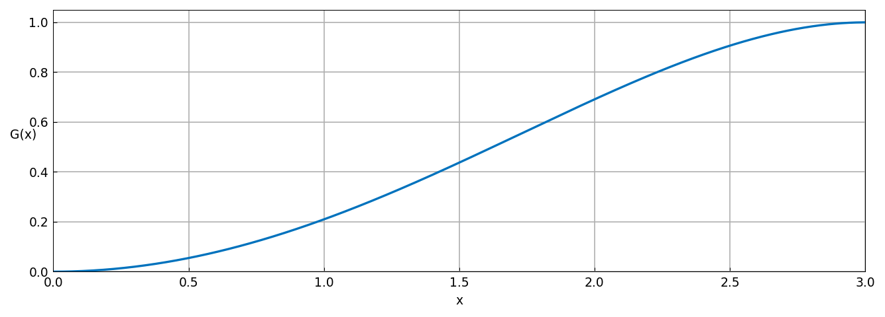
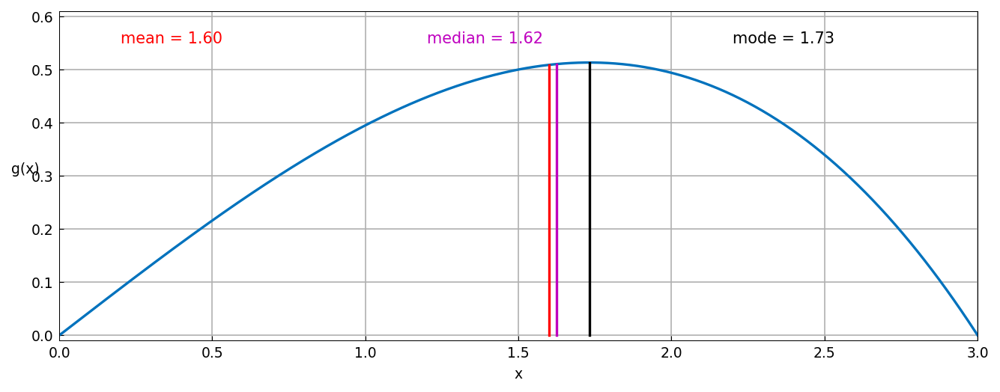

# Mean, median, mode of probability distributions

*Jie Gao and Nick Trefethen, June 2013*

[Original MATLAB Chebfun example](https://www.chebfun.org/examples/stats/Expectations.html)

(Chebfun example stats/Expectations.m)

Take the exponential density $f(x) = 2e^{-2x}$ on $[0, 40]$:



Its integral, mean, and second moment come from chebfun `sum`:

```text
ans =
   1.000000000000000
ans =
   0.499999999999994
ans =
   0.500000000000335
```

Now the polynomial density $g(x) = 4x(9-x^2)/81$ on $[0,3]$:



```text
mean =
   1.599999999999999
```

The *median* is where the cumulative distribution
$G = \mathrm{cumsum}(g)$ crosses $1/2$ — matching the exact value
$\sqrt{9 - 9\sqrt{2}/2}$ to all 15 digits:



```text
median =
   1.623588300438591
median_exact =
   1.623588300438591
```

The *mode* is the argmax, matching $\sqrt{3}$:

```text
mode =
   1.732050807568877
mode_exact =
   1.732050807568877
```



(All values digit-for-digit with the published MATLAB outputs, up to
one ulp.)

---

*Replicated with [chebfunjax](https://github.com/ma-gilles/chebfunjax); original
example copyright The University of Oxford and The Chebfun Developers.*
