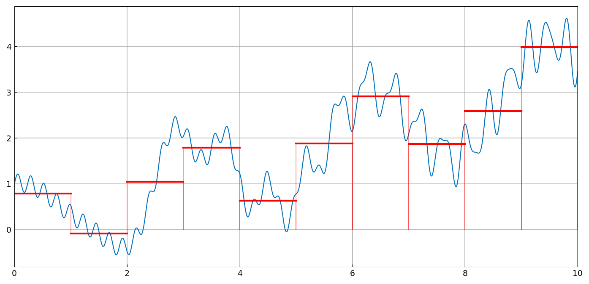
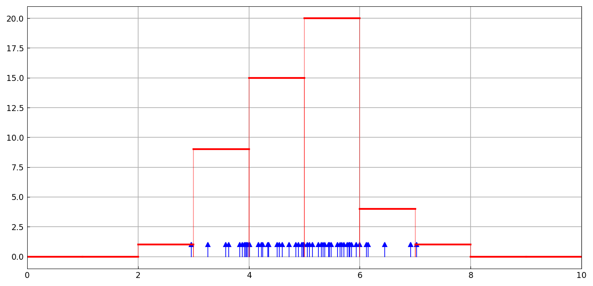
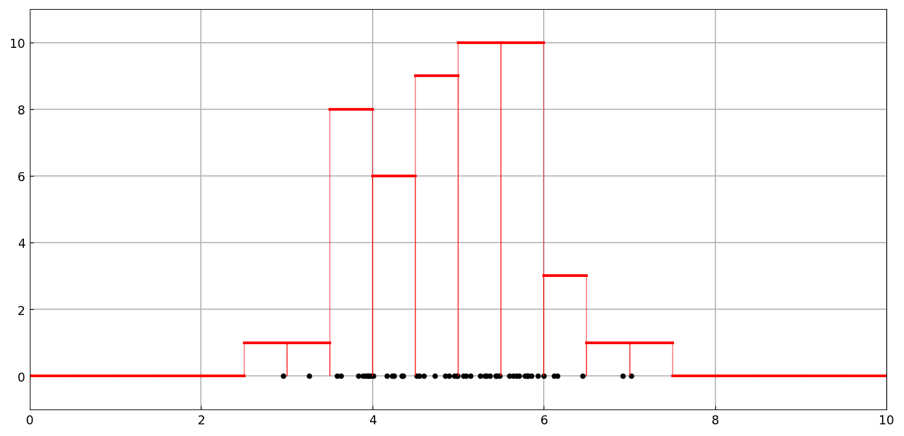

# Histograms

*Nick Trefethen, December 2012*

[Original MATLAB Chebfun example](https://www.chebfun.org/examples/stats/Histogram.html)

(Chebfun example stats/Histogram.m)

A histogram of a chebfun assigns to each bin the integral of the
function over that bin, computed as differences of `cumsum` — giving
a piecewise-constant chebfun:

The same idea applies to point data represented as a sum of Dirac
deltas — the histogram counts the deltas in each bin.  Fifty normal
samples with unit bins:

And with half-unit bins:

(`randn` samples are our own draw; the construction is what
replicates.)

---

*Replicated with [chebfunjax](https://github.com/ma-gilles/chebfunjax); original
example copyright The University of Oxford and The Chebfun Developers.*
