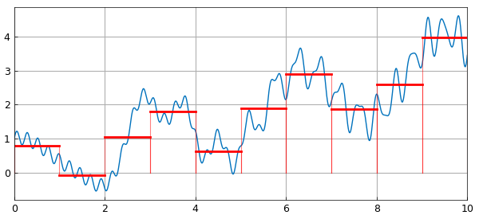
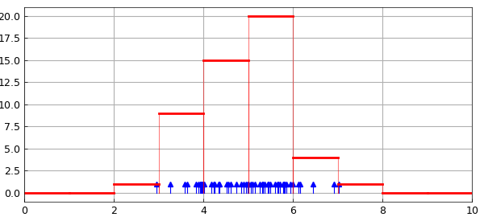
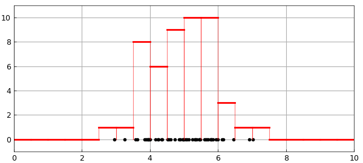

# Histogram from function or data

*Nick Trefethen, May 2011*

[Original MATLAB Chebfun example](https://www.chebfun.org/examples/stats/Histogram.html)

Python translation: [`examples/stats/histogram.py`](https://github.com/ma-gilles/chebfunjax/blob/main/examples/stats/histogram.py)

```matlab
function Histogram
```

Suppose we have a chebfun, like this one:

```matlab
x = chebfun('x',[0,10]);
f = x/3 + cos(2*x) + .5*sin(x.^2) + .2*sin(27*x);
LW = 'linewidth';
plot(f,LW,1), hold on
```



and we have some bins defined by bin edges, like these:

```matlab
edges = 0:10;
```

and we want to "bin" $f$ into these bins. Here is a `histogram` function that will do something along these lines. In each bin, the value it stores is the total integral of $f$ in that interval.

```matlab
function h = hist(f,edges)
    nbins = length(edges)-1;
    data = zeros(nbins,1);
    fsum = cumsum(f);
    for k = 1:nbins
        a = edges(k); b = edges(k+1);
        data(k) = fsum(b)-fsum(a);
    end
    h = chebfun(num2cell(data),edges);
end
```

If we apply the function to our data, we get a histogram represented as a piecewise constant chebfun:

```matlab
h = hist(f,edges);
plot(h,'r',LW,2)
```



What if we wanted to start from data points rather than a function? Chebfun would allow us to do this with delta functions, like this:

```matlab
npts = 50; xpts = 5+randn(npts,1);
f2 = 0*x;
for j = 1:npts
    f2 = f2 + dirac(x-xpts(j));
end
hold off
plot(xpts,0*xpts,'.k','markersize',10)
edges = 0:.5:10;
h = hist(f2,edges);
hold on, plot(h,'r',LW,2)
ylim([-1,max(h)+1])
```



This is an extremely inefficient way to work with data, but it illustrates some of the ways in which chebfuns can be manipulated.

Perhaps an overload of Matlab's `hist` command should be included in Chebfun? Such an overload would certainly not use delta functions internally, and it would require some careful thinking about appropriate definitions.

```matlab
end
```

---

*Translated with [chebfunjax](https://github.com/ma-gilles/chebfunjax); prose and MATLAB code from the original example, copyright The University of Oxford and The Chebfun Developers.  Printed outputs and figures are chebfunjax's.*
