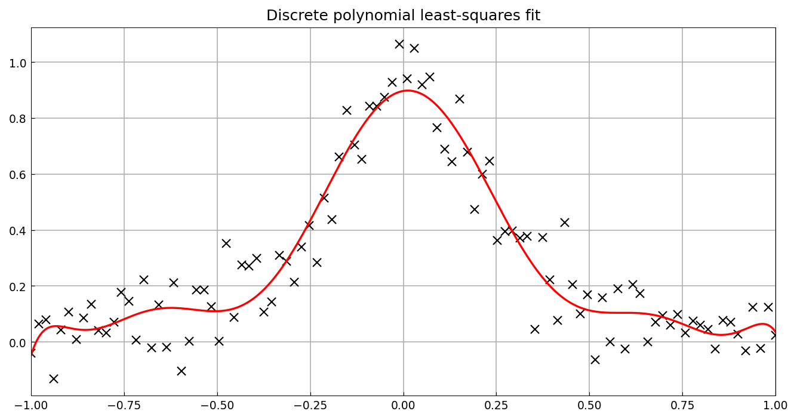
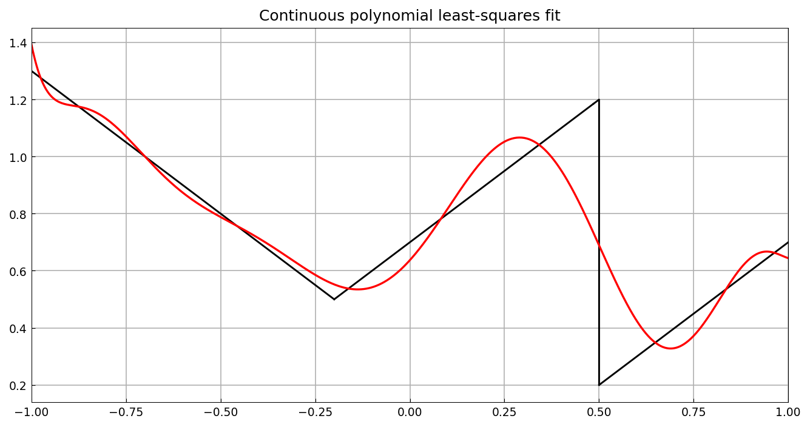

# Discrete and continuous least squares

*Alex Townsend, March 2013*

[Original MATLAB Chebfun example](https://www.chebfun.org/examples/stats/LeastSquares.html)

(Chebfun example stats/LeastSquares.m)

`polyfit` fits noisy samples of the Runge function by a degree-10
polynomial in the least-squares sense:

The continuous analogue fits a piecewise-smooth chebfun by its best
degree-10 polynomial in $L^2$:

(The noise draw is our own; the constructions replicate.)

---

*Replicated with [chebfunjax](https://github.com/ma-gilles/chebfunjax); original
example copyright The University of Oxford and The Chebfun Developers.*
