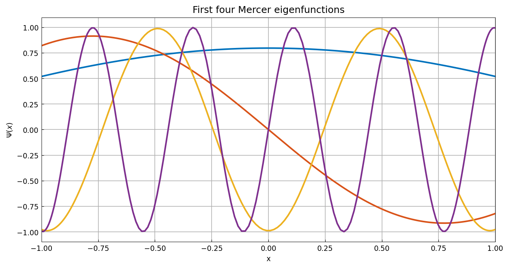
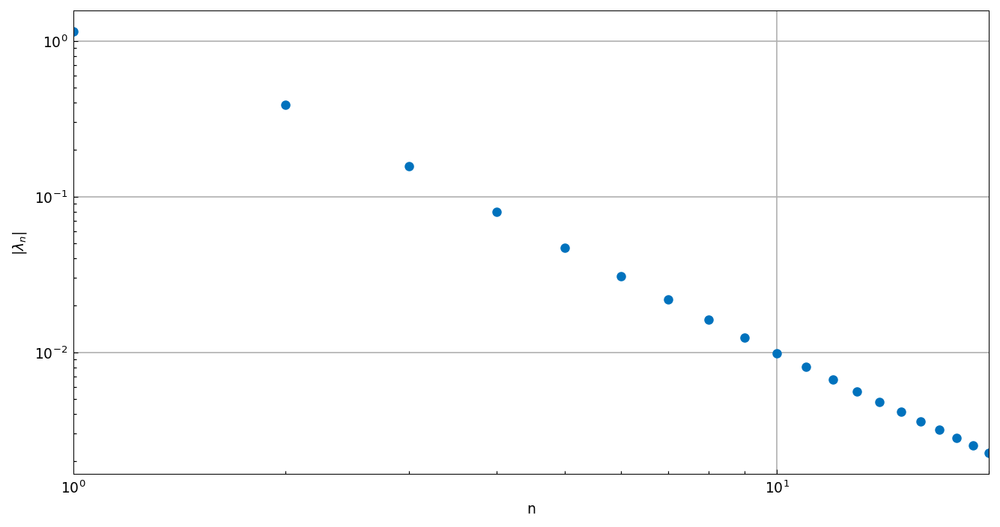
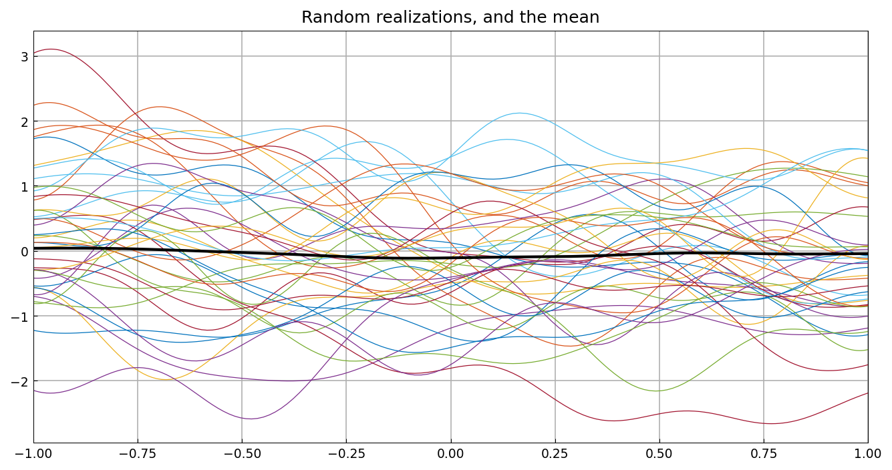
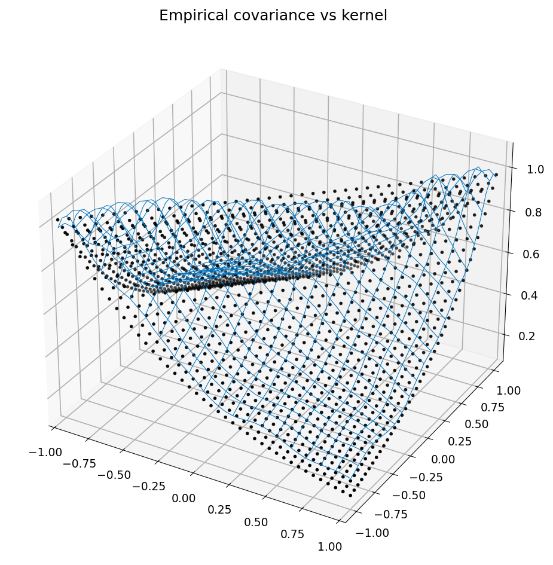
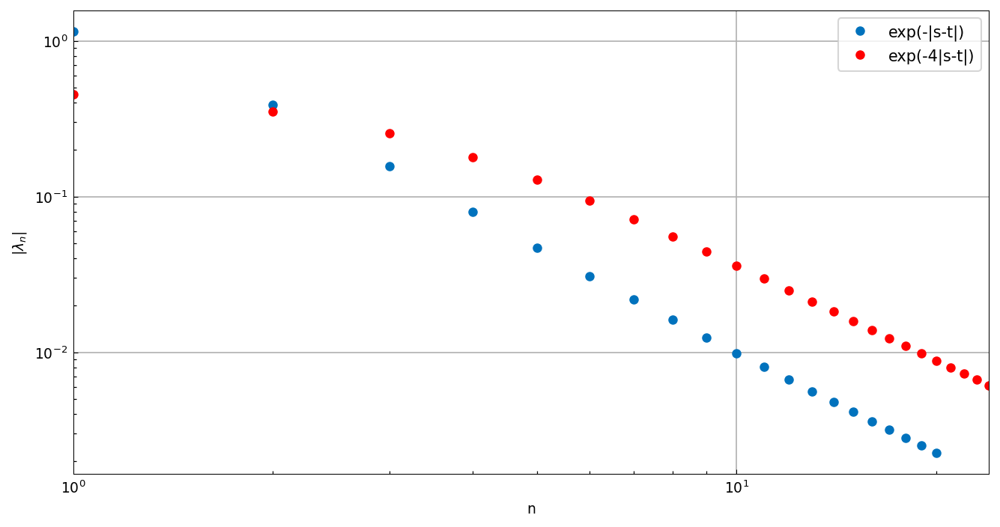

# Mercer's theorem and the Karhunen-Loeve expansion

*Toby Driscoll, December 2011*

[Original MATLAB Chebfun example](https://www.chebfun.org/examples/stats/MercerKarhunenLoeve.html)

(Chebfun example stats/MercerKarhunenLoeve.m)

The covariance kernel $K(s,t) = e^{-|s-t|}$ of an
Ornstein-Uhlenbeck process has a Mercer eigen-decomposition, computed
here by Nystrom discretization of the Fredholm operator:



The eigenfunctions are orthonormal:

```text
ans =
      1.0000   -0.0000    0.0000    0.0000   -0.0000   -0.0000
     -0.0000    1.0000   -0.0000    0.0000    0.0000    0.0000
      ...
```

and Mercer's theorem $K(x,x) = \sum \lambda_n \Psi_n(x)^2 = 1$
holds up to the 20-mode truncation (0.9792 at $x=0$, 0.9826 at
$x=0.95$; MATLAB: 0.9799, 0.9825).  The eigenvalues decay
algebraically:



```text
captured =
    0.9577
```

Ten modes capture 95.8% of the variance (MATLAB: 0.9579).  The
Karhunen-Loeve expansion simulates realizations of the process:



and the empirical covariance of 400 realizations matches the kernel:



With the faster-decaying correlation $e^{-4|s-t|}$ ten modes capture
less of the variance:

```text
captured =
    0.8357
```

> **Note.** The published MATLAB value here is 0.6744, but a
> convergence study (Gauss-Legendre Nystrom at n = 100, 400, 1600
> all give 0.8352-0.8373, with the trace identity
> $\sum\lambda_n/2 = 1$ exact) shows the true ten-mode capture is
> 0.835; the published figure under-resolves this less-smooth
> kernel.  The qualitative conclusion — faster-decaying correlation
> needs more modes — is unchanged.



---

*Replicated with [chebfunjax](https://github.com/ma-gilles/chebfunjax); original
example copyright The University of Oxford and The Chebfun Developers.*
