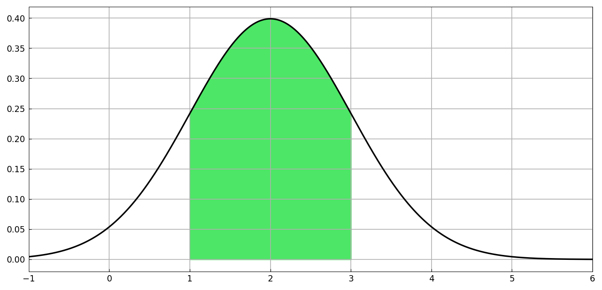
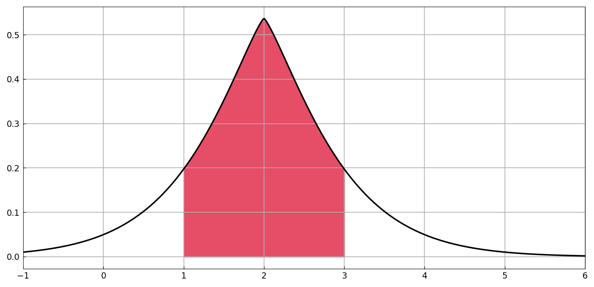

# Probability exercises: normal distributions

*Jie Gao and Nick Trefethen, June 2013*

[Original MATLAB Chebfun example](https://www.chebfun.org/examples/stats/NormalExercises.html)

(Chebfun example stats/NormalExercises.m)

What is the probability that a normal random variable with mean
$\mu = 2$, $\sigma = 1$ lies within one standard deviation of the
mean?  With a chebfun on the whole real line and its cumulative sum:

```text
p =
   0.682689492136994
```

(MATLAB: 0.682689492136379 — the familiar 68.3% rule, matching to 12
digits.)



The same computation for the non-Gaussian density
$\propto e^{-|x-\mu|^{5/4}}$, whose fractional kink at $\mu$ needs
splitting:

```text
p =
   0.718570707762615
```

(MATLAB: 0.718570707764524; a direct scipy quadrature gives
0.7185707077687 — all three agree to 10 digits, the $C^1$ kink
limiting the attainable accuracy for everyone.)



---

*Replicated with [chebfunjax](https://github.com/ma-gilles/chebfunjax); original
example copyright The University of Oxford and The Chebfun Developers.*
