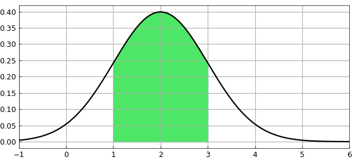
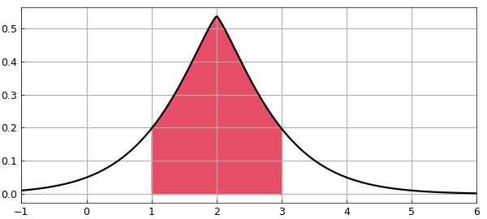

# Normal distribution: Exercises from a textbook

*Jie Gao and Nick Trefethen, April 2013*

[Original MATLAB Chebfun example](https://www.chebfun.org/examples/stats/NormalExercises.html)

Python translation: [`examples/stats/normal_exercises.py`](https://github.com/ma-gilles/chebfunjax/blob/main/examples/stats/normal_exercises.py)

## 1. Introduction

Probability and statistics textbooks contain many exercise problems concerning various probability distributions. In this Example we use Chebfun to solve a problem involving the normal distribution from the textbook [1]. Other similar Examples look at problems from the same book involving the exponential, beta, gamma, Rayleigh, and Maxwell distributions.

Like most textbooks, [1] emphasizes problems that can be solved on paper and don't need numerical tools such as Chebfun. As soon as one varies the problem a little, however, numerical solutions often become necessary. Thus first we solve the problem as written, and then we solve a variant.

## 2. Problem 1(d), page 124

> If $X$ is normally distributed with mean $2$ and variance $1$, find $P[|X-2|<1]$.

The probability density function (PDF) of the normal distribution can be defined like this:

```matlab
ff = @(x,mu,sigma) 1/(sigma*sqrt(2*pi))*exp(-0.5*((x-mu)/sigma).^2);
```

The domain is the entire real line, and this is a case where Chebfun has no difficulty working with that domain. We can construct the chebfun like this:

```matlab
mu = 2;
sigma = 1;
f = chebfun(@(x) ff(x,mu,sigma), [-inf,inf]);
```

The cumulative density function (CDF) is the indefinite integral of $f$:

```matlab
fint = cumsum(f);
```

We can find the probability of $P[|X-2|<1]$ like this:

```matlab
format long
p = fint(3)-fint(1)
```

```text
p =
   0.682689492137119
```

Let's plot $f$ and the region $|X-2|<1$:

```matlab
hold off, h = area(f{1,3});
set(h,'FaceColor',[0.3 0.9 0.4]), axis auto
LW = 'linewidth';
hold on, plot(f,'k',LW,1.6,'interval',[-1 6]), grid on
```



## 3. Problem 1(d), page 124 -- numerical variant

Now let us do a similar computation, except replacing the quadratic term in the normal distribution by an absolute value with a $5/4$ power.

```matlab
ff = @(x,mu,sigma) exp(-abs((x-mu)/sigma).^(5/4));
```

The factor $1/\sqrt{2\pi\sigma}$ has been deleted because now we will have to normalize the distribution by hand. Here is the normalized chebfun:

```matlab
f = chebfun(@(x) ff(x,mu,sigma), [-inf,inf],'splitting','on');
f = f/sum(f);
```

We can compute the probability as before:

```matlab
fint = cumsum(f);
p = fint(3)-fint(1)
```

```text
p =
   0.718570707762934
```

And here is a plot, with a new color for variety:

```matlab
hold off, h = area(f{1,3});
set(h,'FaceColor',[0.9 0.3 0.4]), axis auto
hold on, plot(f,'k',LW,1.6,'interval',[-1 6]), grid on
```



## References

1. A. M. Mood, F. A. Graybill, and D. Boes, Introduction to the Theory of Statistics, McGraw-Hill, 1974.

---

*Translated with [chebfunjax](https://github.com/ma-gilles/chebfunjax); prose and MATLAB code from the original example, copyright The University of Oxford and The Chebfun Developers.  Printed outputs and figures are chebfunjax's.*
