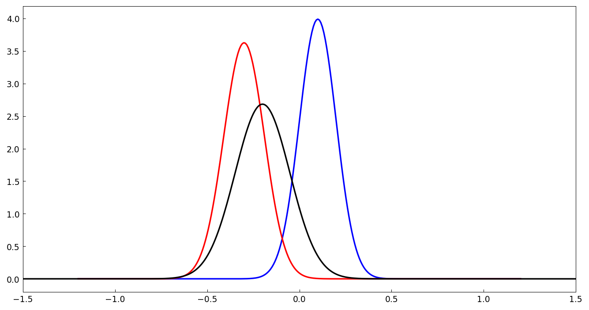
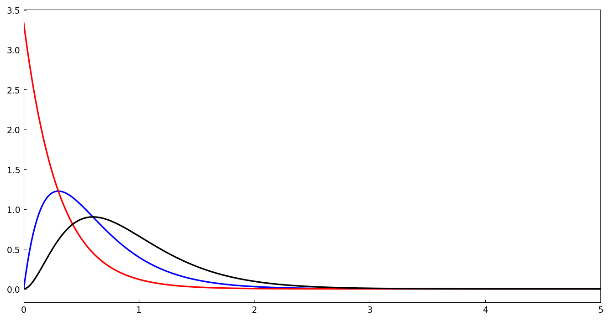
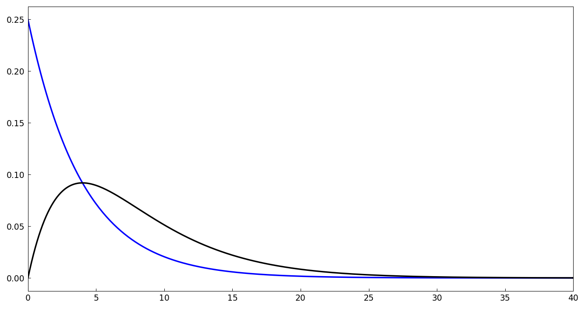
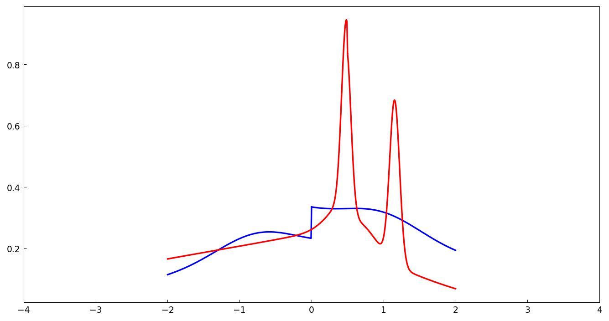
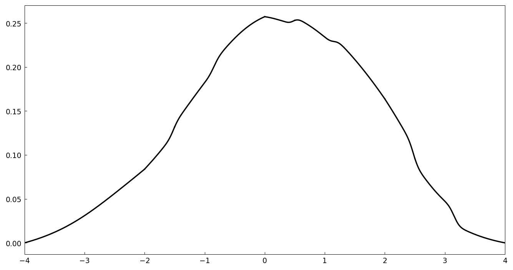

# Convolutions of probability distributions

*Nick Hale, December 2012*

[Original MATLAB Chebfun example](https://www.chebfun.org/examples/stats/ProbabilityConvolution.html)

(Chebfun example stats/ProbabilityConvolution.m)

If $X$ and $Y$ are independent random variables, the density of
$X + Y$ is the convolution of their densities.  Chebfun's `conv`
makes such computations easy.  Two normal distributions convolve to a
normal with summed means and variances:



```text
ans =
     4.026102188356811e-15
```

(MATLAB: 2.18e-14.)  Gamma distributions with a shared scale add
their shape parameters:



```text
ans =
     9.873531983140551e-15
```

The sum of two exponential random variables has a Gamma(2)
distribution:



```text
ans =
     3.707757370778446e-15
```

Convolution works for piecewise distributions too — here two
mixtures on top of Heaviside steps (our own random draws):



The convolution is computed in about a second and integrates to 1:



```text
Elapsed time is 1.285105 seconds.
sum h = 0.999999999999999
```

---

*Replicated with [chebfunjax](https://github.com/ma-gilles/chebfunjax); original
example copyright The University of Oxford and The Chebfun Developers.*
